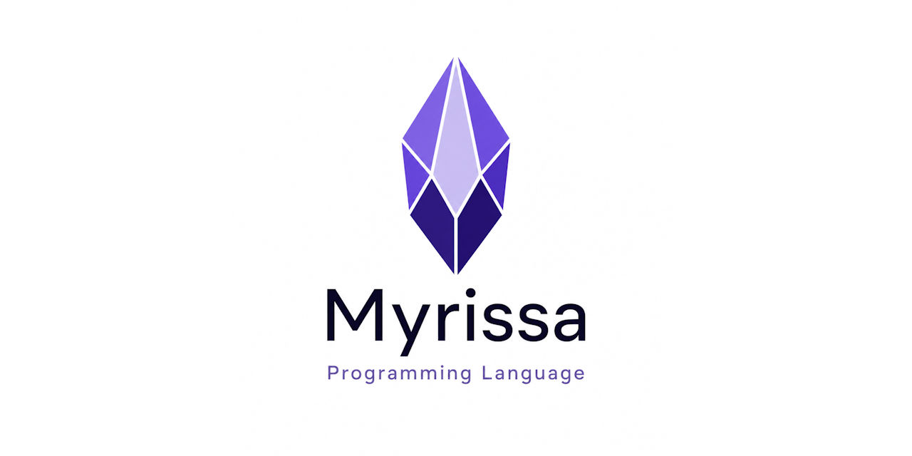
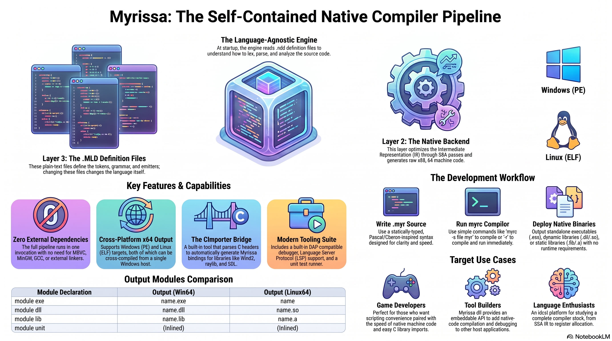

<div align="center">



[](https://discord.gg/Wb6z8Wam7p) [](https://bsky.app/profile/tinybiggames.com)

**Source in. Machine code out. Nothing in between.**

</div>

## 🔥 What is Myrissa?

Myrissa is a Pascal-family systems programming language with a compiler that owns the whole stack. Written entirely in Delphi, it takes `.myr` source and produces native Win64 (PE) and Linux64 (ELF) executables, dynamic libraries and static libraries. It parses, optimizes, encodes x86_64, writes the image, links archives and injects its own runtime, all inside one process. No LLVM, no Clang, no GCC, no external linker, no runtime to ship.

```myrissa
module exe hello;
begin
  println("Hello, Myrissa!");
end.
```

```
myr hello -r
```

The compiler is one executable, `myr.exe`. That is the install.

## 🎬 Media

<div align="center">
<br/>



https://github.com/user-attachments/assets/62ff149a-4701-4bd4-8865-666426e88744

</div>

## 🚫 What you do not install

| | |
|---|---|
| LLVM, Clang, GCC, MSVC | The compiler encodes x86_64 directly. No assembler pass, no IR handed to someone else. |
| link.exe, ld | Myrissa's own linker consumes COFF and ELF archives, resolves symbols across multi-member archives, chases `/DEFAULTLIB` into SDK import libraries, and links foreign MSVC and MinGW archives. |
| A C runtime to ship | The runtime (refcounted strings, dynamic arrays, heap tracking with leak reports, structured exceptions, unit-test harness) is generated into every module through the same IR API a frontend uses. |
| A Linux toolchain | `linux64` binaries come out of the same compiler on the same Windows host. With WSL installed, `-r` runs them immediately. |

## 🎯 Who is Myrissa for?

- **Systems programmers** who want a Pascal-flavored alternative to C with exact-width types, a module system, and first-class C interop in both directions.
- **Delphi and Pascal developers** who want a language that feels familiar and compiles straight to native code with nothing else to install.
- **Game developers** who want to call raylib, SDL3 or any C library without binding layers. CImporter generates the units from the headers; raylib and SDL3 ship as demos.
- **Cross-platform developers** who want Windows and Linux from one source, one compiler, one command.
- **Compiler enthusiasts** who want to read a complete native compiler, from lexer to PE/ELF writer, in one codebase with zero third-party dependencies.

## ✨ The language

```myrissa
module exe shapes;

type
  Color = choices(red, green, blue = 5, alpha);

  Point = record
    x: float64;
    y: float64;
  end;

  Shape = record
    origin: Point;
    color:  Color;
    name:   string;
  end;

routine hsv_to_rgb(const h: float32; var r: uint8; var g: uint8; var b: uint8);
begin
  r := uint8(h * 255.0);
  g := uint8((1.0 - h) * 255.0);
  b := 128;
end;

routine safe_div(const a: int32; const b: int32): int32;
begin
  guard
    return a div b;          // hardware divide-by-zero is caught too
  except
    println("caught %s (code %lld)", cstr(excmsg()), exccode());
    return -1;
  end;
end;

begin
  var s: Shape = Shape(origin: Point(x: 10.0, y: 20.0), color: Color.blue, name: "box");
  var r: uint8;
  var g: uint8;
  var b: uint8;
  hsv_to_rgb(0.25, r, g, b);
  println("%s at (%f, %f) rgb(%d, %d, %d)", cstr(s.name), s.origin.x, s.origin.y, r, g, b);
  println("%d", safe_div(10, 0));
end.
```

- **Sixteen primitive types** with exact machine sizes, every one mapping to a C type: `int8` to `uint64`, `float32`, `float64`, `char`, `wchar`, `boolean`, `pointer`, and managed `string` (UTF-8) and `wstring` (UTF-16).
- **Records like C structs**: inheritance, `packed`, `align(n)`, overlays (unions), anonymous overlays for tagged unions, bit fields, named record literals.
- **Routines**: one keyword for functions and procedures, `const` and `var` parameters, local sections, first-class routine types, overloading via `cpplink`, forward declarations, variadics with `varargs`.
- **Control flow**: `if`, `while`, `for` and `downto`, `repeat`, `match` with ranges and lists, `break`, `continue`, compound assignment.
- **Exceptions**: `guard`/`except`/`finally` with `throw` and `throwcode`. Catches software throws and hardware faults on both targets and propagates across routine, module and static-library boundaries.
- **Sets** as stack bitmasks: union, intersection, difference and membership are single instructions.
- **Modules**: `exe`, `dll`, `lib`, `unit`. Private by default, `public` to export, always qualified on import, `initialize` and `finalize` on every kind.
- **Conditional compilation**: `@define`, `@ifdef`, `@ifndef`, `@elseif`, `@else`, `@endif` with `MYRISSA`, `TARGET_WIN64`, `TARGET_LINUX64`, `DEBUG`, `RELEASE`, `BUILD_EXE`, `BUILD_DLL`, `BUILD_LIB`.
- **Built-in unit testing**: `test "name" begin ... end;` blocks after `end.`, enabled by `@unittestmode on;`, with `assert`, `asserteq`, `asserteqf`, `assertnil`, `assertnotnil`, `assertfail` and more.
- **Version info and icons** embedded through directives. No resource compiler step.

## 🔗 Calling C

```myrissa
module exe interop;

// the same routine, bound to the C runtime of each target
@ifdef TARGET_WIN64
routine clink myabs(const n: int32): int32; external "msvcrt.dll" name "abs";
@elseif TARGET_LINUX64
routine clink myabs(const n: int32): int32; external "libc.so.6" name "abs";
@endif

// a Windows-only system DLL
@ifdef TARGET_WIN64
routine clink GetTick(): uint64; external "kernel32" name "GetTickCount64";
@endif

import SDL3;

begin
  println("abs(-42) = %d", myabs(-42));
  SDL3.SDL_Init(SDL3.SDL_INIT_VIDEO);
  SDL3.SDL_Quit();
end.
```

Naming a library in an `external` clause is what links it. A bare name probes for a static archive first, then a DLL or shared object. The C runtime is a library like any other, so you name it per target (`msvcrt.dll`, `libc.so.6`) under `@ifdef`. `clink` gives an unmangled symbol in both directions, so a `public routine clink` in a `dll` or `lib` module is callable from any language that speaks the C ABI.

`myr cimport <script.mys>` runs CImporter, which reads C headers and writes a complete `unit` module: types, constants and `external` declarations, with per-target DLL names and copy rules. One generated binding serves both `win64` and `linux64`.

## ⚙️ The pipeline

Every stage is Delphi code in the same repository. No temporary files, no child processes.

1. **Lexer**, keywords and the sixteen primitive types registered, not hardcoded
2. **Parser**, recursive descent for declarations and statements, Pratt for expressions
3. **Semantic analysis**, every type, symbol, cross-module reference and directive resolved once and recorded on the AST
4. **Emitter**, walks the enriched AST and drives the backend's fluent IR builder
5. **SSA optimizer**, constant propagation and folding, copy propagation, common subexpression elimination, dead code elimination
6. **x86_64 code generation**, linear-scan register allocation, direct byte encoding, Win64 and System V ABIs
7. **Image writer and linker**, PE with `.pdata` unwind info, version resources and icons; ELF; COFF and ELF archive writers; a linker that reads foreign archives
8. **Runtime**, injected into every module

Optimization levels: `none` (default, writes a `.mdbg` debug sidecar), `basic` (constant propagation, constant folding, DCE), `full` (adds copy propagation and CSE). Every level must produce correct output on both targets; the compliance gate enforces it.

## 🛠️ Tools

| Tool | What it does |
|---|---|
| `myr` | Build, run, cross-compile, or launch the debugger. `myr hello -r -t linux64 -opt full` |
| `myr cimport` | Generate a Myrissa binding unit from a C header via a `.mys` script |
| `myrlsp` | Language server: diagnostics, completions, hover, go-to-definition, document symbols |
| Debugger | Native DAP debugger over a `.mdbg` sidecar. Breakpoints via `@breakpoint;`, stepping, variables, call stacks. `myr hello -d` |
| `myrtester` | Runs every compliance suite across both targets at all three optimization levels |

### 🖥️ CLI

```
myr <source> [options]
myr cimport <script>
```

| Flag | Description |
|---|---|
| `-r`, `--run` | Run after a successful build (Linux binaries run via WSL) |
| `-d`, `--debug` | Build with debug info and launch the debugger |
| `-t`, `--target` | `win64` (default) or `linux64` |
| `-o`, `--output` | Output directory |
| `-sub`, `--subsystem` | `console` (default) or `gui` |
| `-opt`, `--optimize` | `none` (default), `basic`, `full` |
| `-h`, `--help` | Help |

Pass the source name without the `.myr` extension. `-r` and `-d` are mutually exclusive. The debugger currently targets `win64`.

## 🌍 Every kind, every target

| Module | win64 | linux64 |
|---|---|---|
| `module exe name` | `name.exe` | `name` |
| `module dll name` | `name.dll` | `name.so` |
| `module lib name` | `name.lib` | `name.a` |
| `module unit name` | compiled inline into the importer | |

The compliance gate runs the EXE, DLL, LIB, UNIT, UNITTEST and LINK suites on both targets at `none`, `basic` and `full`, and requires zero assertion failures and zero heap leaks in every run. The LINK suite covers lib-to-lib dependencies, DLL globals through static libs, SEH across library boundaries, foreign MSVC and MinGW archives, ADDR64 tables, multi-member archives, SDK import-lib chasing and two DLLs in one process.

## 📖 Documentation

| Document | Description |
|---|---|
| **[Myrissa Language Reference](https://github.com/tinyBigGAMES/Myrissa/blob/main/docs/Myrissa.md)** | Getting started, the full language reference, module system, C interop and CImporter, memory and data structures, the BNF grammar, runtime library, debugging, code style and recipes. |

## 🔨 Getting Myrissa

**[Download the latest release](https://github.com/tinyBigGAMES/Myrissa/releases/latest)**, extract it, and put the directory containing `myr.exe` on your `PATH`. There is nothing else.

| | Requirement |
|---|---|
| **Host OS** | Windows 10/11 x64 |
| **Targets** | Windows x64 (PE) and Linux x64 (ELF), both from the Windows host |
| **Runtime dependencies** | None |
| **External toolchain** | None |
| **Running Linux binaries** | WSL, or a Linux x64 machine |

## 🔧 Building the compiler from source

For contributors who want to change the compiler itself.

| | Requirement |
|---|---|
| **Host OS** | Windows 10/11 x64 |
| **Compiler** | Delphi 12.x or higher |

```
git clone https://github.com/tinyBigGAMES/Myrissa.git
```

Open `projects\Myrissa.groupproj` in the Delphi IDE and build all projects. This produces `myr.exe`, `myrlsp.exe` and `myrtester.exe` in `bin\`. Run `myrtester` to compile and execute every compliance test and demo across both targets and all optimization levels.

## 🤝 Contributing

- **Report bugs** with a minimal `.myr` reproduction.
- **Suggest features**: describe the use case first, then the syntax you have in mind.
- **Submit pull requests** for bug fixes, documentation, new test cases and well-scoped features.
- **Review and discuss** open pull requests and issues.

Join the [Discord](https://discord.gg/Wb6z8Wam7p) to talk development, ask questions, or show what you are building.

## 💖 Support the project

If Myrissa saves you time, helps you learn, or sparks something useful:

- ⭐ **Star the repo**: it costs nothing and helps others find the project
- 📣 **Spread the word**: write a post, mention it in a community, or share a screenshot
- 💬 **Join the community**: show what you are building and help shape what comes next on [Discord](https://discord.gg/Wb6z8Wam7p)
- 🧪 **Try examples**: real usage finds issues that synthetic tests miss
- 💖 [**Become a sponsor**](https://github.com/sponsors/tinyBigGAMES): sponsorship directly funds development, examples, and documentation

## 📜 License

Myrissa is licensed under the **Apache License, Version 2.0**. See [LICENSE](https://github.com/tinyBigGAMES/Myrissa?tab=Apache-2.0-1-ov-file#License-1-ov-file) for details.

Apache 2.0 is a permissive open source license that lets you use, modify, and distribute Myrissa freely in both open source and commercial projects. You are not required to release your own source code. Attribution is required: keep the copyright notice and license file in place.

## 🔗 Links

- 🌐 [Homepage](https://myrissa.org/)
- 🧑‍💻 [GitHub](https://github.com/tinyBigGAMES/Myrissa)
- 💬 [Discord](https://discord.gg/Wb6z8Wam7p)
- 🦋 [Bluesky](https://bsky.app/profile/tinybiggames.com)
- 🎮 [tinyBigGAMES](https://tinybiggames.com)

<div align="center">

**Myrissa**&#8482; Programming Language

Copyright &copy; 2026-present tinyBigGAMES&#8482; LLC
All Rights Reserved.

</div>
