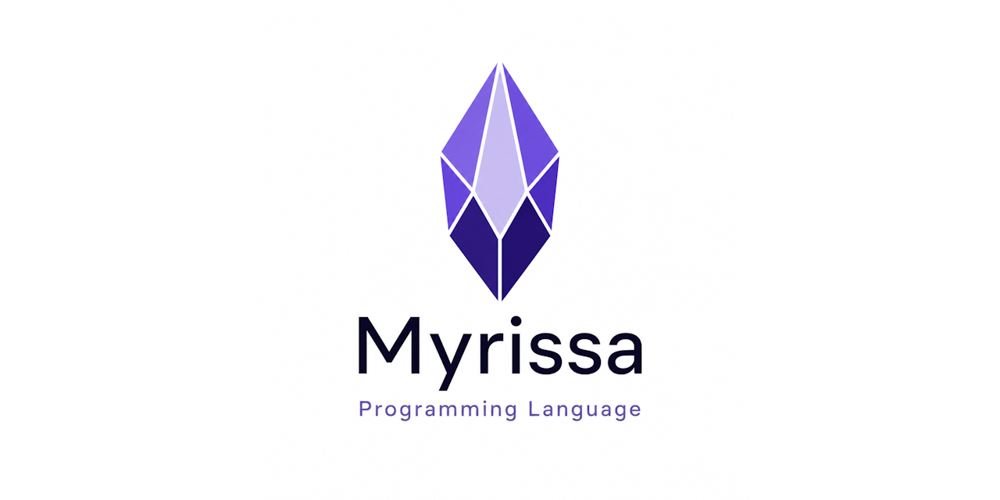

<div align="center">



</div>

<a id="what-is-myrissa"></a>

## 💎 What is Myrissa?

**Myrissa** is a zero-dependency native compiler for Windows x64. It takes clean, statically-typed `.myr` source code and produces native PE executables, DLLs, static libraries, in-memory executables, or reusable unit modules without requiring MSVC, MinGW, an external linker, or a separate runtime.

Write a source file. Run `myrc`. Get native machine code.

```
// hello.myr
module exe hello;
begin
  println("Hello, Myrissa!");
end.
```

```
> myrc -s hello.myr -r
Hello, Myrissa!
```
  
> [!TIP]
> 💡 **Fast path:** read [Getting Started](#getting-started), skim [Language Reference](#language-reference), then jump into [How-To Guide](#how-to-guide) when you want copy-paste examples.

### 🚦 Documentation Roadmap

| Reader Goal | Start Here | Why |
|-------------|------------|-----|
| 🚀 Run your first program | [Getting Started](#getting-started) | Minimal setup, first `.myr` file, build modes, and project layout |
| 📘 Learn the language | [Language Reference](#language-reference) | Types, routines, records, objects, modules, directives, and unit tests |
| 🧾 Verify exact syntax | [BNF Grammar](#bnf-grammar) | Formal grammar rules, lexical elements, and precedence |
| 🛠️ Use the toolchain | [Tools](#tools) | Compiler, debugger, CImporter, and LSP workflow |
| 🔌 Embed Myrissa | [API Reference](#api-reference) | `Myrissa.dll` lifecycle, handles, callbacks, strings, and error handling |
| 🧪 Solve a task | [How-To Guide](#how-to-guide) | Practical recipes with complete examples |

### 💡 Core Idea

Myrissa is designed around one direct workflow:

```text
write .myr  ->  run myrc  ->  get native Win64 output
```

The language keeps a Pascal/Oberon-style structure, but the toolchain is intentionally modern: native x64 output, built-in diagnostics, built-in debugger support, built-in LSP support, and a DLL API for embedding the compiler into other tools.

> [!IMPORTANT]
> 🧱 Myrissa is not a scripting runtime that interprets source at execution time. It is a native compiler pipeline that turns source into machine code.


### ✨ Key Features

| Feature | What It Means |
|---------|---------------|
| **🧰 Zero external dependencies** | The full compiler pipeline runs in one invocation. No build system setup, no toolchain installation, and no PATH configuration. |
| **⚡ Native Win64 output** | Myrissa emits x86_64 machine code directly. There is no interpreter, VM, or bytecode layer. |
| **🎯 Multiple output targets** | Compile the same source to an EXE, DLL, static library, in-memory executable, or reusable unit module. |
| **🐞 Built-in debugger** | Debug Adapter Protocol (DAP) support provides breakpoints, stepping, call stacks, and variable inspection. |
| **🧠 Language Server Protocol** | Real-time diagnostics, completion, hover information, go-to-definition, references, and document symbols for editor integration. |
| **🌉 CImporter** | Parse C headers and generate Myrissa bindings for C libraries such as Win32 APIs, raylib, SDL, and custom native DLLs. |
| **🔌 Embeddable API** | `Myrissa.dll` exposes a flat C-callable API so host applications can embed the compiler, debugger, CImporter, and LSP. |


### 🏗️ Architecture

```
Source (.myr)
    |
    v
+-------------------------------------------+
|  Myrissa Compiler                         |
|                                           |
|  Lexer --> Parser --> AST                 |
|              |                            |
|              v                            |
|  Semantics (type check, symbol resolve)   |
|              |                            |
|              v                            |
|  IR Generation --> SSA Optimization       |
|              |                            |
|              v                            |
|  x64 Codegen (register alloc, encoding)   |
|              |                            |
|              v                            |
|  PE Linker (sections, imports, exports)   |
+-------------------------------------------+
    |
    v
Output: .exe / .dll / .lib / memory
```

The compiler is built as a layered pipeline. Each stage has a clean responsibility, and the same front end, IR, optimizer, and code generator serve every output target. The final output writer determines whether the result becomes an executable, DLL, library, memory image, or unit module.


### 🧩 Toolchain Map

| Component | Description |
|-----------|-------------|
| **Compiler** | Lexing, parsing, semantic analysis, IR generation, optimization, x64 code generation, and PE linking |
| **Debugger** | DAP protocol, breakpoints, stepping, variable inspection, call stacks, and source mapping |
| **🌉 CImporter** | C header parser and Myrissa binding generator for foreign function interfaces |
| **LSP Server** | Language Server Protocol support for diagnostics, completion, hover, go-to-definition, references, and document symbols |
| **Test Runner** | Built-in unit testing with assertions and automatic entry point replacement |
| **Embedding DLL** | Flat C-compatible API for host applications that need runtime compilation or tooling integration |


### 🎯 Who Is This For?

- **Game developers** who want scripting-language convenience while still compiling to native machine code. Myrissa's `subsystem.routine` API style, such as `gfx.clear` and `input.pressed`, is designed to pair naturally with the PIXELS 2D engine.
- **Tool builders** who need an embeddable compiler. Ship `Myrissa.dll` and give your application native-code compilation at runtime.
- **Language enthusiasts** who want to study a complete native compiler stack, from parsing and SSA IR through register allocation and PE linking.
- **Windows developers** who want standalone binaries without shipping .NET, JVM, Python, or a pile of runtime DLLs.


### 📌 Current Status

The compiler stack is working end-to-end with support for:

- Primitive types: integers, floats, booleans, characters, strings, wide strings, and pointers
- Records with inheritance, packed layout, custom alignment, and bit fields
- Objects with methods, `self`/`parent`, and create/destroy lifecycle management
- Choices, sets, overlays, routine types, and variadic arguments
- Control flow: `if`, `while`, `for`, `repeat`, `match`, `leave`, and `skip`
- Exception handling with `guard`, `except`, `finally`, `throw`, and `throwcode`
- External function declarations and runtime DLL loading
- Module imports, module qualification, public/private visibility, and lifecycle hooks
- Conditional compilation with `@define`, `@ifdef`, `@ifndef`, `@elseif`, `@else`, and `@endif`
- Built-in unit testing with assertion helpers and test runner injection
- SSA optimization passes, including Mem2Reg, constant folding, and dead code elimination
- Win64 ABI calling conventions, including C-style linkage and `cpplink`
- PE generation with `.text`, `.rdata`, `.data`, `.idata`, `.edata`, `.pdata`, and `.reloc` sections
- DAP debugger, LSP server, and CImporter tooling
- 70+ test cases covering language and toolchain behavior


### 💻 System Requirements

| Area | Requirement |
|------|-------------|
| **Operating system** | Windows 10/11 x64 |
| **Runtime dependencies** | None |
| **External toolchain** | None |
| **Building from source** | Delphi 12.x or higher |


### 🗺️ Table of Contents

- 🚀 [Getting Started](#getting-started): installation assumptions, first script, build modes, project layout, editor support
- 📘 [Language Reference](#language-reference): types, operators, routines, control flow, records, objects, modules, directives, and tests
- 🧾 [BNF Grammar](#bnf-grammar): formal grammar and lexical rules
- 🛠️ [Tools](#tools): compiler, debugger, CImporter, and LSP server
- 🔌 [API Reference](#api-reference): `Myrissa.dll` C API for embedding
- 🧪 [How-To Guide](#how-to-guide): practical recipes for common tasks

<a id="getting-started"></a>

## 🚀 Getting Started

This section gets you from an empty folder to a running native executable. For language details, see [Language Reference](#language-reference). For task-based examples, see [How-To Guide](#how-to-guide).


### 🧰 Requirements

- Windows 10 or later, x64
- No external compiler, linker, SDK, runtime, or package manager

> [!NOTE]
> 🧰 Myrissa is self-contained. The compiler, optimizer, linker, runtime support, debugger, CImporter, and LSP tooling are built in.

### 🧭 Mental Model

A Myrissa project is just source files plus the `myrc` compiler. There is no external linker project, no runtime package folder, and no separate SDK install.

| Concept | Meaning |
|---------|---------|
| 📄 `.myr` | Human-written source file |
| 📦 `.myr` unit | Reusable module compiled inline into the importer |
| 🚀 `module exe` | Native executable entry point |
| 🧩 `module dll` | Dynamic library with exported routines |
| 🧱 `module lib` | Static library output |
| ⚡ `module mem` | Native code compiled and executed in memory |

> [!TIP]
> 🧠 Think of the first line of every file as the build contract. `module exe hello;` says what the file produces and what the module is called.


### 👋 Your First Script

Create a file named `hello.myr`:

```
module exe hello;

begin
  println("Hello, Myrissa!");
end.
```

Compile and run it:

```
myrc -s hello.myr -r
```

Expected output:

```
Hello, Myrissa!
```

The command compiles `hello.myr` to a native Win64 executable and runs it.

> [!TIP]
> Every source file starts with a `module` declaration. The declaration defines the module kind (`exe`, `dll`, `lib`, `unit`, or `mem`) and the module name.


### 🏗️ Build Modes

Myrissa can produce several target types. The output type is determined by the `module` declaration in the source file:

| Module Declaration | Output | Description |
|-------------------|--------|-------------|
| `module exe name` | `name.exe` | Native Win64 executable |
| `module dll name` | `name.dll` | Dynamic link library with exported routines |
| `module lib name` | `name.lib` | Standard Win64 static library, linkable by Myrissa or other compilers |
| `module mem name` | (in memory) | Compile to memory and execute directly |
| `module unit name` | (none) | Reusable module compiled inline into the importing module |

Common CLI patterns:

| Command | Effect |
|---------|--------|
| `myrc -s hello.myr` | Compile only |
| `myrc -s hello.myr -r` | Compile and run |
| `myrc -s hello.myr -o build` | Compile with custom output path |
| `myrc -s hello.myr -d` | Compile and launch the debugger |


#### EXE: Standalone Executable

The default mode produces a native Win64 PE executable with no runtime dependencies:

```
module exe myapp;
begin
  println("Running as a standalone .exe");
end.
```


#### DLL: Dynamic Link Library

Use `module dll` and mark exported routines as `public`:

```
module dll mylib;

public routine calculate(x: int32; y: int32): int32;
begin
  return x * x + y * y;
end;

end.
```


#### Static Library

Use `module lib` to produce a standard Win64 static library that can be linked by Myrissa or any other compiler that supports Win64 `.lib` files:

```
module lib mathlib;

public routine add(a: int32; b: int32): int32;
begin
  return a + b;
end;

end.
```


#### Memory: In-Memory Compilation

Use `module mem` when a host application needs to compile and execute code without writing files to disk. In-memory compilation requires a host using the `Myrissa.dll` API -- it cannot be invoked from the command line. See the [API Reference](#api-reference) for details.


#### Unit Modules

Unit modules are reusable `.myr` source files that other modules can import. When a module imports a unit, the unit is compiled inline into the importing module -- there is no separate output file:

```
module unit helpers;

public routine double(n: int32): int32;
begin
  return n * 2;
end;

end.
```

Import the unit from another module:

```
module exe main;

import helpers;

begin
  println("%d", helpers.double(21));   // 42
end.
```

> [!IMPORTANT]
> 📥 Imported symbols must be accessed with full module qualification. Use `helpers.double`, not `double`. This keeps imports explicit and prevents symbol conflicts between modules.


### 🗂️ Project Structure

A typical project keeps the executable entry point separate from reusable unit modules:

```
myproject/
  main.myr          // entry point (module exe)
  utils.myr         // utility module (module unit)
  mathlib.myr       // math library (module unit)
  assets/           // game assets, resources, data files
```

For larger projects, use `@libpath` to add module search directories:

```
@libpath "libs"
import mathlib;
```

> [!TIP]
> 💡 Keep units small and focused. Because imports require module qualification, names stay readable even when a project grows.


### ✅ First-Project Checklist

Before moving from a tiny sample to a real project, verify these basics:

- 🧪 A `module exe` file builds and runs from the command line
- 📦 Shared code lives in `module unit` files
- 📥 Imports use full module qualification, such as `helpers.double(21)`
- 🗂️ Reusable units are kept in predictable folders
- 🔎 `@libpath` points to any folder that contains imported units
- 🧯 Errors are fixed at the first reported source location before chasing follow-up messages

### 🧯 Common First-Run Issues

| Symptom | Likely Cause | Fix |
|---------|--------------|-----|
| `module not found` | Unit file is not in the current folder or `@libpath` | Add `@libpath "folder"` or move the unit next to the main file |
| `unknown symbol` | Imported symbol was called without module qualification | Use `moduleName.symbolName` |
| Output is not what you expected | The default command compiled and ran the EXE immediately | Use `-o output.exe` when you only want to build |
| DLL routine is not visible | Routine is missing `public` | Mark exported routines as `public` |

> [!NOTE]
> 🧩 Myrissa favors explicitness. Fully qualified imports and clear module kinds make larger projects easier to understand.

### 🧠 Editor Support

Myrissa includes a Language Server Protocol (LSP) implementation for real-time IDE features:

| Feature | Description |
|---------|-------------|
| Diagnostics | Errors and warnings as you type |
| Completion | Context-aware suggestions for keywords, types, routines, and symbols |
| Hover | Type and documentation information on mouse hover |
| Go-to-definition | Jump to symbol declarations |
| Document symbols | Outline view of the current module |
| References | Find usages of a symbol |

The LSP server communicates over stdin/stdout using JSON-RPC and works with editors that support LSP, including VS Code.


#### 🐞 Debugger Integration

The built-in debugger supports the Debug Adapter Protocol (DAP), which enables a graphical debugging workflow in VS Code and other DAP-capable editors:

- Set breakpoints from the editor gutter or with `@breakpoint`
- Step into, over, and out of routines
- Inspect variables and watch expressions
- Navigate the call stack

See [Tools](#tools) for detailed debugger and LSP documentation.

<a id="language-reference"></a>

## 📘 Language Reference

Myrissa is a statically-typed, compiled language with Pascal/Oberon-inspired syntax. It is case-sensitive, uses `end` to close blocks, and compiles directly to native x64 machine code with zero external dependencies.

Use this section as the practical language reference. For the formal grammar, see [BNF Grammar](#bnf-grammar). For complete examples, see [How-To Guide](#how-to-guide).

> [!NOTE]
> ✍️ Myrissa uses `:=` for assignment and `=` for equality comparison. Keywords are lowercase and case-sensitive. Semicolons terminate declarations but are optional after statements.

### 🧭 Language Model at a Glance

Myrissa uses a small set of consistent rules across the whole language:

| Rule | What to Remember |
|------|------------------|
| 🧱 Static types | Every variable, field, parameter, and routine result has a known type |
| ✍️ Assignment | `:=` assigns a value; `=` compares values |
| 🔤 Case-sensitive names | `Value`, `value`, and `VALUE` are different identifiers |
| 🚪 Block endings | Structured blocks close with `end` |
| 📦 Modules | Every source file starts with a `module` declaration |
| 📥 Imports | Imported symbols are accessed through `moduleName.symbolName` |
| 🧪 Tests | Unit test modules can use built-in assertion helpers |

> [!TIP]
> 💎 When reading Myrissa code, scan for `module`, then `import`, then declarations, then the final `begin ... end.` body. That gives you the shape of the file quickly.


### 💬 Comments

```
// single-line comment

/* multi-line
   comment */

/* block comments /* can be nested */ like this */
```

Line comments begin with `//` and extend to the end of the line. Block comments use `/* ... */` and may be nested to any depth.

> [!NOTE]
> 💎 Myrissa does not use `(* *)` or `{ }` as comment delimiters.


### 🧱 Types

Myrissa has a concrete type system that maps directly to machine reality. Primitive values have known sizes at compile time, and aggregate types such as records, arrays, overlays, and objects are built from those primitives.

#### 🔢 Integer Types

| Type | Size | Range |
|------|------|-------|
| `int8` | 1 byte | -128 to 127 |
| `int16` | 2 bytes | -32,768 to 32,767 |
| `int32` | 4 bytes | -2,147,483,648 to 2,147,483,647 |
| `int64` | 8 bytes | Full 64-bit signed range |
| `uint8` | 1 byte | 0 to 255 |
| `uint16` | 2 bytes | 0 to 65,535 |
| `uint32` | 4 bytes | 0 to 4,294,967,295 |
| `uint64` | 8 bytes | Full 64-bit unsigned range |

#### 🧮 Floating-Point Types

| Type | Size | Description |
|------|------|-------------|
| `float32` | 4 bytes | 32-bit IEEE 754 |
| `float64` | 8 bytes | 64-bit IEEE 754 |

Float literals without a suffix are resolved from context. If the context is ambiguous, the compiler uses `float64`. Append `f` or `F` to force `float32`:

```
var x: float64 = 3.14159;       // float64
var y: float32 = 3.14f;         // float32
```

#### ✅ Boolean Type

| Type | Size | Values |
|------|------|--------|
| `boolean` | 1 byte | `true`, `false` |

#### 🔤 Character Types

| Type | Size | Description |
|------|------|-------------|
| `char` | 1 byte | 8-bit character |
| `wchar` | 2 bytes | 16-bit wide character |

Characters are assigned using single-character string literals. The compiler verifies the literal is exactly one character:

```
var c: char = "A";
var wc: wchar = w"B";
```

#### 🧵 String Types

| Type | Size | Description |
|------|------|-------------|
| `string` | 8 bytes (pointer) | Managed UTF-8 string |
| `wstring` | 8 bytes (pointer) | Managed UTF-16 string |

```
var name: string = "Myrissa";
var wide: wstring = w"Hello, world!";
```

Escape sequences: `\n` (newline), `\t` (tab), `\r` (carriage return), `\0` (null), `\\` (backslash), `\"` (quote), `\xNN` (hex byte).

#### 📍 Pointer Type

| Type | Size | Description |
|------|------|-------------|
| `pointer` | 8 bytes | Untyped pointer |

Typed pointers and pointer operations are described in the [Pointers](#pointers) section below.

> [!TIP]
> Integer literals default to `int32`. Hex literals use `0x` prefix: `var flags: uint32 = 0xFF00;`


### 📦 Variables

Variables are declared with `var` and require an explicit type. An initializer is optional; variables without one are default-initialized:

```
var x: int32 = 42;
var name: string = "Myrissa";
var pi: float64 = 3.14159;
var count: int32;              // default zero-initialized
```

Multiple variables can appear in a `var` section:

```
var
  width: int32 = 800;
  height: int32 = 600;
  title: string = "My App";
```


### 🔒 Constants

Constants are declared with `const` and must provide an initial value:

```
const MAX_SIZE: int32 = 1024;
const GREETING: string = "Hello";
const PI: float64 = 3.14159265358979;
```


### 🏷️ Type Aliases

Use `type` aliases to give an existing type a domain-specific name:

```
type
  Byte = uint8;
  Word = uint16;
  Size = int64;
```


### ⚙️ Operators

#### ➕ Arithmetic

| Operator | Description |
|----------|-------------|
| `+` | Addition |
| `-` | Subtraction |
| `*` | Multiplication |
| `/` | Division (float) |
| `div` | Integer division |
| `mod` | Modulo (remainder) |

#### ⚖️ Comparison

| Operator | Description |
|----------|-------------|
| `=` | Equal |
| `<>` | Not equal |
| `<` | Less than |
| `>` | Greater than |
| `<=` | Less than or equal |
| `>=` | Greater than or equal |
| `in` | Set membership |

#### 🔀 Logical

| Operator | Description |
|----------|-------------|
| `and` | Logical AND |
| `or` | Logical OR |
| `not` | Logical NOT |
| `xor` | Logical XOR |

#### 🧬 Bitwise

| Operator | Description |
|----------|-------------|
| `and` | Bitwise AND (context-dependent) |
| `or` | Bitwise OR (context-dependent) |
| `xor` | Bitwise XOR (context-dependent) |
| `shl` | Shift left |
| `shr` | Shift right |

#### ✍️ Assignment

| Operator | Description |
|----------|-------------|
| `:=` | Assignment |
| `+=` | Add and assign |
| `-=` | Subtract and assign |
| `*=` | Multiply and assign |
| `/=` | Divide and assign |

#### 🎚️ Operator Precedence (Highest to Lowest)

| Precedence | Operators |
|------------|-----------|
| 1 (highest) | `not`, unary `-`, unary `+`, `address of` |
| 2 | `*`, `/`, `div`, `mod`, `and`, `shl`, `shr` |
| 3 | `+`, `-`, `or`, `xor` |
| 4 (lowest) | `=`, `<>`, `<`, `>`, `<=`, `>=`, `in` |


### 🔧 Routines

Functions and procedures are both declared with the `routine` keyword. A routine with a return type behaves as a function; a routine without a return type behaves as a procedure:

```
routine add(const a: int32; const b: int32): int32;
begin
  return a + b;
end;

routine greet(const name: string);
begin
  println("Hello, " + name);
end;
```

#### 📨 Parameter Modes

| Mode | Description |
|------|-------------|
| `const` | Read-only (default convention) |
| `var` | Pass by reference, caller sees modifications |
| (none) | Value parameter |

#### 🧺 Variadic Arguments

Routines can accept a variable number of arguments using `...`:

```
routine print_all(...);
var
  i: int32;
begin
  for i := 0 to varargs.count - 1 do
    println(varargs.next(string));
  end;
end;
```

Access variadic arguments through the `varargs` intrinsic:

| Expression | Description |
|------------|-------------|
| `varargs.count` | Total number of variadic arguments |
| `varargs.next(Type)` | Retrieve and consume the next argument as the given type |
| `varargs.get(Index, Type)` | Retrieve the argument at `Index` as the given type (no cursor advance) |
| `varargs.reset()` | Reset the cursor back to the first argument |
| `varargs.copy()` | Copy the current varargs cursor position |

#### 🌉 External Routines

Call functions from DLLs by declaring routines with an `external` clause:

```
routine MessageBoxA(const hwnd: pointer; const text: string;
  const caption: string; const flags: uint32): int32;
  external "user32.dll";

MessageBoxA(nil, "Hello from Myrissa!", "Greeting", 0);
```

#### 🔗 C++ Linkage and Overloading

Use `cpplink` when a routine needs C++-compatible linkage with Itanium ABI name mangling. This enables routine overloading and interoperability with C++ libraries:

```
routine cpplink add(const x: int32; const y: int32): int32;
begin
  return x + y;
end;

routine cpplink add(const x: float64; const y: float64): float64;
begin
  return x + y;
end;
```

Overloaded routines with `cpplink` can be exported from and imported into `.dll` and `.lib` files. Without `cpplink`, routines use C calling convention and naming, which does not support overloading.

#### ☎️ Routine Types

Routines are first-class types. Declare a routine type and use it as a callback or function pointer:

```
type
  TCompareFunc = routine(const a: int32; const b: int32): int32;

routine compare_ascending(const a: int32; const b: int32): int32;
begin
  return a - b;
end;

var
  cmp: TCompareFunc;
begin
  cmp := compare_ascending;
  println(cmp(3, 7));
end;
```

> [!TIP]
> Routine types use C calling convention by default. Add `cpplink` for C++ ABI compatibility.


### 🚦 Control Flow

#### 🔀 If/Else

```
if x > 0 then
  println("positive");
else
  println("non-positive");
end;
```

The `else` branch is optional. There is no `elif` -- use nested `if` inside `else`:

```
if x > 0 then
  println("positive");
else
  if x < 0 then
    println("negative");
  else
    println("zero");
  end;
end;
```

#### 🔁 While Loop

```
var i: int32 = 0;
while i < 10 do
  println(i);
  i += 1;
end;
```

#### 🔂 For Loop

```
for i := 0 to 9 do
  println(i);
end;

for i := 9 downto 0 do
  println(i);
end;
```

The loop variable is declared implicitly by the `for` statement.

#### 🔄 Repeat/Until

```
var i: int32 = 0;
repeat
  println(i);
  i += 1;
until i >= 10;
```

The body executes at least once. The loop exits when the condition becomes true.

#### 🎯 Match Statement

Use `match` for value-based branching. Match arms can contain single values, comma-separated values, or ranges:

```
match value of
  1: println("one");
  2: println("two");
  3..5: println("three to five");
  else
    println("other");
end;
```

Multiple values can share a case:

```
match ch of
  "a", "e", "i", "o", "u": println("vowel");
  else
    println("consonant");
end;
```

#### 🛑 Loop Control

| Statement | Description |
|-----------|-------------|
| `leave` | Exit the current loop immediately |
| `skip` | Skip to the next iteration |


### 📋 Records

Records are value types with named fields. They are useful for compact structured data, binary layouts, and C interop:

```
type
  Point = record
    x: float32;
    y: float32;
  end;

var p: Point;
p.x := 10.0;
p.y := 20.0;
```

#### 🧬 Record Inheritance

Records can inherit from a base record:

```
type
  Shape = record
    x: int32;
    y: int32;
  end;

  Circle = record(Shape)
    radius: float32;
  end;

var c: Circle;
c.x := 100;
c.y := 200;
c.radius := 50.0;
```

#### 📦 Packed Records

Use `record packed` when fields must be stored without padding between them:

```
type
  Header = record packed
    magic: uint16;
    version: uint8;
    flags: uint8;
  end;
```

#### 📐 Custom Alignment

```
type
  AlignedData = record align(16)
    values: array[4] of float32;
  end;
```

#### 🧩 Bit Fields

Fields can specify a bit width for compact binary layouts:

```
type
  Flags = record packed
    visible: uint8 : 1;
    enabled: uint8 : 1;
    priority: uint8 : 3;
    reserved: uint8 : 3;
  end;
```

#### 📝 Record Literals

Construct records inline:

```
type
  Color = record
    r: uint8;
    g: uint8;
    b: uint8;
  end;

var red: Color = Color(r: 255, g: 0, b: 0);
```


### 📚 Arrays

Fixed-size arrays declare their element count or explicit bounds at compile time:

```
var numbers: array[10] of int32;
numbers[0] := 42;
numbers[9] := 100;
```

Arrays can also use explicit range bounds:

```
var grid: array[0..7] of int32;
```

#### 📈 Dynamic Arrays

Arrays declared without bounds are dynamic:

```
var items: array of int32;
setlength(items, 10);
items[0] := 42;
println(len(items));    // 10
```

Use `setlength` to resize and `len` to query the current length.


### 🎛️ Choices (Enumerations)

Myrissa uses `choices` for enumeration-style values:

```
type
  TColor = choices(Red = 0, Green = 1, Blue = 2);
  TDirection = choices(North, South, East, West);
```

Choices values can be assigned explicit integer values. Access values with type qualification:

```
var c: TColor;
c := TColor.Green;
println("%d", int32(c));   // prints 1

match int32(c) of
  0: println("red");
  1: println("green");
  2: println("blue");
end;
```


### 🧮 Sets

Sets represent compact collections of values and are tested with the `in` operator:

```
var s: set;
s := [1, 3, 5, 7];
if 3 in s then
  println("3 is in set");
end;
if not (4 in s) then
  println("4 is not in set");
end;
```

Sets can also be declared with explicit ranges:

```
type
  CharSet = set of 0..255;
```

Set literals use square brackets with optional ranges:

```
var digits: set = [0..9];
var evens: set = [0, 2, 4, 6, 8];
```

Use the `in` operator to test membership.


### 🧊 Overlays (Unions)

Overlays share storage between fields. They are Myrissa's union-style data structure:

```
type
  Value = overlay
    as_int: int32;
    as_float: float32;
    as_bytes: array[4] of uint8;
  end;

var v: Value;
v.as_int := 42;
println(v.as_bytes[0]);   // low byte of 42
```

#### 👻 Anonymous Overlays in Records

Overlays can nest inside records for C-style union-in-struct patterns:

```
type
  Variant = record
    kind: int32;
    overlay
      int_val: int64;
      float_val: float64;
      str_val: string;
    end;
  end;
```


### 🏛️ Objects

Objects are heap-allocated reference types with methods, create/destroy lifecycle management, and single inheritance. Objects are always used through typed pointers; the `.` operator auto-dereferences object pointers:

```
type
  TCounter = object
    value: int32;

    method increment();
    begin
      self.value := self.value + 1;
    end;

    method get_value(): int32;
    begin
      return self.value;
    end;
  end;

var c: pointer to TCounter;
begin
  create(c);
  c.value := 0;
  c.increment();
  c.increment();
  println("count: %d", c.get_value());   // count: 2
  destroy(c);
end;
```

#### 🧬 Object Inheritance

```
type
  TBase = object
    x: int32;

    method get_x(): int32;
    begin
      return self.x;
    end;

    method describe(): int32;
    begin
      return self.x * 10;
    end;
  end;

  TDerived = object(TBase)
    y: int32;

    method sum(): int32;
    begin
      return self.x + self.y;
    end;

    method describe(): int32;
    begin
      return parent.describe() + self.y;
    end;
  end;

var d: pointer to TDerived;
begin
  create(d);
  d.x := 7;
  d.y := 3;
  println("describe: %d", d.describe());   // parent.describe() + y = 73
  destroy(d);
end;
```

Use `self` to access the current object's fields and methods. Use `parent` to call the base object's methods.

#### ♻️ Object Lifecycle

| Statement | Description |
|-----------|-------------|
| `create(obj)` | Allocate and initialize an object instance |
| `destroy(obj)` | Finalize and free an object instance |

> [!WARNING]
> Objects are always declared as `pointer to TMyObject` and allocated with `create`. Every `create` must have a matching `destroy` to avoid memory leaks.


### 📍 Pointers

Myrissa supports typed and untyped pointers for low-level memory access:

```
type
  PInt32 = pointer to int32;

var
  x: int32 = 42;
  p: PInt32;
begin
  p := address of x;
  println(p^);           // dereference: prints 42
  p^ := 100;            // write through pointer
  println(x);            // prints 100
```

| Operation | Syntax | Description |
|-----------|--------|-------------|
| Address-of | `address of expr` | Get a pointer to a variable |
| Dereference | `expr^` | Follow a pointer to its value |

Const pointers prevent writes through the pointer:

```
type
  PConstInt = pointer to const int32;
```


### 🧠 Memory Management

Myrissa provides direct memory-management intrinsics for object allocation, raw blocks, and dynamic arrays:

| Statement | Description |
|-----------|-------------|
| `getmem(ptr)` | Allocate a block of memory |
| `freemem(ptr)` | Free a previously allocated block |
| `resizemem(ptr, size)` | Resize an allocated block |
| `setlength(arr, size)` | Resize a dynamic array |


### 🛡️ Exception Handling

Myrissa uses `guard/except/finally` for structured exception handling:

```
guard
  println("in guard");
finally
  println("finally runs always");
end;
```

With exception catching:

```
guard
  println("before throw");
  throw 42;
  println("this never runs");
except
  println("caught exception");
end;

println("continues after guard");
```

| Keyword | Description |
|---------|-------------|
| `guard` | Begins a protected block |
| `except` | Handles exceptions from the guard block |
| `finally` | Cleanup code that always runs (with or without exception) |
| `throw expr` | Raise an exception |
| `throwcode(code, msg)` | Raise an exception with a numeric code and message |
| `exccode()` | Get the exception code (inside `except` block) |
| `excmsg()` | Get the exception message (inside `except` block) |

> [!NOTE]
> A `guard` block requires either `except` or `finally` (or both). When both are present, `except` comes first.


### ⚡ Intrinsics

Intrinsics are built-in operations recognized directly by the compiler:

| Intrinsic | Description |
|-----------|-------------|
| `len(expr)` | Length of a string, wide string, or dynamic array |
| `size(Type)` | Byte size of a type or expression |
| `utf8(wstr)` | Convert a wide string to a UTF-8 string |
| `paramcount()` | Number of command-line arguments |
| `paramstr(n)` | Get command-line argument by index |
| `print(...)` | Print values without newline |
| `println(...)` | Print values with newline |


### 📦 DLL Loading

Myrissa provides two mechanisms for loading DLLs at runtime.

**Resource-based loading** loads DLLs that are embedded as resources inside the PE:

```
regdll(w"mylib.dll", w"MYLIB_RES");
loaddlls();
```

| Operation | Description |
|-----------|-------------|
| `regdll(dll, resource)` | Register an embedded DLL resource for loading |
| `loaddlls()` | Load all registered DLL resources into memory |

**Filesystem loading** loads DLLs from disk at runtime:

```
var lib: pointer;
var proc: routine(const msg: string);

lib := loadlib("mylib.dll");
proc := getproc(lib, "MyFunction");
proc("Hello from loaded DLL");
freelib(lib);
```

| Operation | Description |
|-----------|-------------|
| `loadlib(path)` | Load a DLL from the filesystem, returns a handle |
| `getproc(lib, name)` | Get a function pointer from a loaded DLL |
| `freelib(lib)` | Unload a DLL |


### 🧱 Modules

Every Myrissa source file is a module. The module declaration specifies what the compiler should produce and what the module is called:

```
module exe myapp;

// declarations...

begin
  // entry point
  println("Hello!");
end.
```

#### 🧭 Module Kinds

| Kind | Description | Output |
|------|-------------|--------|
| `exe` | Standalone executable | `.exe` |
| `dll` | Dynamic link library | `.dll` |
| `lib` | Static library | `.lib` |
| `unit` | Reusable module (compiled inline into importer) | (none) |
| `mem` | In-memory compilation | (none) |

#### 📥 Imports and Module Qualification

Import other modules with the `import` statement. All imported symbols must be accessed with full module qualification:

```
module exe main;

import mathutils;

begin
  println(mathutils.add(2, 3));
end.
```

> [!IMPORTANT]
> Unqualified access to imported symbols is a compile error. If modules A and B both export `Foo`, they are accessed as `A.Foo` and `B.Foo` -- no ambiguity.

#### 👁️ Visibility

Declarations can be marked `public` to make them accessible from importing modules:

```
public routine add(const a: int32; const b: int32): int32;
begin
  return a + b;
end;
```

Declarations without `public` are private to the module.

#### 🚪 Initialize and Finalize

Modules can have lifecycle hooks that run at startup and shutdown:

```
module exe myapp;

initialize
  println("Starting up...");
end;

finalize
  println("Shutting down...");
end;

begin
  println("Main body");
end.
```

`initialize` runs before the main body. `finalize` runs after the main body completes. Both are optional and supported on all module kinds.


### 🎛️ Directives

Directives are compile-time instructions prefixed with `@`. They do not require trailing semicolons.

#### 📄 Module Directives

| Directive | Description |
|-----------|-------------|
| `@exeicon "path"` | Set the application icon (EXE only) |
| `@resfile "path"` | Link a compiled resource file (.res) |
| `@outputpath "path"` | Set the output directory |
| `@copydll "path"` | Copy a DLL to the output directory during build |
| `@linklibrary "path"` | Link against a library |
| `@libpath "path"` | Add a library/module search path |
| `@subsystem console\|gui` | Set the application subsystem (default: `console`) |
| `@optimize level` | Set optimization: `debug`, `releasesafe`, `releasefast`, `releasesmall` |
| `@unittestmode "on"\|"off"` | Enable/disable test block compilation |

#### 🏷️ Version Information Directives

| Directive | Description |
|-----------|-------------|
| `@addverinfo "on"\|"off"` | Enable version information embedding |
| `@vimajor number` | Major version number |
| `@viminor number` | Minor version number |
| `@vipatch number` | Patch version number |
| `@viproductname "name"` | Product name |
| `@videscription "text"` | File description |
| `@vifilename "name"` | Original filename |
| `@vicompanyname "name"` | Company name |
| `@vicopyright "text"` | Copyright string |

#### 🧾 Statement Directives

| Directive | Description |
|-----------|-------------|
| `@breakpoint` | Insert a debugger breakpoint |
| `@message hint\|warn\|error\|fatal "text"` | Emit a compile-time diagnostic |


### 🔀 Conditional Compilation

Conditional compilation lets a source file include or exclude code based on defined symbols:

```
@define VERBOSE

@ifdef VERBOSE
  println("Debug: entering main loop");
@endif

@ifdef WIN64
  println("Running on 64-bit Windows");
@endif
```

| Directive | Description |
|-----------|-------------|
| `@define SYM` | Define a symbol |
| `@undef SYM` | Undefine a symbol |
| `@ifdef SYM` | Compile if symbol is defined |
| `@ifndef SYM` | Compile if symbol is not defined |
| `@elseif SYM` | Alternative branch with condition |
| `@else` | Alternative branch |
| `@endif` | End conditional block |

#### 🏁 Predefined Symbols

| Symbol | Defined When |
|--------|-------------|
| `MYRISSA` | Always |
| `WINDOWS`, `MSWINDOWS`, `WIN64`, `TARGET_WIN64`, `CPUX64` | Always (Win64-only target) |
| `BUILD_EXE`, `BUILD_DLL`, `BUILD_LIB`, `BUILD_UNIT`, `BUILD_MEM` | Based on module kind |
| `CONSOLE_APP`, `GUI_APP` | Based on `@subsystem` directive |
| `UNITTEST` | When `@unittestmode "on"` is active |


### 🧪 Unit Testing

Test blocks appear after the module's `end.` marker and are compiled only when `@unittestmode "on"` is active. In test mode, the compiler replaces the normal entry point with the test runner.

```
module exe mathlib;

@unittestmode "on"

routine add(const a: int32; const b: int32): int32;
begin
  return a + b;
end;

end.

test "add returns correct sum"
var
  result: int32;
begin
  result := add(2, 3);
  asserteq(5, result);
end;

test "add handles negatives"
begin
  asserteq(-2, add(-5, 3));
  asserteq(-8, add(-5, -3));
end;
```

#### ✅ Assertion Functions

| Assertion | Description |
|-----------|-------------|
| `assert(expr)` | Fails if expression is false |
| `asserttrue(expr)` | Fails if expression is not true |
| `assertfalse(expr)` | Fails if expression is not false |
| `asserteq(expected, actual)` | Fails if values are not equal (type-dispatched) |
| `assertnil(expr)` | Fails if expression is not nil |
| `assertnotnil(expr)` | Fails if expression is nil |
| `assertfail("message")` | Unconditional failure with a message |

All assertions continue after failure -- failures accumulate and are reported per test. The compiler injects source file and line number automatically.

> [!TIP]
> Test blocks have access to all module declarations. Use tests to verify routines, types, and module behavior without building a separate test harness.

### 🧯 Practical Gotchas

These are not new syntax rules. They are the small details that tend to matter most when reading or writing real Myrissa code.

| Area | Watch For |
|------|-----------|
| 🧵 Strings | `string` and `wstring` are different widths. Use `w"..."` for wide strings. |
| 🔤 Characters | `char` and `wchar` are assigned from single-character string literals and checked semantically. |
| 📍 Pointers | Use address and dereference operations deliberately. Width mismatches should be treated as real bugs. |
| 📦 Records | Packed layout, custom alignment, and bit fields affect binary compatibility. Document layout-sensitive records clearly. |
| 🧩 Objects | `create` and `destroy` model lifecycle. Keep ownership rules obvious. |
| 📥 Imports | Imported routines should be called with module qualification to avoid ambiguity. |
| 🧪 Assertions | Use `asserteq(expected, actual)` consistently so failures read clearly. |

### 🧠 Reading Order for This Reference

For a first pass, read these sections in order:

1. 🚀 Types, variables, constants, and operators
2. 🔧 Routines and parameter modes
3. 🚦 Control flow
4. 📋 Records, arrays, choices, sets, and overlays
5. 🏛️ Objects and lifecycle
6. 📥 Modules, imports, directives, and unit tests

After that, use this file as a lookup reference while writing code.

<a id="bnf-grammar"></a>

## 🧾 BNF Grammar

### 🧾 Syntax Notation

This section is the formal grammar reference for Myrissa. It is intended for implementers, tooling authors, and anyone who needs exact syntax rules. For an easier language walkthrough, see [Language Reference](#language-reference).

The grammar uses EBNF notation. Brackets `[` and `]` mark optional elements. Braces `{` and `}` mark repetition, zero or more times. Parentheses group alternatives. The vertical bar `|` separates alternatives. Terminal symbols are enclosed in quotes or written as lowercase literal tokens. Non-terminals are written in PascalCase.


> [!NOTE]
> 🧾 This file is intentionally formal. Use it when you need the exact grammar contract. Use the [Language Reference](#language-reference) for explanations and the [How-To Guide](#how-to-guide) for examples.

### 🔎 How to Read This Grammar

| Symbol | Meaning |
|--------|---------|
| `A B` | `A` followed by `B` |
| `A | B` | either `A` or `B` |
| `[ A ]` | optional `A` |
| `{ A }` | zero or more repetitions of `A` |
| `( A | B )` | grouped alternatives |
| `"text"` | literal source text |

> [!TIP]
> 💡 When implementing a parser, treat this file as the external behavior contract, not as a required internal parser architecture. Recursive descent, Pratt parsing, table-driven parsing, or another strategy can all implement the same grammar.


### 🔤 1. Lexical Elements

```
letter     = "A" | ... | "Z" | "a" | ... | "z" | "_" .
digit      = "0" | ... | "9" .
hexDigit   = digit | "A" | ... | "F" | "a" | ... | "f" .
character  = (* any source character except the delimiter *) .
newline    = (* line feed (U+000A) *) .

ident      = letter { letter | digit } .
integer    = digit { digit } | "0" ( "x" | "X" ) hexDigit { hexDigit } .
float_literal = digit { digit } "." { digit } [ exponent ] [ "f" | "F" ] .
exponent      = ( "e" | "E" ) [ "+" | "-" ] digit { digit } .
cstring    = '"' { character | escapeSeq } '"' .
wstring    = "w" '"' { character | escapeSeq } '"' .
escapeSeq  = "\" ( "n" | "t" | "r" | "0" | "\" | "'" | '"' | "x" hexDigit hexDigit ) .
```

#### 🔢 Numeric Literal Type Rules

| Literal         | Suffix | Type      | Example         |
|----------------|--------|-----------|-----------------|
| `42`           | --     | `int32` | integer |
| `1.5`          | --     | contextual | float literal |
| `1.5f`, `1.5F` | `f`/`F` | `float32` | explicit `float32` |

**Float literal resolution without a suffix:**

- Assigned to a `float32` variable or passed to a `float32` parameter: `float32`
- Assigned to a `float64` variable or passed to a `float64` parameter: `float64`
- Ambiguous or unknown context: `float64`

**Float literal resolution with `f` or `F` suffix:**

- Always `float32`, regardless of context

#### 🧵 String Literal Convention

- `"..."` -- String literal. Escape sequences processed. UTF-8 encoded.
- `w"..."` -- Wide string literal. Escape sequences processed. UTF-16 encoded. Prefix is case-sensitive: only lowercase `w`.

#### 🔤 Character Type Assignment Rules

The `char` and `wchar` types have no dedicated literal syntax. Characters are
assigned using string literals, variable-to-variable assignment, or string indexing.
The semantic pass validates type compatibility using the AST.

**Valid `char` assignments:**
- `c := "x";` -- A `cstring` literal of exactly one character. The semantic pass
  verifies `len = 1`; longer literals produce a compile error.
- `c := d;` -- Where `d` is also of type `char`.
- `c := s[i];` -- Indexing a `string` yields a `char`.

**Valid `wchar` assignments:**
- `wc := w"x";` -- A `wstring` literal of exactly one character (semantic-checked).
- `wc := wd;` -- Where `wd` is also of type `wchar`.
- `wc := ws[i];` -- Indexing a `wstring` yields a `wchar`.

**Invalid assignments (compile error):**
- `c := "abc";` -- Multi-character literal assigned to `char`.
- `c := s;` -- `string` variable assigned to `char` (use indexing instead).
- `c := wc;` -- `wchar` assigned to `char` (width mismatch).
- `wc := c;` -- `char` assigned to `wchar` (width mismatch).


### 🚫 2. Reserved Words

The language is **case-sensitive** for keywords and identifiers.

```
address    align      and        array      assert     asserteq
assertfalse assertfail assertnil assertnotnil asserttrue
begin      choices    const      cpplink    create     destroy
div        do         downto     else       end        except
exccode    excmsg     external   false      finalize   finally
for        freelib    freemem    getmem     getproc    guard
if         import     in         initialize is         leave      len
loaddlls   loadlib    match      method     mod        module
nil        not        object     of         or         overlay
packed     paramcount paramstr   parent     pointer    print
println    public     record     regdll     repeat     resizemem
return     routine    self       set        setlength  shl
shr        size       skip       test       then       throw
throwcode  to         true       type       until      utf8
var        varargs    while      xor
```

> [!NOTE]
> The identifiers `exe`, `dll`, `lib`, `unit`, and `mem` are contextual. They have special meaning only in the `ModuleKind` position and may be used as ordinary identifiers elsewhere. Unit modules are `.myr` source files that are compiled inline into the importing module rather than producing separate output.


### 🧱 3. Built-in Types

```
int8       int16      int32      int64
uint8      uint16     uint32     uint64
float32    float64
boolean
char       wchar
string     wstring
pointer
```

#### 📏 Type Sizes

| Type        | Size (bytes) | Description            |
|-------------|-------------|------------------------|
| `int8`      | 1           | Signed 8-bit integer   |
| `int16`     | 2           | Signed 16-bit integer  |
| `int32`     | 4           | Signed 32-bit integer  |
| `int64`     | 8           | Signed 64-bit integer  |
| `uint8`     | 1           | Unsigned 8-bit integer |
| `uint16`    | 2           | Unsigned 16-bit integer|
| `uint32`    | 4           | Unsigned 32-bit integer|
| `uint64`    | 8           | Unsigned 64-bit integer|
| `float32`   | 4           | 32-bit IEEE 754 float  |
| `float64`   | 8           | 64-bit IEEE 754 float  |
| `boolean`   | 1           | Boolean (0 or 1)       |
| `char`      | 1           | 8-bit character        |
| `wchar`     | 2           | 16-bit wide character  |
| `string`    | 8 (pointer) | Managed UTF-8 string   |
| `wstring`   | 8 (pointer) | Managed UTF-16 string  |
| `pointer`   | 8           | Untyped pointer        |


### ⚙️ 4. Operators and Delimiters

```
+    -    *    /    =    <>   <    >    <=   >=
:=   +=   -=   *=   /=
:    ;    ,    .    ..   ...  ^    |    &
(    )    [    ]
```

#### 🧠 Operator Semantics

- `:=` -- Assignment
- `=` -- Equality comparison
- `<>` -- Not equal
- `^` -- Postfix: pointer dereference
- `&` -- Prefix: address-of (see also `address of`)
- `|` -- Reserved token (available for future use)


### 💬 5. Comments

```
Comment    = "//" { character } newline
           | "/*" { character | Comment } "*/" .
```

- `//` -- Line comment.
- `/* ... */` -- Block comment. May be nested.

> [!NOTE]
> `(* *)` and `{ }` are not comment delimiters in Myrissa.


### 🧱 6. Module Structure

```
Module        = "module" ModuleKind ident ";" [ Directives ] [ ImportClause ]
                { Declaration }
                [ "initialize" StatementSeq "end" ";" ]
                [ "finalize" StatementSeq "end" ";" ]
                [ "begin" StatementSeq ] "end" "."
                { TestBlock } .

ModuleKind    = "exe" | "dll" | "lib" | "unit" | "mem" .

Directives    = { Directive } .
Directive     = "@" ident [ DirectiveValue ] .
DirectiveValue = cstring | integer | float_literal | ident .

ImportClause  = "import" ident { "," ident } ";" .

TestBlock     = "test" cstring [ "var" { VarDecl } ]
                "begin" StatementSeq "end" ";" .
```

> [!NOTE]
> **Module lifecycle: `initialize` and `finalize`.** The `initialize` and `finalize`
> blocks are module lifecycle hooks. `initialize` runs at startup (before the
> entry point), `finalize` runs at shutdown. Both are optional and supported on
> all module kinds. They are separate from `begin`, which is the main program
> body for exe/dll modules. For unit modules, `initialize`/`finalize` replace
> the old `begin`/`finalize` embedded syntax. The SSA pass auto-discovers
> these functions by name prefix and wires them into the entry point.

> [!IMPORTANT]
> **Module qualification rule.** All public symbols from an imported module must be
> accessed using full module qualification: `moduleName.symbolName`. Unqualified
> access to imported symbols is a compile error. This applies to routines, types,
> variables, and constants alike. If modules A and B both export a symbol `Foo`,
> they are distinguished as `A.Foo` and `B.Foo` -- there is no ambiguity.

> [!NOTE]
> **Test blocks.** Test blocks appear after `end.` and are only compiled when
> `@unittestmode "on"` is active. Each test block has a string name, optional local
> variables, and a body. When unittest mode is on, the compiler replaces the normal
> entry point with the test runner. Test blocks have access to all module declarations.


### 🔀 7. Conditional Compilation

```
ConditionalDirective = DefineDir | UndefDir | IfdefDir | IfndefDir
                     | ElseIfDir | ElseDir | EndifDir .

DefineDir   = "@define" ident .
UndefDir    = "@undef" ident .
IfdefDir    = "@ifdef" ident .
IfndefDir   = "@ifndef" ident .
ElseIfDir   = "@elseif" ident .
ElseDir     = "@else" .
EndifDir    = "@endif" .
```

#### 📜 Known Directives

**Module-level directives** (appear after `module` header, before or among declarations):

- `@exeicon "path"` -- Sets the application icon (Windows EXE modules only).
- `@resfile "path"` -- Specifies a compiled resource file (.res) to link into the output.
- `@outputpath "path"` -- Sets the output directory for the compiled binary.
- `@copydll "path"` -- Copies a DLL to the output directory during build.
- `@linklibrary "path"` -- Specifies a library to link against.
- `@libpath "path"` -- Adds a directory to the library and module search path.
- `@subsystem type` -- Sets the application subsystem. Valid values: `console` (default), `gui`.
- `@optimize level` -- Sets optimization level. Valid values: `debug`, `releasesafe`, `releasefast`, `releasesmall`.
- `@unittestmode "on"|"off"` -- Enables or disables test block compilation and test runner entry point.

**Version information directives** (for embedding in the PE executable):

- `@addverinfo "on"|"off"` -- Enables or disables version information embedding.
- `@vimajor number` -- Major version number.
- `@viminor number` -- Minor version number.
- `@vipatch number` -- Patch version number.
- `@viproductname "name"` -- Product name.
- `@videscription "text"` -- File description.
- `@vifilename "name"` -- Original filename.
- `@vicompanyname "name"` -- Company name.
- `@vicopyright "text"` -- Copyright string.

**Statement-level directives:**

- `@breakpoint` -- Marks a debugger breakpoint location.
- `@message hint|warn|error|fatal "text"` -- Emits a compiler diagnostic at parse time.

#### 🏁 Predefined Symbols

| Symbol               | Defined when                          |
|----------------------|---------------------------------------|
| `MYRISSA`            | Always                                |
| `WINDOWS`            | Always (Win64-only target)            |
| `MSWINDOWS`          | Always (Win64-only target)            |
| `WIN64`              | Always (Win64-only target)            |
| `TARGET_WIN64`       | Always (Win64-only target)            |
| `CPUX64`             | Always (x64-only target)              |
| `BUILD_EXE`          | Module kind is `exe`                  |
| `BUILD_DLL`          | Module kind is `dll`                  |
| `BUILD_LIB`          | Module kind is `lib`                  |
| `BUILD_UNIT`         | Module kind is `unit`                 |
| `BUILD_MEM`          | Module kind is `mem`                  |
| `CONSOLE_APP`        | Subsystem is `console` (default)      |
| `GUI_APP`            | Subsystem is `gui`                    |
| `UNITTEST`           | `@unittestmode on` is active          |


### 📦 8. Declarations

```
Declaration     = [ "public" ] ( ConstSection | TypeSection | VarSection | RoutineDecl ) .

ConstSection    = "const" { [ "public" ] ConstDecl } .
ConstDecl       = ident [ ":" TypeExpr ] "=" Expression ";" .

TypeSection     = "type" { [ "public" ] TypeDecl } .
TypeDecl        = ident "=" TypeDef ";" .

VarSection      = "var" { [ "public" ] VarDecl } .
VarDecl         = ident ":" TypeExpr [ "=" Expression ] ";" [ ExternalVarClause ] .
ExternalVarClause = "external" [ cstring | ident ] ";" .
```


### 🔧 9. Routine Declarations

```
RoutineDecl     = "routine" [ LinkageSpec ] ident [ FormalParams ] [ ":" TypeExpr ] ";"
                  ( ExternalClause | RoutineBody ) .

LinkageSpec     = "cpplink" .

FormalParams    = "(" [ ParamList ] ")" .
ParamList       = ParamDecl { ";" ParamDecl } [ ";" "..." ] | "..." .
ParamDecl       = [ "var" | "const" ] ident ":" TypeExpr .

ExternalClause  = "external" [ cstring | ident ] ";" .

RoutineBody     = [ "type" { TypeDecl } ]
                  [ "const" { ConstDecl } ]
                  [ "var" { VarDecl } ]
                  "begin" StatementSeq "end" ";" .
```

- **Default linkage**: Routines use C calling convention and naming by default.
- **C++ linkage (`cpplink`)**: Enables Itanium ABI name mangling for C++ interoperability and overloading.


### 🏷️ 10. Type Definitions

```
TypeDef         = RecordType | ObjectType | OverlayType | ArrayType
                | PointerType | SetType | ChoicesType | RoutineType | TypeExpr .

RecordType      = "record" [ "packed" ] [ "align" "(" integer ")" ]
                  [ "(" TypeExpr ")" ]
                  { FieldDecl | AnonOverlay } "end" .

ObjectType      = "object" [ "(" TypeExpr ")" ] { FieldDecl | MethodDecl } "end" .

OverlayType     = "overlay" { FieldDecl | AnonRecord } "end" .
AnonRecord      = "record" [ "packed" ] { FieldDecl | AnonOverlay } "end" ";" .
AnonOverlay     = "overlay" { FieldDecl | AnonRecord } "end" ";" .

FieldDecl       = ident ":" TypeExpr [ ":" integer ] ";" .

MethodDecl      = "method" ident [ FormalParams ] [ ":" TypeExpr ] ";"
                  [ "var" { VarDecl } ] "begin" StatementSeq "end" ";" .

ArrayType       = "array" [ "[" [ ArrayBounds ] "]" ] "of" TypeExpr .
ArrayBounds     = integer ".." integer .

PointerType     = "pointer" [ "to" [ "const" ] TypeExpr ] .

SetType         = "set" [ "of" ( integer ".." integer | TypeExpr ) ] .

ChoicesType     = "choices" "(" ChoicesValue { "," ChoicesValue } ")" .
ChoicesValue    = ident [ "=" Expression ] .

RoutineType     = "routine" [ LinkageSpec ] "(" [ ParamList ] ")" [ ":" TypeExpr ] .

TypeExpr        = QualIdent
                | "pointer" [ "to" [ "const" ] TypeExpr ]
                | "array" [ "[" [ ArrayBounds ] "]" ] "of" TypeExpr
                | "set" [ "of" ( integer ".." integer | TypeExpr ) ] .

QualIdent       = ident { "." ident } .
```

> [!NOTE]
> `object` is used instead of `class`, `choices` instead of `enum`,
> and `overlay` instead of `union`. Anonymous overlays and records can nest
> inside each other for C data interop. Records support single inheritance
> via `record(BaseType)` syntax and bit fields via `fieldname: type : width`.


### 📋 11. Statements

```
StatementSeq    = { Statement } .

Statement       = [ Assignment | CallStmt | IfStmt | WhileStmt | ForStmt
                | RepeatStmt | MatchStmt | ReturnStmt | GuardStmt | RaiseStmt
                | CreateStmt | DestroyStmt
                | GetMemStmt | FreeMemStmt | ResizeMemStmt | SetLengthStmt
                | PrintStmt | RegDllStmt | FreeLibStmt
                | AssertStmt | Directive | ";" ] .

Assignment      = Designator ( ":=" | "+=" | "-=" | "*=" | "/=" ) Expression [ ";" ] .

CallStmt        = Designator [ ";" ] .

IfStmt          = "if" Expression "then" StatementSeq [ "else" StatementSeq ] "end" [ ";" ] .

WhileStmt       = "while" Expression "do" StatementSeq "end" [ ";" ] .

ForStmt         = "for" ident ":=" Expression ( "to" | "downto" ) Expression
                  "do" StatementSeq "end" [ ";" ] .

RepeatStmt      = "repeat" StatementSeq "until" Expression [ ";" ] .

MatchStmt       = "match" Expression "of" { MatchArm } [ "else" StatementSeq ] "end" [ ";" ] .
MatchArm        = MatchLabel { "," MatchLabel } ":" StatementSeq .
MatchLabel      = Expression [ ".." Expression ] .

ReturnStmt      = "return" [ Expression ] [ ";" ] .

GuardStmt       = "guard" StatementSeq
                  ( "except" StatementSeq [ "finally" StatementSeq ]
                  | "finally" StatementSeq ) "end" [ ";" ] .

RaiseStmt       = ( "throw" "(" Expression ")"
                  | "throwcode" "(" Expression "," Expression ")" ) [ ";" ] .

CreateStmt      = "create" "(" Expression ")" [ ";" ] .
DestroyStmt     = "destroy" "(" Expression ")" [ ";" ] .
GetMemStmt      = "getmem" "(" Expression ")" [ ";" ] .
FreeMemStmt     = "freemem" "(" Expression ")" [ ";" ] .
ResizeMemStmt   = "resizemem" "(" Expression "," Expression ")" [ ";" ] .
SetLengthStmt   = "setlength" "(" Expression "," Expression ")" [ ";" ] .
PrintStmt       = ( "print" | "println" ) "(" [ ArgList ] ")" [ ";" ] .
RegDllStmt      = "regdll" "(" Expression "," Expression ")" [ ";" ] .
FreeLibStmt     = "freelib" "(" Expression ")" [ ";" ] .
```

#### 🧪 Assert Statements (Unit Testing)

Assert statements are available in all code but are primarily used inside test blocks.
All assertions continue after failure -- failures accumulate and are reported per test.
The compiler handles all test infrastructure automatically. When `@unittestmode "on"` is active, test blocks are compiled, registered, and executed by the built-in test runner.
The compiler injects source file and line number automatically.

```
AssertStmt      = ( "assert" "(" Expression ")"
                  | "asserttrue" "(" Expression ")"
                  | "assertfalse" "(" Expression ")"
                  | "asserteq" "(" Expression "," Expression ")"
                  | "assertnil" "(" Expression ")"
                  | "assertnotnil" "(" Expression ")"
                  | "assertfail" "(" Expression ")" ) [ ";" ] .
```

- `assert(expr)` -- Fails if `expr` is false.
- `asserttrue(expr)` -- Fails if `expr` is not true.
- `assertfalse(expr)` -- Fails if `expr` is not false.
- `asserteq(expected, actual)` -- Fails if values are not equal. Type-dispatched: the compiler selects the appropriate comparison (int, uint, float, string, bool, pointer) based on operand types.
- `assertnil(expr)` -- Fails if `expr` is not nil.
- `assertnotnil(expr)` -- Fails if `expr` is nil.
- `assertfail("message")` -- Unconditional failure with a message.


### 🧮 12. Expressions

```
Expression      = SimpleExpr [ RelOp SimpleExpr ] .
RelOp           = "=" | "<>" | "<" | ">" | "<=" | ">=" | "in" .

SimpleExpr      = [ "+" | "-" ] Term { AddOp Term } .
AddOp           = "+" | "-" | "or" | "xor" .

Term            = Factor { MulOp Factor } .
MulOp           = "*" | "/" | "div" | "mod" | "and" | "shl" | "shr" .

Factor          = "not" Factor | "-" Factor | "+" Factor
                | "address" "of" Factor | Primary .

Primary         = integer | float_literal | cstring | wstring
                | "true" | "false" | "nil"
                | SetLiteral | RecordLiteral
                | "(" Expression ")" | Designator | Intrinsic | TypeCast .

Designator      = ( ident | "self" | "parent" | "varargs" ) { Selector } .
Selector        = "." ident | "[" Expression "]" | "^" | "(" [ ArgList ] ")" .

ArgList         = Expression { "," Expression } .

SetLiteral      = "[" [ SetElement { "," SetElement } ] "]" .
SetElement      = Expression [ ".." Expression ] .

RecordLiteral   = ident "(" FieldInit { "," FieldInit } ")" .
FieldInit       = ident ":" Expression .

TypeCast        = TypeExpr "(" Expression ")" .
```

#### 📍 Pointer Operations

- `address of expr` -- Returns a pointer to the operand.
- `expr^` -- Postfix (selector): dereference. Follows the pointer to its target.


### ⚡ 13. Intrinsics

```
Intrinsic       = LenExpr | SizeExpr | Utf8Expr | ParamCountExpr | ParamStrExpr
                | ExcCodeExpr | ExcMsgExpr
                | LoadDllsExpr | LoadLibExpr | GetProcExpr .

LenExpr         = "len" "(" Expression ")" .
SizeExpr        = "size" "(" ( TypeExpr | Expression ) ")" .
Utf8Expr        = "utf8" "(" Expression ")" .
ParamCountExpr  = "paramcount" "(" ")" .
ParamStrExpr    = "paramstr" "(" Expression ")" .
ExcCodeExpr     = "exccode" "(" ")" .
ExcMsgExpr      = "excmsg" "(" ")" .
LoadDllsExpr    = "loaddlls" "(" ")" .
LoadLibExpr     = "loadlib" "(" Expression ")" .
GetProcExpr     = "getproc" "(" Expression "," Expression ")" .
```

> [!NOTE]
> `len` returns the length of strings, wide strings, and dynamic arrays.
> `size` returns the byte size of a type or expression. `utf8` converts a wide
> string to a UTF-8 managed string. Memory management (`create`/`destroy`/`getmem`/
> `freemem`/`resizemem`/`setlength`) is defined in Statements (Section 11).
> DLL loader: `regdll`/`freelib` are statements (Section 11);
> `loaddlls`/`loadlib`/`getproc` are expression intrinsics returning values.


### 🧺 14. Variadic Arguments

```
ParamList       = ParamDecl { ";" ParamDecl } [ ";" "..." ] | "..." .

VarArgsAccess   = "varargs" "." "next" "(" TypeExpr ")"
                | "varargs" "." "get" "(" Expression "," TypeExpr ")"
                | "varargs" "." "reset" "(" ")"
                | "varargs" "." "copy" "(" ")"
                | "varargs" "." "count" .
```

- `varargs.next(TypeExpr)` -- Retrieves and consumes the next variadic argument.
- `varargs.get(Expression, TypeExpr)` -- Retrieves the argument at the given index without advancing the cursor.
- `varargs.reset()` -- Resets the cursor back to the first argument.
- `varargs.count` -- Total number of variadic arguments passed.
- `varargs.copy()` -- Returns a new `varargs` object with a copied cursor position.


### 🧪 15. Unit Testing

Test blocks appear after the module's `end.` and are only compiled when the
`@unittestmode "on"` directive is active. When `@unittestmode "on"` is active:

1. The compiler parses test blocks after `end.`
2. Each test block is compiled as a parameterless routine
3. The normal entry point is replaced with the built-in test runner

```
TestBlock     = "test" cstring [ "var" { VarDecl } ]
                "begin" StatementSeq "end" ";" .
```

#### Example

```
module exe mathlib;

@unittestmode on

routine add(const a, b: int32): int32;
begin
  return a + b;
end;

routine mul(const a, b: int32): int32;
begin
  return a * b;
end;

initialize
  println("Module initialized");
end;

finalize
  println("Module finalized");
end;

end.

test "add returns correct sum"
var
  result: int32;
begin
  result := add(2, 3);
  asserteq(5, result);
end;

test "add handles negative numbers"
begin
  asserteq(-2, add(-5, 3));
  asserteq(-8, add(-5, -3));
end;

test "mul returns correct product";
begin
  asserteq(20, mul(4, 5));
  asserteq(0, mul(0, 100));
end;
```


### 🎚️ 16. Operator Precedence (Highest to Lowest)

| Precedence | Operators                                        |
|------------|--------------------------------------------------|
| 1 (highest)| `not` `-` (unary) `+` (unary) `address of`      |
| 2          | `*` `/` `div` `mod` `and` `shl` `shr`           |
| 3          | `+` `-` `or` `xor`                               |
| 4 (lowest) | `=` `<>` `<` `>` `<=` `>=` `in`                  |

### 🧪 Grammar Validation Checklist

Use this checklist when updating the grammar or adding syntax:

- 🔤 Lexical rules define the token shape before parser rules depend on it
- 🚫 Reserved words are listed before examples rely on them
- 🧱 New type forms appear in both the type grammar and the Language Reference
- 🔧 New routine syntax is reflected in declarations, statements, and examples where applicable
- 🧮 Operator changes update precedence and expression grammar together
- 🧪 Unit-test syntax matches the assertion helper documentation
- 🧭 Any new directive is added to the known directive table and the conditional compilation section

> [!WARNING]
> 🧯 Keep grammar changes synchronized with examples. A grammar rule that accepts syntax not shown anywhere else is hard for users to discover, and an example that violates the grammar is worse than no example at all.

<a id="tools"></a>

## 🛠️ Tools

Myrissa includes a complete native development toolchain: compiler, debugger, CImporter, language server, and test runner. The tools are designed to work both from the command line and through embeddable APIs.


### 🧭 Toolchain Workflow

| Step | Tool | Result |
|------|------|--------|
| 1️⃣ Write source | Editor + LSP | Diagnostics, completion, hover, references |
| 2️⃣ Build | Compiler | Native EXE, DLL, LIB, memory image, or unit module |
| 3️⃣ Debug | DAP debugger / REPL | Breakpoints, stepping, variables, call stack |
| 4️⃣ Bind native code | CImporter | Myrissa declarations generated from C headers |
| 5️⃣ Embed | `Myrissa.dll` API | Host applications can drive the compiler/tooling programmatically |

> [!NOTE]
> 🧰 The tools are designed to share the same compiler front end. That means diagnostics in the CLI, debugger, LSP, and API all come from the same language understanding.

### ⚙️ Compiler

The Myrissa compiler takes `.myr` source files and produces native Win64 output. A single compiler invocation handles lexing, parsing, semantic analysis, IR generation, SSA optimization, x64 code generation, and PE linking.


#### ▶️ Basic Usage

```
myrc -s hello.myr                  // compile only
myrc -s hello.myr -r               // compile and run
myrc -s hello.myr -o build         // compile with custom output path
myrc -s hello.myr -d               // compile and debug
```


#### 🎯 Output Targets

| Target | Module Kind | Description |
|--------|-------------|-------------|
| EXE | `exe` | Standalone Windows executable |
| DLL | `dll` | Dynamic link library with exported functions |
| Static Library | `lib` | Standard Win64 static library, linkable by Myrissa or other compilers |
| Memory | `mem` | Compile and execute directly in memory |
| Unit Module | `unit` | Reusable module compiled inline into the importing module |


#### ⚙️ Compiler Pipeline

The compiler processes source through these stages:

1. **Lexer**: tokenizes source text into a stream of tokens
2. **Parser**: builds an abstract syntax tree (AST)
3. **Semantics**: performs type checking, symbol resolution, and validation
4. **IR generation**: converts the AST to intermediate representation
5. **SSA optimization**: runs passes such as Mem2Reg, constant folding, and dead code elimination
6. **x64 code generation**: performs instruction selection, register allocation, and encoding
7. **PE linking**: builds valid PE64 images with sections, imports, exports, relocations, and metadata

> [!NOTE]
> The pipeline runs in-process. There is no separate linker step, no temporary object-file workflow, and no dependency on MSVC, MinGW, or another external toolchain.


#### 🚀 Optimization Levels

Control optimization with the `@optimize` directive:

| Level | Description |
|-------|-------------|
| `debug` | No optimization; full debug information |
| `releasesafe` | Optimized output with safety checks |
| `releasefast` | Maximum performance optimization |
| `releasesmall` | Optimization focused on binary size |


#### 🏷️ Version Information

Embed Windows version information in an EXE with version directives:

```
module exe myapp;

@addverinfo "on"
@vimajor 1
@viminor 0
@vipatch 0
@viproductname "My Application"
@videscription "A sample Myrissa application"
@vicompanyname "My Company"
@vicopyright "Copyright 2026"
```


### 🐞 Debugger

The Myrissa debugger implements the Debug Adapter Protocol (DAP), making it compatible with VS Code and other DAP-capable editors.


#### ✨ Features

| Feature | Description |
|---------|-------------|
| Breakpoints | Source-line breakpoints and `@breakpoint` directives |
| Stepping | Step in, step over, and step out |
| Variables | Inspect local and global variables |
| Call stack | Inspect stack frames |
| Source mapping | Generated code maps back to `.myr` source lines |


#### 📍 Using Breakpoints

Add a breakpoint directly in source with the `@breakpoint` directive:

```
var x: int32 = compute_value();
@breakpoint                      // execution pauses here
println("x = %d", x);           // inspect x before this runs
```


#### 💬 Interactive REPL

Start a terminal-based debugging session from the command line:

```
myrc -s hello.myr -d
```


#### 🧩 DAP Server: VS Code Integration

The debugger can run as a DAP server for editors that support Debug Adapter Protocol. This enables:

- Breakpoint gutter markers
- Variable watch panels
- Call stack navigation
- Step controls in the editor toolbar
- Inline variable values

> [!TIP]
> Use `@optimize debug` while debugging so source mapping is complete and local variables are not optimized away.


#### 📊 Three-Tier Output Model

The debugger separates output into three levels so normal debugging stays readable:

| Tier | Content | Visibility |
|------|---------|------------|
| Wire traffic | JSON-RPC DAP messages | Hidden unless verbose logging is enabled |
| Operational status | Connection events, launch state, breakpoint hits | Status callback |
| REPL UI | User-facing commands and output | Always visible in the REPL |


### 🌉 CImporter

CImporter generates Myrissa bindings from C header files. It parses declarations and emits the import definitions needed to call C libraries from Myrissa code.


#### ✅ What It Handles

| C Construct | Myrissa Output |
|-------------|----------------|
| Function declarations | `routine` with `external` clause |
| Calling conventions | `cdecl` by default, with `stdcall` support |
| Structs and unions | `record` and `overlay` types |
| Enums | `choices` types |
| Typedefs | `type` aliases |
| Pointer types | `pointer to` declarations |
| Arrays | `array` types |
| `#define` constants | `const` declarations for numeric and string values |
| Preprocessor guards | Handled automatically |


#### ▶️ Usage

CImporter is available through the `Myrissa.dll` API, allowing host applications to drive the import process programmatically. Hosts can control:

- Which headers are parsed
- Which symbols are imported
- Naming and filtering rules
- Output format
- Calling convention overrides


#### 📤 Example Output

Given this C header:

```c
typedef struct {
    float x, y, z;
} Vector3;

void DrawLine3D(Vector3 start, Vector3 end, int color);
```

CImporter produces Myrissa source similar to this:

```
type
  Vector3 = record
    x: float32;
    y: float32;
    z: float32;
  end;

routine DrawLine3D(start: Vector3; finish: Vector3; color: int32);
  external "raylib.dll";
```

> [!NOTE]
> C identifiers that conflict with Myrissa keywords are renamed. In the example above, the C parameter `end` becomes `finish`.


### 🧠 Language Server (LSP)

The Myrissa Language Server implements the Language Server Protocol for editor integration. It communicates over stdin/stdout using JSON-RPC and follows the standard LSP message model.


#### ✨ Capabilities

| Feature | Description |
|---------|-------------|
| Diagnostics | Real-time error and warning reporting as you type |
| Completion | Context-aware completion for keywords, types, routines, and symbols |
| Hover | Type and documentation information on mouse hover |
| Go-to-definition | Navigate directly to symbol declarations |
| Document symbols | Outline view of routines, types, variables, and constants |
| References | Find symbol usages across the module |


#### 🏗️ Architecture

The LSP server runs in two modes:

| Mode | Description |
|------|-------------|
| In-process | Runs inside the host application for embedded tooling scenarios |
| Out-of-process | Runs as a standalone stdin/stdout JSON-RPC server |

The LSP is accessed through the `Myrissa.dll` API (`Myr_LSP_*` functions) or launched as a standalone stdin/stdout JSON-RPC server. See the [API Reference](#api-reference) for embedding details.

> [!TIP]
> Diagnostics come from the full compiler pipeline, so the LSP reports semantic issues such as type mismatches and undeclared symbols, not just syntax errors.

### 🧯 Tooling Troubleshooting

| Problem | What to Check |
|---------|---------------|
| 🧱 Build fails before code generation | Start with syntax and semantic diagnostics. Fix the first source error first. |
| 🔗 External call fails | Verify DLL name, exported symbol name, calling convention, and parameter sizes. |
| 🧠 LSP has no diagnostics | Confirm the editor launched the Myrissa LSP process and that the workspace folder contains the source file. |
| 🐞 Breakpoint is not hit | Confirm debug output was enabled and the source path matches the compiled file. |
| 🌉 CImporter output needs adjustment | Check symbol filters, keyword-renaming behavior, and calling convention overrides. |

### ✅ Toolchain Best Practices

- 🚀 Use `releasefast` only after the debug build behaves correctly
- 🧪 Keep small sample programs for imported C libraries
- 🧭 Prefer explicit output paths in repeatable scripts
- 🧠 Keep LSP and compiler versions from the same Myrissa release
- 🧯 Preserve generated CImporter output separately from hand-written wrappers

<a id="api-reference"></a>

## 🔌 API Reference

`Myrissa.dll` exposes a flat, C-compatible API for embedding the Myrissa toolchain in host applications. The DLL API is designed for tools, editors, build systems, game engines, and other applications that need compiler, debugger, CImporter, or LSP functionality without linking against Delphi runtime units.

> [!NOTE]
> The command-line compiler and the embeddable DLL serve different integration styles. Use the CLI for direct builds and automation. Use `Myrissa.dll` when another application needs to control Myrissa programmatically.


### 📁 Binding Files

Pre-built bindings for embedding `Myrissa.dll` are included in the `lib/` directory:

| Language | Path | Description |
|----------|------|-------------|
| C/C++ | `lib/c/include/Myrissa.h` | Single-header dynamic loader. Define `MYRISSA_IMPLEMENTATION` in one translation unit before including. |
| Delphi / Free Pascal | `lib/pascal/Myrissa.pas` | Dynamic import unit. Call `Myr_Load` / `Myr_Unload` at runtime. No compile-time dependency on Myrissa source units. |

Both bindings load `Myrissa.dll` at runtime and resolve all exports dynamically.


### 🧭 Embedding Checklist

Before embedding `Myrissa.dll`, decide these host-side rules:

- ♻️ Which component owns each handle and when it is destroyed
- 🧵 Whether returned strings are copied immediately or freed after use
- 🧯 How compiler errors are surfaced to users
- 📡 Whether status callbacks are displayed, logged, or ignored
- 🧵 Which threads are allowed to create and use handles
- 📦 Where generated files, temporary outputs, or in-memory compilation artifacts are stored

> [!IMPORTANT]
> 🔒 Treat every handle as an owned resource. The embedding host should make lifetime rules obvious in its own wrapper layer.

### 🧭 Design Principles

| Principle | Description |
|-----------|-------------|
| **Handle-based** | Subsystems are represented by opaque handles. Internal Delphi types never cross the DLL boundary. |
| **C-compatible** | Exports use `cdecl` and C-compatible values: integers, pointers, null-terminated UTF-8 strings, and callbacks. |
| **Explicit lifecycle** | Every handle has a clear create/destroy pair. Ownership is visible at the call site. |
| **Status-code returns** | API calls return status codes. Detailed diagnostics are retrieved through query functions. |
| **Thread-isolated handles** | Handles are independent. Multiple compiler instances can run concurrently when each thread uses its own handle. |
| **Clear string ownership** | Input strings are read-only. Returned strings are allocated by the DLL and must be released by the caller. |


### 🧩 Subsystem Handles

Each major subsystem is accessed through an opaque handle:

| Handle | Subsystem | Description |
|--------|-----------|-------------|
| `MyrCompiler` | Compiler | Compiles `.myr` source to EXE, DLL, static library, in-memory executable, or unit module |
| `MyrDebugger` | Debugger | DAP-compatible debugger with breakpoints, stepping, call stacks, and variable inspection |
| `MyrDebugREPL` | Debug REPL | Interactive command-line debugger interface |
| `MyrCImporter` | CImporter | C header parser and Myrissa binding generator |
| `MyrLSP` | Language Server | LSP protocol handler for editor and IDE integration |


### ♻️ Lifecycle Pattern

Every subsystem follows the same create-configure-use-destroy pattern:

```c
// 1. Create a handle
void* compiler = Myr_Compiler_Create();

// 2. Configure
Myr_Compiler_LoadFile(compiler, "hello.myr");
Myr_Compiler_SetOutput(compiler, "output");

// 3. Use
uint32_t exitCode = 0;
MyrBool result = Myr_Compiler_Compile(compiler, 0, &exitCode);

// 4. Check for errors
if (Myr_HasErrors(compiler)) {
    Myr_PrintErrors(compiler);
}

// 5. Destroy
Myr_Compiler_Destroy(compiler);
```

> [!WARNING]
> ⚠️ Every `_create()` call must have a matching `_destroy()` call. Undestroyed handles retain memory and operating-system resources.


### 🧯 Error Handling

Handles maintain an internal diagnostic list. Use the generic error API with any subsystem handle:

```c
if (Myr_HasErrors(handle)) {
    int count = Myr_GetErrorCount(handle);
    for (int i = 0; i < count; i++) {
        const char* msg = Myr_GetError(handle, i);
        printf("Error: %s\n", msg);
        Myr_Free(msg);
    }
    Myr_ClearErrors(handle);
}
```

Error severity levels:

| Level | Description |
|-------|-------------|
| `MYR_HINT` | Informational suggestion |
| `MYR_WARNING` | Potential issue; compilation can continue |
| `MYR_ERROR` | Recoverable failure; the requested operation did not complete |
| `MYR_FATAL` | Unrecoverable failure; the handle may need to be destroyed |


### ⚙️ Compiler API

The compiler handle drives the full pipeline from source to native output:

```c
void* compiler = Myr_Compiler_Create();

// Set source from a file path or from a string
Myr_Compiler_LoadFile(compiler, "app.myr");
// or: Myr_Compiler_LoadString(compiler, source_code, "app.myr");

// Set output path
Myr_Compiler_SetOutput(compiler, "output");

// Optional configuration
Myr_Compiler_SetDefine(compiler, "DEBUG", "");

// Build
uint32_t exitCode = 0;
MyrBool result = Myr_Compiler_Compile(compiler, 0, &exitCode);

Myr_Compiler_Destroy(compiler);
```


#### 🎯 Output Modes

| Output | Description |
|--------|-------------|
| `.exe` | Native Win64 executable |
| `.dll` | Dynamic link library |
| `.lib` | Static library, COFF format |
| Memory | Compile to memory and execute via callback |


#### ⚡ In-Memory Compilation

For in-memory execution, compile to memory and invoke exported symbols:

```c
void* compiler = Myr_Compiler_Create();
Myr_Compiler_LoadString(compiler, source, "mem_module.myr");
uint32_t exitCode = 0;
Myr_Compiler_Compile(compiler, 1, &exitCode);
// Use Myr_Compiler_GetSymbol / Myr_Compiler_Invoke for exported symbols
Myr_Compiler_Destroy(compiler);
```


### 🐞 Debugger API

The debugger implements the Debug Adapter Protocol (DAP):

```c
void* server = Myr_DbgServer_Create();
void* client = Myr_DbgClient_Create();

// Start the debug server for an executable
Myr_DbgServer_DebugExe(server, "app.exe", 0);
int port = Myr_DbgServer_GetPort(server);

// Connect the client
Myr_DbgClient_Connect(client, "127.0.0.1", port);
Myr_DbgClient_Initialize(client);
Myr_DbgClient_Launch(client, "app.exe", 1);
Myr_DbgClient_ConfigurationDone(client);

// Set breakpoints, step, continue, inspect...
Myr_DbgClient_StepOver(client);
Myr_DbgClient_Continue(client);

Myr_DbgClient_Destroy(client);
Myr_DbgServer_Destroy(server);
```


### 🌉 CImporter API

The CImporter parses C headers and generates Myrissa bindings:

```c
void* importer = Myr_CImporter_Create();

// Configure
Myr_CImporter_SetHeader(importer, "raylib.h");
Myr_CImporter_SetDllName(importer, "raylib.dll");
Myr_CImporter_SetModuleName(importer, "raylib");
Myr_CImporter_SetOutputPath(importer, "output");

// Parse and generate
MyrBool result = Myr_CImporter_Process(importer);

Myr_CImporter_Destroy(importer);
```


### 🧠 LSP API

The language server can be hosted in-process or run as a stdin/stdout JSON-RPC server:

```c
void* lsp = Myr_LSP_Create();

// In-process mode: open documents and query
Myr_LSP_SetWorkspaceRoot(lsp, "/path/to/project");
Myr_LSP_OpenDocument(lsp, "file:///app.myr", source_text);
const char* diag = Myr_LSP_GetDiagnostics(lsp, "file:///app.myr");
Myr_Free(diag);

// Out-of-process mode: run as stdin/stdout server
Myr_LSP_Run(lsp);  // blocks until shutdown

Myr_LSP_Destroy(lsp);
```

| Mode | Description |
|------|-------------|
| In-process | Use `Myr_LSP_OpenDocument()`, `Myr_LSP_GetDiagnostics()`, `Myr_LSP_Hover()`, etc. directly from the host |
| Out-of-process | Call `Myr_LSP_Run()` for a standalone stdin/stdout JSON-RPC server |


### 🧩 Additional Subsystems

Beyond the core compiler, debugger, CImporter, and LSP handles, the DLL also exports these subsystems:

| Subsystem | Prefix | Description |
|-----------|--------|-------------|
| Console | `Myr_Console_*` | Terminal output, cursor control, color, progress bars, spinners, and input |
| Utils | `Myr_Utils_*` | Process launching, path helpers, PE validation, version info, environment variables |
| Console Menu | `Myr_Menu_*` | Interactive console menu with items, separators, submenus, and color |
| Tester | `Myr_Tester_*` | Test registration, execution, filtering, and result reporting |

See the binding files in `lib/` for the complete list of exported functions in each subsystem.


### 🧵 String Contract

All strings crossing the DLL boundary are null-terminated UTF-8.

| Direction | Rule |
|-----------|------|
| **Input**: caller to DLL | Read-only. The DLL copies internally when it needs to retain the data. |
| **Output**: DLL to caller | Heap-allocated. Caller must free the returned string with `Myr_Free()`. |
| **Callbacks** | Valid only for the duration of the callback. Copy the string if you need to keep it. |

> [!WARNING]
> ⚠️ Every function that returns a heap-allocated `const char*` must be paired with `Myr_Free()`. Forgetting to free returned strings will leak memory.


### 📡 Status Callbacks

Subscribe to compiler progress and status events:

```c
void my_callback(const char* message, void* user_data) {
    printf("Status: %s\n", message);
}

Myr_Compiler_SetStatusCallback(compiler, my_callback, NULL);
```

> [!NOTE]
> The API surface is actively being finalized. Function signatures shown here document the intended design pattern. Check release notes or generated headers for the definitive exported names and parameters for a specific release.

### 🧱 Host Wrapper Pattern

Most host applications should wrap raw handles in a small language-specific class or record that owns cleanup.

```c
void* compiler = Myr_Compiler_Create();
if (!compiler) {
    return MYR_ERROR;
}

// Configure, build, query diagnostics...

Myr_Compiler_Destroy(compiler);
compiler = NULL;
```

A wrapper should usually provide:

- ♻️ automatic `_destroy()` in its destructor/finalizer
- 🧯 helper methods that collect and clear diagnostics
- 🧵 safe copying of returned UTF-8 strings
- 📡 optional progress/status callback routing
- 🔒 a clear rule for whether the wrapper is thread-confined or thread-safe

### 🧪 API Integration Smoke Test

A minimal host integration should prove these operations before adding advanced features:

1. 🚀 Create and destroy a compiler handle
2. 📄 Compile a tiny `module exe` source file
3. 🧯 Retrieve diagnostics from a deliberately broken source file
4. 🧵 Retrieve and free at least one returned string
5. 📡 Receive at least one status callback
6. ⚡ Compile a tiny module to memory if the host needs in-memory execution

> [!TIP]
> 💡 Build the host wrapper around the lifecycle pattern first. Once create/configure/use/destroy is bulletproof, debugger, CImporter, and LSP hosting become much easier to add.

<a id="how-to-guide"></a>

## 🧪 How-To Guide

Practical recipes for common Myrissa tasks. Each recipe is intentionally small, focused, and written as a complete module you can paste into a `.myr` file.

> [!TIP]
> These recipes are meant for copying, experimenting, and adapting. For exact language rules, see [Language Reference](#language-reference).


### 🗺️ Recipe Map

| Need | Recipe |
|------|--------|
| 🖨️ Output text | Print to the console |
| 📦 Store values | Variables and constants |
| 🚦 Branch or loop | Control flow |
| 🔧 Reuse logic | Routines and var parameters |
| 📋 Model data | Records, arrays, choices, sets, overlays, and objects |
| 📍 Work close to memory | Pointers, allocation, DLLs, and Windows API calls |
| 🛡️ Recover from failures | Exceptions and guards |
| 🧪 Verify behavior | Unit tests and assertions |

> [!TIP]
> 💡 Recipes are meant to be copied. Rename the module, compile it, then change one thing at a time.

### 🖨️ How Do I Print to the Console?

Use `print` when you do not want a newline and `println` when you do. Both support C-style format strings:

```
module exe hello;
begin
  println("Hello, world!");
  println("Name: %s, Age: %d", "Alice", 30);
  println("Pi: %f", 3.14159);
  print("no newline");
  print(" here\n");
end.
```

Common format specifiers:

| Specifier | Type |
|-----------|------|
| `%d` | int32 |
| `%lld` | int64 |
| `%f` | float32/float64 |
| `%s` | string |
| `%x` | hex |


### 📦 How Do I Work with Variables and Constants?

```
module exe vars;

const
  MAX: int32 = 100;
  GREETING: string = "Hello";

var
  count: int32 = 0;
  name: string = "Myrissa";
  pi: float64 = 3.14159;

begin
  count := count + 1;
  println("%s says %s (count=%d, pi=%f)", name, GREETING, count, pi);
end.
```


### 🚦 How Do I Use Control Flow?

#### 🔀 If/Else

```
module exe flow_if;
var
  x: int32 = 42;
begin
  if x > 0 then
    println("positive");
  else
    if x < 0 then
      println("negative");
    else
      println("zero");
    end;
  end;
end.
```

#### 🔁 While Loop

```
module exe flow_while;
var
  i: int32 = 0;
begin
  while i < 5 do
    println("i = %d", i);
    i += 1;
  end;
end.
```

#### 🔂 For Loop

```
module exe flow_for;
var
  i: int32;
begin
  for i := 0 to 4 do
    println("up: %d", i);
  end;

  for i := 4 downto 0 do
    println("down: %d", i);
  end;
end.
```

#### 🔄 Repeat/Until

```
module exe flow_repeat;
var
  n: int32 = 1;
begin
  repeat
    println("%d", n);
    n *= 2;
  until n > 100;
end.
```

#### 🎯 Match (Pattern Matching)

```
module exe flow_match;
var
  day: int32 = 3;
begin
  match day of
    1: println("Monday");
    2: println("Tuesday");
    3: println("Wednesday");
    4: println("Thursday");
    5: println("Friday");
    6, 7: println("Weekend");
    else
      println("Unknown");
  end;
end.
```


### 🔧 How Do I Write and Call Routines?

```
module exe routines;

routine add(a: int32; b: int32): int32;
begin
  return a + b;
end;

routine greet(name: string);
begin
  println("Hello, %s!", name);
end;

routine factorial(n: int32): int32;
var
  result: int32;
  i: int32;
begin
  result := 1;
  for i := 2 to n do
    result := result * i;
  end;
  return result;
end;

begin
  println("3 + 4 = %d", add(3, 4));
  greet("Myrissa");
  println("5! = %d", factorial(5));
end.
```


### 📨 How Do I Use Var Parameters (Pass by Reference)?

```
module exe byref;

routine swap(var a: int32; var b: int32);
var
  temp: int32;
begin
  temp := a;
  a := b;
  b := temp;
end;

var
  x: int32 = 10;
  y: int32 = 20;

begin
  println("before: x=%d y=%d", x, y);
  swap(x, y);
  println("after:  x=%d y=%d", x, y);
end.
```


### How Do I Use Variadic Arguments?

```
module exe variadics;

routine print_all(...);
var
  i: int32;
  count: int32;
begin
  count := varargs.count;
  for i := 0 to count - 1 do
    println("  arg %d: %d", i, varargs.next(int32));
  end;
end;

begin
  println("Three args:");
  print_all(10, 20, 30);
end.
```


### 📋 How Do I Define and Use a Record?

```
module exe records;

type
  TPoint = record
    x: float32;
    y: float32;
  end;

routine print_point(p: TPoint);
begin
  println("(%f, %f)", p.x, p.y);
end;

var
  p: TPoint;
begin
  p.x := 10.5;
  p.y := 20.3;
  print_point(p);
end.
```


### 🧬 How Do I Use Record Inheritance?

```
module exe rec_inherit;

type
  TShape = record
    x: int32;
    y: int32;
  end;

  TCircle = record(TShape)
    radius: float32;
  end;

var
  c: TCircle;
begin
  c.x := 100;
  c.y := 200;
  c.radius := 50.0;
  println("Circle at (%d, %d) radius %f", c.x, c.y, c.radius);
end.
```


### 📦 How Do I Use Packed Records and Bit Fields?

Packed records have no padding between fields. Bit fields let you pack multiple values into a single byte:

```
module exe packed;

type
  TFlags = record packed
    visible: uint8 : 1;
    enabled: uint8 : 1;
    priority: uint8 : 3;
    reserved: uint8 : 3;
  end;

  THeader = record packed
    magic: uint16;
    version: uint8;
    flags: uint8;
  end;

begin
  println("TFlags size: %d", size(TFlags));     // 1 byte
  println("THeader size: %d", size(THeader));   // 4 bytes
end.
```


### 📚 How Do I Use Arrays?

```
module exe arrays;

var
  numbers: array[5] of int32;
  i: int32;

begin
  for i := 0 to 4 do
    numbers[i] := i * i;
  end;

  for i := 0 to 4 do
    println("numbers[%d] = %d", i, numbers[i]);
  end;
end.
```


### 🎛️ How Do I Use Choices (Enumerations)?

```
module exe choices;

type
  TColor = choices(Red = 0, Green = 1, Blue = 2);

var
  c: TColor;

begin
  c := TColor.Green;
  println("color value: %d", int32(c));

  match int32(c) of
    0: println("red");
    1: println("green");
    2: println("blue");
  end;
end.
```


### 🧮 How Do I Use Sets?

```
module exe sets;

var
  s: set;

begin
  s := [1, 3, 5, 7, 9];

  if 3 in s then
    println("3 is in the set");
  end;

  if not (4 in s) then
    println("4 is not in the set");
  end;
end.
```


### 🧊 How Do I Use Overlays (Unions)?

```
module exe overlays;

type
  TValue = overlay
    i: int32;
    f: float32;
  end;

var
  v: TValue;

begin
  v.i := 42;
  println("as int: %d", v.i);
  println("size: %d bytes", size(TValue));   // 4 (max of all fields)
end.
```


### 🏛️ How Do I Use Objects?

Objects are heap-allocated and used through typed pointers. The `.` operator auto-dereferences object pointers:

```
module exe objects;

type
  TCounter = object
    value: int32;

    method increment();
    begin
      self.value := self.value + 1;
    end;

    method get_value(): int32;
    begin
      return self.value;
    end;
  end;

var
  c: pointer to TCounter;

begin
  create(c);
  c.value := 0;
  c.increment();
  c.increment();
  c.increment();
  println("count: %d", c.get_value());   // count: 3
  destroy(c);
end.
```


### 🧬 How Do I Use Object Inheritance?

```
module exe obj_inherit;

type
  TBase = object
    x: int32;

    method describe(): int32;
    begin
      return self.x * 10;
    end;
  end;

  TDerived = object(TBase)
    y: int32;

    method describe(): int32;
    begin
      return parent.describe() + self.y;
    end;
  end;

var
  d: pointer to TDerived;

begin
  create(d);
  d.x := 7;
  d.y := 3;
  println("describe: %d", d.describe());   // 73 (7*10 + 3)
  destroy(d);
end.
```


### 📍 How Do I Use Pointers?

```
module exe pointers;

type
  PInt32 = pointer to int32;

var
  x: int32 = 42;
  p: PInt32;

begin
  p := address of x;
  println("value: %d", p^);    // 42
  p^ := 100;
  println("x is now: %d", x);  // 100
end.
```


### 🧠 How Do I Allocate and Free Memory?

Use `create` and `destroy` for typed object or record-pointer allocations:

```
module exe memory;

type
  TData = record
    value: int32;
  end;

var
  p: pointer to TData;

begin
  create(p);
  p^.value := 99;
  println("value: %d", p^.value);
  destroy(p);
  println("freed");
end.
```


### 🪟 How Do I Call a Windows API Function?

Declare external functions with their DLL name:

```
module exe external;

routine GetTickCount64(): int64;
  external "kernel32.dll";

routine GetCurrentProcessId(): int32;
  external "kernel32.dll";

routine Sleep(ms: int32);
  external "kernel32.dll";

var
  t: int64;
  pid: int32;

begin
  t := GetTickCount64();
  println("tick: %lld", t);

  pid := GetCurrentProcessId();
  println("pid: %d", pid);

  Sleep(0);
  println("done");
end.
```


### 📦 How Do I Load a DLL at Runtime?

```
module exe dllops;

var
  h: pointer;
  proc: pointer;

begin
  h := loadlib("kernel32.dll");
  if h <> nil then
    println("loaded kernel32");
  end;

  proc := getproc(h, "GetTickCount64");
  if proc <> nil then
    println("got function pointer");
  end;

  freelib(h);
  println("freed");
end.
```


### 🧩 How Do I Build a DLL?

Write a module with `dll` kind and `public` exports:

```
module dll mylib;

public routine calculate(x: int32; y: int32): int32;
begin
  return x * x + y * y;
end;

end.
```

Compile:

```
myrc -s mylib.myr
```


### 🛡️ How Do I Handle Exceptions?

```
module exe exceptions;

begin
  /* guard/finally without exception */
  guard
    println("in guard");
  finally
    println("finally always runs");
  end;

  /* guard/except with throw */
  guard
    println("before throw");
    throw 42;
    println("this never runs");
  except
    println("caught exception");
  end;

  println("continues normally");
end.
```


### 🐞 How Do I Use the Debugger?

Add breakpoints in your source with the `@breakpoint` directive:

```
module exe debug_example;

var
  x: int32 = 42;

begin
  x := x + 1;
  @breakpoint
  println("x = %d", x);   // execution pauses here so you can inspect x
end.
```

Run with the debugger:

```
myrc -s debug_example.myr -d
```

The debugger supports the Debug Adapter Protocol (DAP), so VS Code and other DAP-capable editors can provide a graphical debugging experience.


### ⚡ How Do I Compile to Memory and Run?

In-memory compilation requires a host application using the `Myrissa.dll` API. The host loads source with `module mem`, compiles it, and invokes exported symbols directly:

```c
void* compiler = Myr_Compiler_Create();
Myr_Compiler_LoadString(compiler, source, "mem_module.myr");
uint32_t exitCode = 0;
Myr_Compiler_Compile(compiler, 1, &exitCode);

// Look up and call exported functions
if (Myr_Compiler_HasSymbol(compiler, "my_function")) {
    int64_t result = Myr_Compiler_Invoke(compiler, "my_function", MYR_TYPE_INT32);
}

Myr_Compiler_Destroy(compiler);
```

This is useful for game engines, tool builders, and any host that needs runtime native-code compilation without writing files to disk.


### 🔀 How Do I Use Conditional Compilation?

```
module exe conditional;

@define VERBOSE

begin
  @ifdef VERBOSE
    println("verbose mode is on");
  @endif

  @ifndef RELEASE
    println("not a release build");
  @endif

  @ifdef BUILD_EXE
    println("building an EXE");
  @endif
end.
```


### ☎️ How Do I Use Routine Types (Function Pointers)?

```
module exe routine_types;

type
  TCompare = routine(a: int32; b: int32): int32;

routine ascending(a: int32; b: int32): int32;
begin
  return a - b;
end;

routine descending(a: int32; b: int32): int32;
begin
  return b - a;
end;

routine apply(cmp: TCompare; x: int32; y: int32): int32;
begin
  return cmp(x, y);
end;

begin
  println("asc: %d", apply(ascending, 3, 7));
  println("desc: %d", apply(descending, 3, 7));
end.
```


### 🔁 How Do I Use Type Casting?

```
module exe typecast;

var
  i: int32 = 65;
  f: float64 = 3.14;

begin
  println("int as float: %f", float64(i));
  println("float as int: %d", int32(f));
end.
```


### ✍️ How Do I Use Compound Assignment?

```
module exe compound;

var
  x: int32 = 10;

begin
  x += 5;     // x = 15
  x -= 3;     // x = 12
  x *= 2;     // x = 24
  x /= 4;     // x = 6
  println("x = %d", x);
end.
```


### 🚪 How Do I Use Initialize and Finalize?

Module lifecycle hooks run at startup and shutdown:

```
module exe lifecycle;

initialize
  println("startup");
end;

finalize
  println("shutdown");
end;

begin
  println("main");
end.
```

Output:

```
startup
main
shutdown
```


### 🧪 How Do I Write Unit Tests?

```
module exe tests;

@unittestmode "on"

routine add(a: int32; b: int32): int32;
begin
  return a + b;
end;

routine is_even(n: int32): boolean;
begin
  return (n mod 2) = 0;
end;

end.

test "addition"
begin
  asserteq(5, add(2, 3));
  asserteq(0, add(-1, 1));
  asserteq(0, add(0, 0));
end;

test "even check"
begin
  asserttrue(is_even(0));
  asserttrue(is_even(42));
  assertfalse(is_even(7));
end;

test "comparisons"
begin
  asserttrue(10 > 5);
  asserttrue(5 <= 5);
  asserttrue(42 = 42);
  asserttrue(42 <> 99);
end;

test "nil pointer"
var
  p: pointer;
begin
  p := nil;
  assertnil(p);
end;
```

When `@unittestmode "on"` is active, the compiler replaces the normal entry point with the test runner. Assertions accumulate failures and report results per test instead of aborting at the first failure.


### ⌨️ How Do I Read Command-Line Arguments?

```
module exe cmdargs;

var
  i: int32;
  count: int32;

begin
  count := paramcount();
  println("argument count: %d", count);
  for i := 0 to count - 1 do
    println("arg[%d] = %s", i, paramstr(i));
  end;
end.
```


### 📏 How Do I Use the Size and Len Intrinsics?

```
module exe intrinsics;

type
  TPoint = record
    x: float32;
    y: float32;
  end;

var
  s: string = "Hello";

begin
  println("int32 size: %d", size(int32));      // 4
  println("TPoint size: %d", size(TPoint));    // 8
  println("string length: %d", len(s));        // 5
end.
```

### 🧯 How Do I Debug a Compile Error?

Start with the first reported diagnostic. Later errors are often follow-up noise caused by the first failure.

```text
1. Read the first error message
2. Check the exact source location
3. Verify the surrounding declaration or statement
4. Rebuild after fixing one issue
5. Repeat until diagnostics are clean
```

Common causes:

| Error Pattern | Likely Fix |
|---------------|------------|
| 🔤 Unknown identifier | Check spelling, case, imports, and module qualification |
| 🧱 Type mismatch | Confirm the declared type and expression result type |
| 📥 Import failure | Check unit filename, `module unit` name, and `@libpath` |
| 🔧 Routine call failure | Check parameter count, order, and parameter mode |
| 📍 Pointer issue | Check address/dereference usage and target type |

### 🧪 How Do I Build Confidence in a New Feature?

Use tiny programs before wiring the feature into a larger app:

```text
feature_sandbox/
  test_basic.myr
  test_errors.myr
  test_edge_cases.myr
```

Recommended flow:

- ✅ Write the smallest working example
- 🧯 Add one intentional failure and confirm the diagnostic makes sense
- 📈 Add edge cases only after the happy path works
- 🧪 Turn the final examples into unit tests when possible
- 📚 Move reusable code into a `module unit` only after the API feels stable

### 📌 Recipe Style Notes

- 🧱 Examples favor clarity over cleverness
- 📦 Declarations are shown near the code that uses them
- 🔤 Names are simple so the syntax stands out
- 🧪 Test examples use `asserteq(expected, actual)`
- 🧠 Memory and pointer examples are intentionally explicit


---

<a id="contributing"></a>

## 🤝 Contributing

Myrissa is developed by tinyBigGAMES. Whether you are fixing a bug, improving documentation, improving examples, or proposing a feature, contributions are welcome.

| Contribution | Best Way to Help |
|--------------|------------------|
| 🐞 Bug report | Open an issue with a minimal reproduction and the exact command used |
| 💡 Feature idea | Describe the real use case first, then the proposed syntax or behavior |
| 🧾 Documentation fix | Point to the section and explain what was unclear or missing |
| 🧪 Test case | Include the smallest `.myr` file that proves the behavior |
| 🔧 Pull request | Keep the change focused and explain the before/after behavior |

> [!TIP]
> 🚀 Small, focused contributions are the easiest to review and the fastest to land.

## 💖 Support the Project

If Myrissa saves you time, helps you learn, or sparks something useful:

- ⭐ **Star the repo**: it costs nothing and helps others find the project
- 🗣️ **Spread the word**: write a post, mention it in a community, or share a screenshot
- 💬 **Join the community**: show what you are building and help shape what comes next
- 🧪 **Try examples**: real usage finds issues that synthetic tests miss
- 💖 **[Become a sponsor](https://github.com/sponsors/tinyBigGAMES)**: sponsorship directly funds development, examples, and documentation

## 📜 License

Myrissa is licensed under the **Apache License, Version 2.0**. See [LICENSE](https://github.com/tinyBigGAMES/Myrissa#Apache-2.0-1-ov-file) for details.

Apache 2.0 is a permissive open source license that lets you use, modify, and distribute Myrissa freely in both open source and commercial projects. You are not required to release your own source code. Attribution is required: keep the copyright notice and license file in place.

## 🔗 Links

- 🌐 [myrissa.org](https://myrissa.org)
- 🧑‍💻 [GitHub](https://github.com/tinyBigGAMES/Myrissa)
- 💬 [Discord](https://discord.gg/Wb6z8Wam7p)
- 🦋 [Bluesky](https://bsky.app/profile/tinybiggames.com)
- 🎮 [tinyBigGAMES](https://tinybiggames.com)

<div align="center">

**💎 Myrissa Programming Language&trade;**

Copyright &copy; 2026-present tinyBigGAMES&trade; LLC<br/>All Rights Reserved.

</div>
