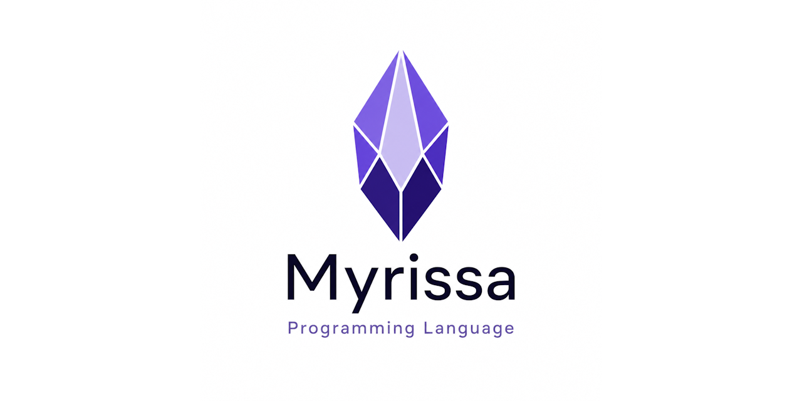

<div align="center">



</div>

<a id="what-is-myrissa"></a>

## 💎 What is Myrissa?

**Myrissa** is a zero-dependency native compiler for Windows x64 and Linux x64. It takes clean, statically-typed `.myr` source code and produces native executables, dynamic libraries, static libraries, or reusable unit modules for either platform without requiring MSVC, MinGW, GCC, an external linker, or a separate runtime.

Write a source file. Run `myrc`. Get native machine code.

```
// hello.myr
module exe hello;
begin
  println("Hello, Myrissa!");
end.
```

```
> myrc -s hello.myr -r
Hello, Myrissa!
```
  
> [!TIP]
> 💡 **Fast path:** read [Getting Started](#getting-started), skim [Language Reference](#language-reference), then jump into [How-To Guide](#how-to-guide) when you want copy-paste examples.

### 🚦 Documentation Roadmap

| Reader Goal | Start Here | Why |
|-------------|------------|-----|
| 🚀 Run your first program | [Getting Started](#getting-started) | Minimal setup, first `.myr` file, build modes, and project layout |
| 📘 Learn the language | [Language Reference](#language-reference) | Types, routines, records, objects, modules, directives, and unit tests |
| 🧾 Verify exact syntax | [BNF Grammar](#bnf-grammar) | Formal grammar rules, lexical elements, and precedence |
| 🧬 Understand how the compiler defines the language | [Langdef System](#langdef-system) | MLD meta-language: tokens, grammar, semantics, emitters |
| 🛠️ Use the toolchain | [Tools](#tools) | Compiler, debugger, CImporter, and LSP workflow |
| 🔌 Embed Myrissa | [API Reference](#api-reference) | `Myrissa.dll` lifecycle, handles, callbacks, strings, and error handling |
| 🧪 Solve a task | [How-To Guide](#how-to-guide) | Practical recipes with complete examples |

### 💡 Core Idea

Myrissa is designed around one direct workflow:

```text
write .myr  ->  run myrc  ->  get native Win64 or Linux64 output
```

The language keeps a Pascal/Oberon-style structure, but the toolchain is intentionally modern: native x64 output for both platforms, cross-compiled from a single Windows host, built-in diagnostics, built-in debugger support, built-in LSP support, and a DLL API for embedding the compiler into other tools.

> [!IMPORTANT]
> 🧱 Myrissa is not a scripting runtime that interprets source at execution time. It is a native compiler pipeline that turns source into machine code.


### ✨ Key Features

| Feature | What It Means |
|---------|---------------|
| **🧰 Zero external dependencies** | The full compiler pipeline runs in one invocation. No build system setup, no toolchain installation, and no PATH configuration. |
| **⚡ Native x64 output** | Myrissa emits x86_64 machine code directly. There is no interpreter, VM, or bytecode layer. |
| **🌍 Cross-platform targets** | Build for `win64` or `linux64` from the same source via the `@target` directive. PE output for Windows, ELF for Linux -- both cross-compiled from a single Windows host with no external toolchain. |
| **🎯 Multiple output kinds** | Compile the same source to an executable, dynamic library, static library, or reusable unit module. |
| **🐞 Built-in debugger** | Debug Adapter Protocol (DAP) support provides breakpoints, stepping, call stacks, and variable inspection. |
| **🧠 Language Server Protocol** | Real-time diagnostics, completion, hover information, go-to-definition, references, and document symbols for editor integration. |
| **🌉 CImporter** | Parse C headers and generate Myrissa bindings for C libraries such as Win32 APIs, raylib, SDL, and custom native DLLs. |
| **🔌 Embeddable API** | `Myrissa.dll` exposes a flat C-callable API so host applications can embed the compiler, debugger, CImporter, and LSP. |


### 🏗️ Architecture

```
Source (.myr)
    |
    v
+-------------------------------------------+
|  Layer 1: Language-Agnostic Engine        |
|  (reads .mld files at startup)            |
|                                           |
|  Lexer --> Pratt Parser --> AST           |
|              |                            |
|              v                            |
|  Semantics (type check, symbol resolve)   |
|              |                            |
|              v                            |
|  Emitters (IR builtins from .mld)         |
+-------------------------------------------+
    |  IR instructions
    v
+-------------------------------------------+
|  Layer 2: Native Backend                  |
|                                           |
|  IR --> SSA Optimization                  |
|              |                            |
|              v                            |
|  x64 Codegen (register alloc, encoding)   |
|              |                            |
|              v                            |
|  PE / ELF Linker (sections, imports,      |
|                   exports, relocations)   |
+-------------------------------------------+
    |
    v
Output: .exe / .dll / .lib (win64)
        elf / .so / .a    (linux64)

Layer 3: .mld definition files
(tokens, grammar, semantics, emitters -- the language itself)
```

The compiler is built as a three-layer pipeline. Layer 1 is a language-agnostic engine that reads `.mld` definition files at startup and uses them to lex, parse, analyze, and emit IR instructions. Layer 2 is the native backend that optimizes the IR through SSA passes and generates x64 machine code. Layer 3 is the `.mld` files themselves — plain-text definitions that specify everything about the Myrissa language. Change the `.mld` files and you change the language without recompiling the compiler.


### 🧩 Toolchain Map

| Component | Description |
|-----------|-------------|
| **Compiler** | Lexing, parsing, semantic analysis, IR generation, optimization, x64 code generation, and PE/ELF linking |
| **Debugger** | DAP protocol, breakpoints, stepping, variable inspection, call stacks, and source mapping |
| **🌉 CImporter** | C header parser and Myrissa binding generator for foreign function interfaces |
| **LSP Server** | Language Server Protocol support for diagnostics, completion, hover, go-to-definition, references, and document symbols |
| **Test Runner** | Built-in unit testing with assertions and automatic entry point replacement |
| **Embedding DLL** | Flat C-compatible API for host applications that need runtime compilation or tooling integration |


### 🎯 Who Is This For?

- **Game developers** who want scripting-language convenience while still compiling to native machine code. Myrissa's `subsystem.routine` API style, such as `gfx.clear` and `input.pressed`, is designed to pair naturally with the PIXELS 2D engine. Import C libraries like raylib and SDL via the built-in CImporter -- one generated binding serves both Windows and Linux.
- **Tool builders** who need an embeddable compiler. Ship `Myrissa.dll` and give your application native-code compilation at runtime.
- **Language enthusiasts** who want to study a complete native compiler stack, from parsing and SSA IR through register allocation and PE/ELF linking.
- **Windows and Linux developers** who want standalone native binaries for either platform without shipping .NET, JVM, Python, or a pile of runtime libraries.


### 📌 Current Status

The compiler stack is working end-to-end with support for:

- Primitive types: integers, floats, booleans, characters, strings, wide strings, and pointers
- Records with inheritance, packed layout, custom alignment, and bit fields
- Objects with methods, `self`/`parent`, and create/destroy lifecycle management
- Choices, sets, overlays, routine types, and variadic arguments
- Control flow: `if`, `while`, `for`, `repeat`, and `match`
- Exception handling with `guard`, `except`, `finally`, `throw`, and `throwcode`
- External function declarations with per-target library resolution
- Module imports, module qualification, public/private visibility, and lifecycle hooks
- Conditional compilation with `@define`, `@ifdef`, `@ifndef`, `@elseif`, `@else`, and `@endif`
- Built-in unit testing with assertion helpers and test runner injection
- SSA optimization passes, including Mem2Reg, constant folding, and dead code elimination
- Cross-platform targets: `win64` and `linux64` via the `@target` directive, cross-compiled from a single Windows host
- Win64 and SysV ABI calling conventions, including C-style linkage and `cpplink`
- PE generation with `.text`, `.rdata`, `.data`, `.idata`, `.edata`, `.pdata`, and `.reloc` sections; ELF generation for Linux executables, shared objects, and static libraries
- DAP debugger, LSP server, and CImporter tooling
- Official test suite: 26 test files covering every major BNF section, passing on both win64 and linux64 targets
- Language definition via `.mld` files: the entire language (tokens, grammar, semantics, emitters) is defined in editable plain-text definition files that the engine reads at startup


### 💻 System Requirements

| Area | Requirement |
|------|-------------|
| **Operating system** | Windows 10/11 x64 |
| **Compilation targets** | Windows x64 (PE) and Linux x64 (ELF), both cross-compiled from the Windows host |
| **Runtime dependencies** | None |
| **External toolchain** | None |
| **Building from source** | Delphi 12.x or higher |


### 🗺️ Table of Contents

- 🚀 [Getting Started](#getting-started): installation assumptions, first script, build modes, project layout, editor support
- 📘 [Language Reference](#language-reference): types, operators, routines, control flow, records, objects, modules, directives, and tests
- 🧾 [BNF Grammar](#bnf-grammar): formal grammar and lexical rules
- 🧬 [Langdef System](#langdef-system): MLD meta-language reference
- 🛠️ [Tools](#tools): compiler, debugger, CImporter, and LSP server
- 🔌 [API Reference](#api-reference): `Myrissa.dll` C API for embedding
- 🧪 [How-To Guide](#how-to-guide): practical recipes for common tasks

<a id="getting-started"></a>

## 🚀 Getting Started

This section gets you from an empty folder to a running native executable. For language details, see [Language Reference](#language-reference). For task-based examples, see [How-To Guide](#how-to-guide).


### 🧰 Requirements

- Windows 10 or later, x64
- No external compiler, linker, SDK, runtime, or package manager

> [!NOTE]
> 🧰 Myrissa is self-contained. The compiler, optimizer, linker, runtime support, debugger, CImporter, and LSP tooling are built in.

### 🧭 Mental Model

A Myrissa project is just source files plus the `myrc` compiler. There is no external linker project, no runtime package folder, and no separate SDK install.

| Concept | Meaning |
|---------|---------|
| 📄 `.myr` | Human-written source file |
| 📦 `.myr` unit | Reusable module compiled inline into the importer |
| 🚀 `module exe` | Native executable entry point |
| 🧩 `module dll` | Dynamic library with exported routines |
| 🧱 `module lib` | Static library output |

> [!TIP]
> 🧠 Think of the first line of every file as the build contract. `module exe hello;` says what the file produces and what the module is called.


### 👋 Your First Script

Create a file named `hello.myr`:

```
module exe hello;

begin
  println("Hello, Myrissa!");
end.
```

Compile and run it:

```
myrc -s hello.myr -r
```

Expected output:

```
Hello, Myrissa!
```

The command compiles `hello.myr` to a native executable and runs it. The default target is `win64`; add `@target linux64;` to the source to cross-compile a native Linux binary from the same Windows host.

> [!TIP]
> Every source file starts with a `module` declaration. The declaration defines the module kind (`exe`, `dll`, `lib`, or `unit`) and the module name.


### 🏗️ Build Modes

Myrissa can produce several target types. The output type is determined by the `module` declaration in the source file:

| Module Declaration | Output (win64 / linux64) | Description |
|-------------------|--------------------------|-------------|
| `module exe name` | `name.exe` / `name` | Native executable |
| `module dll name` | `name.dll` / `name.so` | Dynamic library with exported routines |
| `module lib name` | `name.lib` / `name.a` | Static library, linkable by Myrissa or other compilers |
| `module unit name` | (none) | Reusable module compiled inline into the importing module |

Common CLI patterns:

| Command | Effect |
|---------|--------|
| `myrc -s hello.myr` | Compile only |
| `myrc -s hello.myr -r` | Compile and run |
| `myrc -s hello.myr -o build` | Compile with custom output path |
| `myrc -s hello.myr -d` | Compile and launch the debugger |


#### EXE: Standalone Executable

The default mode produces a native executable with no runtime dependencies -- a PE executable on `win64`, an ELF executable on `linux64`:

```
module exe myapp;
begin
  println("Running as a standalone .exe");
end.
```


#### DLL: Dynamic Link Library

Use `module dll` and mark exported routines as `public`:

```
module dll mylib;

public routine calculate(x: int32; y: int32): int32;
begin
  return x * x + y * y;
end;

end.
```


#### Static Library

Use `module lib` to produce a static library (`.lib` on win64, `.a` on linux64) that can be linked by Myrissa or any other compiler that supports the target's static library format:

```
module lib mathlib;

public routine add(a: int32; b: int32): int32;
begin
  return a + b;
end;

end.
```


#### Unit Modules

Unit modules are reusable `.myr` source files that other modules can import. When a module imports a unit, the unit is compiled inline into the importing module -- there is no separate output file:

```
module unit helpers;

public routine double(n: int32): int32;
begin
  return n * 2;
end;

end.
```

Import the unit from another module:

```
module exe main;

import helpers;

begin
  println("%d", helpers.double(21));   // 42
end.
```

> [!IMPORTANT]
> 📥 Imported symbols must be accessed with full module qualification. Use `helpers.double`, not `double`. This keeps imports explicit and prevents symbol conflicts between modules.


### 🗂️ Project Structure

A typical project keeps the executable entry point separate from reusable unit modules:

```
myproject/
  main.myr          // entry point (module exe)
  utils.myr         // utility module (module unit)
  mathlib.myr       // math library (module unit)
  assets/           // game assets, resources, data files
```

For larger projects, use `@libpath` to add module search directories:

```
@libpath "libs";
import mathlib;
```

> [!TIP]
> 💡 Keep units small and focused. Because imports require module qualification, names stay readable even when a project grows.


### ✅ First-Project Checklist

Before moving from a tiny sample to a real project, verify these basics:

- 🧪 A `module exe` file builds and runs from the command line
- 📦 Shared code lives in `module unit` files
- 📥 Imports use full module qualification, such as `helpers.double(21)`
- 🗂️ Reusable units are kept in predictable folders
- 🔎 `@libpath` points to any folder that contains imported units
- 🧯 Errors are fixed at the first reported source location before chasing follow-up messages

### 🧯 Common First-Run Issues

| Symptom | Likely Cause | Fix |
|---------|--------------|-----|
| `module not found` | Unit file is not in the current folder or `@libpath` | Add `@libpath "folder"` or move the unit next to the main file |
| `unknown symbol` | Imported symbol was called without module qualification | Use `moduleName.symbolName` |
| Output is not what you expected | The default command compiled and ran the EXE immediately | Use `-o output.exe` when you only want to build |
| DLL routine is not visible | Routine is missing `public` | Mark exported routines as `public` |

> [!NOTE]
> 🧩 Myrissa favors explicitness. Fully qualified imports and clear module kinds make larger projects easier to understand.

### 🧠 Editor Support

Myrissa includes a Language Server Protocol (LSP) implementation for real-time IDE features:

| Feature | Description |
|---------|-------------|
| Diagnostics | Errors and warnings as you type |
| Completion | Context-aware suggestions for keywords, types, routines, and symbols |
| Hover | Type and documentation information on mouse hover |
| Go-to-definition | Jump to symbol declarations |
| Document symbols | Outline view of the current module |
| References | Find usages of a symbol |

The LSP server communicates over stdin/stdout using JSON-RPC and works with editors that support LSP, including VS Code.


#### 🐞 Debugger Integration

The built-in debugger supports the Debug Adapter Protocol (DAP), which enables a graphical debugging workflow in VS Code and other DAP-capable editors:

- Set breakpoints from the editor gutter or with `@breakpoint`
- Step into, over, and out of routines
- Inspect variables and watch expressions
- Navigate the call stack

See [Tools](#tools) for detailed debugger and LSP documentation.

<a id="language-reference"></a>

## 📘 Language Reference

Myrissa is a statically-typed, compiled language with Pascal/Oberon-inspired syntax. It is case-sensitive, uses `end` to close blocks, and compiles directly to native x64 machine code with zero external dependencies.

Use this section as the practical language reference. For the formal grammar, see [BNF Grammar](#bnf-grammar). For complete examples, see [How-To Guide](#how-to-guide).

> [!NOTE]
> ✍️ Myrissa uses `:=` for assignment and `=` for equality comparison. Keywords are lowercase and case-sensitive. Semicolons terminate declarations but are optional after statements.

### 🧭 Language Model at a Glance

Myrissa uses a small set of consistent rules across the whole language:

| Rule | What to Remember |
|------|------------------|
| 🧱 Static types | Every variable, field, parameter, and routine result has a known type |
| ✍️ Assignment | `:=` assigns a value; `=` compares values |
| 🔤 Case-sensitive names | `Value`, `value`, and `VALUE` are different identifiers |
| 🚪 Block endings | Structured blocks close with `end` |
| 📦 Modules | Every source file starts with a `module` declaration |
| 📥 Imports | Imported symbols are accessed through `moduleName.symbolName` |
| 🧪 Tests | Unit test modules can use built-in assertion helpers |

> [!TIP]
> 💎 When reading Myrissa code, scan for `module`, then `import`, then declarations, then the final `begin ... end.` body. That gives you the shape of the file quickly.


### 💬 Comments

```
// single-line comment

/* multi-line
   comment */

/* block comments /* can be nested */ like this */
```

Line comments begin with `//` and extend to the end of the line. Block comments use `/* ... */` and may be nested to any depth.

> [!NOTE]
> 💎 Myrissa does not use `(* *)` or `{ }` as comment delimiters.


### 🧱 Types

Myrissa has a concrete type system that maps directly to machine reality. Primitive values have known sizes at compile time, and aggregate types such as records, arrays, overlays, and objects are built from those primitives.

#### 🔢 Integer Types

| Type | Size | Range |
|------|------|-------|
| `int8` | 1 byte | -128 to 127 |
| `int16` | 2 bytes | -32,768 to 32,767 |
| `int32` | 4 bytes | -2,147,483,648 to 2,147,483,647 |
| `int64` | 8 bytes | Full 64-bit signed range |
| `uint8` | 1 byte | 0 to 255 |
| `uint16` | 2 bytes | 0 to 65,535 |
| `uint32` | 4 bytes | 0 to 4,294,967,295 |
| `uint64` | 8 bytes | Full 64-bit unsigned range |

#### 🧮 Floating-Point Types

| Type | Size | Description |
|------|------|-------------|
| `float32` | 4 bytes | 32-bit IEEE 754 |
| `float64` | 8 bytes | 64-bit IEEE 754 |

Float literals without a suffix are resolved from context. If the context is ambiguous, the compiler uses `float64`. Append `f` or `F` to force `float32`:

```
var x: float64 = 3.14159;       // float64
var y: float32 = 3.14f;         // float32
```

#### ✅ Boolean Type

| Type | Size | Values |
|------|------|--------|
| `boolean` | 1 byte | `true`, `false` |

#### 🔤 Character Types

| Type | Size | Description |
|------|------|-------------|
| `char` | 1 byte | 8-bit character |
| `wchar` | 2 bytes | 16-bit wide character |

Characters are assigned using single-character string literals. The compiler verifies the literal is exactly one character:

```
var c: char = "A";
var wc: wchar = w"B";
```

#### 🧵 String Types

| Type | Size | Description |
|------|------|-------------|
| `string` | 8 bytes (pointer) | Managed UTF-8 string |
| `wstring` | 8 bytes (pointer) | Managed UTF-16 string |

```
var name: string = "Myrissa";
var wide: wstring = w"Hello, world!";
```

Escape sequences: `\n` (newline), `\t` (tab), `\r` (carriage return), `\0` (null), `\\` (backslash), `\"` (quote), `\xNN` (hex byte).

#### 📍 Pointer Type

| Type | Size | Description |
|------|------|-------------|
| `pointer` | 8 bytes | Untyped pointer |

Typed pointers and pointer operations are described in the [Pointers](#pointers) section below.

> [!TIP]
> Integer literals default to `int32`. Hex literals use `0x` prefix: `var flags: uint32 = 0xFF00;`


### 📦 Variables

Variables are declared with `var` and require an explicit type. An initializer is optional; variables without one are default-initialized:

```
var x: int32 = 42;
var name: string = "Myrissa";
var pi: float64 = 3.14159;
var count: int32;              // default zero-initialized
```

Multiple variables can appear in a `var` section:

```
var
  width: int32 = 800;
  height: int32 = 600;
  title: string = "My App";
```


### 🔒 Constants

Constants are declared with `const` and must provide an initial value:

```
const MAX_SIZE: int32 = 1024;
const GREETING: string = "Hello";
const PI: float64 = 3.14159265358979;
```


### 🏷️ Type Aliases

Use `type` aliases to give an existing type a domain-specific name:

```
type
  Byte = uint8;
  Word = uint16;
  Size = int64;
```


### ⚙️ Operators

#### ➕ Arithmetic

| Operator | Description |
|----------|-------------|
| `+` | Addition |
| `-` | Subtraction |
| `*` | Multiplication |
| `/` | Division (float) |
| `div` | Integer division |
| `mod` | Modulo (remainder) |

#### ⚖️ Comparison

| Operator | Description |
|----------|-------------|
| `=` | Equal |
| `<>` | Not equal |
| `<` | Less than |
| `>` | Greater than |
| `<=` | Less than or equal |
| `>=` | Greater than or equal |
| `in` | Set membership |

#### 🔀 Logical

| Operator | Description |
|----------|-------------|
| `and` | Logical AND |
| `or` | Logical OR |
| `not` | Logical NOT |
| `xor` | Logical XOR |

#### 🧬 Bitwise

| Operator | Description |
|----------|-------------|
| `and` | Bitwise AND (context-dependent) |
| `or` | Bitwise OR (context-dependent) |
| `xor` | Bitwise XOR (context-dependent) |
| `shl` | Shift left |
| `shr` | Shift right |

#### ✍️ Assignment

| Operator | Description |
|----------|-------------|
| `:=` | Assignment |
| `+=` | Add and assign |
| `-=` | Subtract and assign |
| `*=` | Multiply and assign |
| `/=` | Divide and assign |

#### 🎚️ Operator Precedence (Highest to Lowest)

| Precedence | Operators |
|------------|-----------|
| 1 (highest) | `not`, unary `-`, unary `+`, `address of` |
| 2 | `*`, `/`, `div`, `mod`, `and`, `shl`, `shr` |
| 3 | `+`, `-`, `or`, `xor` |
| 4 (lowest) | `=`, `<>`, `<`, `>`, `<=`, `>=`, `in` |


### 🔧 Routines

Functions and procedures are both declared with the `routine` keyword. A routine with a return type behaves as a function; a routine without a return type behaves as a procedure:

```
routine add(const a: int32; const b: int32): int32;
begin
  return a + b;
end;

routine greet(const name: string);
begin
  println("Hello, " + name);
end;
```

#### 📨 Parameter Modes

| Mode | Description |
|------|-------------|
| `const` | Read-only (default convention) |
| `var` | Pass by reference, caller sees modifications |
| (none) | Value parameter |

#### 🧺 Variadic Arguments

Routines can accept a variable number of arguments using `...`:

```
routine print_all(...);
var
  i: int32;
begin
  for i := 0 to varargs.count - 1 do
    println(varargs.next(string));
  end;
end;
```

Access variadic arguments through the `varargs` intrinsic:

| Expression | Description |
|------------|-------------|
| `varargs.count` | Total number of variadic arguments |
| `varargs.next(Type)` | Retrieve and consume the next argument as the given type |
| `varargs.get(Index, Type)` | Retrieve the argument at `Index` as the given type (no cursor advance) |
| `varargs.reset()` | Reset the cursor back to the first argument |
| `varargs.copy()` | Copy the current varargs cursor position |

#### 🌉 External Routines

Call functions from DLLs by declaring routines with an `external` clause:

```
routine MessageBoxA(const hwnd: pointer; const text: string;
  const caption: string; const flags: uint32): int32;
  external "user32.dll";

MessageBoxA(nil, "Hello from Myrissa!", "Greeting", 0);
```

The value after `external` can also be an **identifier** naming a module-level string constant; the constant's value is used as the library name. This keeps the library name in one place across many external declarations:

```
public const DLL_NAME: string = "raylib";

routine InitWindow(const width: int32; const height: int32;
  const title: pointer); external DLL_NAME;
```

**Extension resolution rules** for the library name:

- `.lib` / `.a` -- static import library.
- `.dll` / `.so` / `.so.<version>` -- dynamic import.
- **Extensionless** -- the library search paths are probed for a static library first; if found, static import. Otherwise dynamic: on linux64 the search paths are probed for `lib<n>.so.<version>`, `lib<n>.so`, then `<n>.so` (the found filename becomes the runtime dependency); if no probe hits, the target's default shared-library extension is appended.

An extensionless name like `DLL_NAME = "raylib"` therefore resolves correctly on both targets from a single binding.

#### 🔗 C++ Linkage and Overloading

Use `cpplink` when a routine needs C++-compatible linkage with Itanium ABI name mangling. This enables routine overloading and interoperability with C++ libraries:

```
routine cpplink add(const x: int32; const y: int32): int32;
begin
  return x + y;
end;

routine cpplink add(const x: float64; const y: float64): float64;
begin
  return x + y;
end;
```

Overloaded routines with `cpplink` can be exported from and imported into `.dll` and `.lib` files. Without `cpplink`, routines use C calling convention and naming, which does not support overloading.

#### ☎️ Routine Types

Routines are first-class types. Declare a routine type and use it as a callback or function pointer:

```
type
  TCompareFunc = routine(const a: int32; const b: int32): int32;

routine compare_ascending(const a: int32; const b: int32): int32;
begin
  return a - b;
end;

var
  cmp: TCompareFunc;
begin
  cmp := compare_ascending;
  println(cmp(3, 7));
end;
```

> [!TIP]
> Routine types use C calling convention by default. Add `cpplink` for C++ ABI compatibility.


### 🚦 Control Flow

#### 🔀 If/Else

```
if x > 0 then
  println("positive");
else
  println("non-positive");
end;
```

The `else` branch is optional. There is no `elif` -- use nested `if` inside `else`:

```
if x > 0 then
  println("positive");
else
  if x < 0 then
    println("negative");
  else
    println("zero");
  end;
end;
```

#### 🔁 While Loop

```
var i: int32 = 0;
while i < 10 do
  println(i);
  i += 1;
end;
```

#### 🔂 For Loop

```
for i := 0 to 9 do
  println(i);
end;

for i := 9 downto 0 do
  println(i);
end;
```

The loop variable is declared implicitly by the `for` statement.

#### 🔄 Repeat/Until

```
var i: int32 = 0;
repeat
  println(i);
  i += 1;
until i >= 10;
```

The body executes at least once. The loop exits when the condition becomes true.

#### ⏭️ Break and Continue

`break` exits the innermost loop immediately; `continue` skips to the next
iteration. Both are valid only inside a `while`, `for`, or `repeat` body --
using them anywhere else is a compile error. In a `for` loop, `continue`
still performs the iterator step before the bound is re-tested.

```
// Find the first index of a value; stop scanning once found
var found: int32 = -1;
for i := 0 to 9 do
  if data[i] = target then
    found := i;
    break;
  end;
end;

// Sum only even numbers
var sum: int32 = 0;
for i := 0 to 100 do
  if (i mod 2) <> 0 then
    continue;
  end;
  sum += i;
end;
```

#### 🎯 Match Statement

Use `match` for value-based branching. Match arms can contain single values, comma-separated values, or ranges:

```
match value of
  1: println("one");
  2: println("two");
  3..5: println("three to five");
  else
    println("other");
end;
```

Multiple values can share a case:

```
match ch of
  "a", "e", "i", "o", "u": println("vowel");
  else
    println("consonant");
end;
```

### 📋 Records

Records are value types with named fields. They are useful for compact structured data, binary layouts, and C interop:

```
type
  Point = record
    x: float32;
    y: float32;
  end;

var p: Point;
p.x := 10.0;
p.y := 20.0;
```

#### 🧬 Record Inheritance

Records can inherit from a base record:

```
type
  Shape = record
    x: int32;
    y: int32;
  end;

  Circle = record(Shape)
    radius: float32;
  end;

var c: Circle;
c.x := 100;
c.y := 200;
c.radius := 50.0;
```

#### 📦 Packed Records

Use `record packed` when fields must be stored without padding between them:

```
type
  Header = record packed
    magic: uint16;
    version: uint8;
    flags: uint8;
  end;
```

#### 📐 Custom Alignment

```
type
  AlignedData = record align(16)
    values: array[4] of float32;
  end;
```

#### 🧩 Bit Fields

Fields can specify a bit width for compact binary layouts:

```
type
  Flags = record packed
    visible: uint8 : 1;
    enabled: uint8 : 1;
    priority: uint8 : 3;
    reserved: uint8 : 3;
  end;
```

#### 📝 Record Literals

Construct records inline:

```
type
  Color = record
    r: uint8;
    g: uint8;
    b: uint8;
  end;

var red: Color = Color(r: 255, g: 0, b: 0);
```


### 📚 Arrays

Fixed-size arrays declare their element count or explicit bounds at compile time:

```
var numbers: array[10] of int32;
numbers[0] := 42;
numbers[9] := 100;
```

Arrays can also use explicit range bounds:

```
var grid: array[0..7] of int32;
```

#### 📈 Dynamic Arrays

Arrays declared without bounds are dynamic:

```
var items: array of int32;
setlength(items, 10);
items[0] := 42;
println(len(items));    // 10
```

Use `setlength` to resize and `len` to query the current length.


### 🎛️ Choices (Enumerations)

Myrissa uses `choices` for enumeration-style values:

```
type
  TColor = choices(Red = 0, Green = 1, Blue = 2);
  TDirection = choices(North, South, East, West);
```

Choices values can be assigned explicit integer values. Access values with type qualification:

```
var c: TColor;
c := TColor.Green;
println("%d", int32(c));   // prints 1

match int32(c) of
  0: println("red");
  1: println("green");
  2: println("blue");
end;
```


### 🧮 Sets

Sets represent compact collections of values and are tested with the `in` operator:

```
var s: set;
s := [1, 3, 5, 7];
if 3 in s then
  println("3 is in set");
end;
if not (4 in s) then
  println("4 is not in set");
end;
```

Sets can also be declared with explicit ranges:

```
type
  CharSet = set of 0..255;
```

Set literals use square brackets with optional ranges:

```
var digits: set = [0..9];
var evens: set = [0, 2, 4, 6, 8];
```

Use the `in` operator to test membership.


### 🧊 Overlays (Unions)

Overlays share storage between fields. They are Myrissa's union-style data structure:

```
type
  Value = overlay
    as_int: int32;
    as_float: float32;
    as_bytes: array[4] of uint8;
  end;

var v: Value;
v.as_int := 42;
println(v.as_bytes[0]);   // low byte of 42
```

#### 👻 Anonymous Overlays in Records

Overlays can nest inside records for C-style union-in-struct patterns:

```
type
  Variant = record
    kind: int32;
    overlay
      int_val: int64;
      float_val: float64;
      str_val: string;
    end;
  end;
```


### 🏛️ Objects

Objects are heap-allocated reference types with methods, create/destroy lifecycle management, and single inheritance. Objects are always used through typed pointers; the `.` operator auto-dereferences object pointers:

```
type
  TCounter = object
    value: int32;

    method increment();
    begin
      self.value := self.value + 1;
    end;

    method get_value(): int32;
    begin
      return self.value;
    end;
  end;

var c: pointer to TCounter;
begin
  create(c);
  c.value := 0;
  c.increment();
  c.increment();
  println("count: %d", c.get_value());   // count: 2
  destroy(c);
end;
```

#### 🧬 Object Inheritance

```
type
  TBase = object
    x: int32;

    method get_x(): int32;
    begin
      return self.x;
    end;

    method describe(): int32;
    begin
      return self.x * 10;
    end;
  end;

  TDerived = object(TBase)
    y: int32;

    method sum(): int32;
    begin
      return self.x + self.y;
    end;

    method describe(): int32;
    begin
      return parent.describe() + self.y;
    end;
  end;

var d: pointer to TDerived;
begin
  create(d);
  d.x := 7;
  d.y := 3;
  println("describe: %d", d.describe());   // parent.describe() + y = 73
  destroy(d);
end;
```

Use `self` to access the current object's fields and methods. Use `parent` to call the base object's methods.

#### ♻️ Object Lifecycle

| Statement | Description |
|-----------|-------------|
| `create(obj)` | Allocate and initialize an object instance |
| `destroy(obj)` | Finalize and free an object instance |

> [!WARNING]
> Objects are always declared as `pointer to TMyObject` and allocated with `create`. Every `create` must have a matching `destroy` to avoid memory leaks.


### 📍 Pointers

Myrissa supports typed and untyped pointers for low-level memory access:

```
type
  PInt32 = pointer to int32;

var
  x: int32 = 42;
  p: PInt32;
begin
  p := address of x;
  println(p^);           // dereference: prints 42
  p^ := 100;            // write through pointer
  println(x);            // prints 100
```

| Operation | Syntax | Description |
|-----------|--------|-------------|
| Address-of | `address of expr` | Get a pointer to a variable |
| Dereference | `expr^` | Follow a pointer to its value |

Const pointers prevent writes through the pointer:

```
type
  PConstInt = pointer to const int32;
```


### 🧠 Memory Management

Myrissa provides direct memory-management intrinsics for object allocation, raw blocks, and dynamic arrays:

| Statement | Description |
|-----------|-------------|
| `getmem(ptr)` | Allocate a block of memory |
| `freemem(ptr)` | Free a previously allocated block |
| `resizemem(ptr, size)` | Resize an allocated block |
| `setlength(arr, size)` | Resize a dynamic array |


### 🛡️ Exception Handling

Myrissa uses `guard/except/finally` for structured exception handling:

```
guard
  println("in guard");
finally
  println("finally runs always");
end;
```

With exception catching:

```
guard
  println("before throw");
  throw(42);
  println("this never runs");
except
  println("caught exception");
end;

println("continues after guard");
```

| Keyword | Description |
|---------|-------------|
| `guard` | Begins a protected block |
| `except` | Handles exceptions from the guard block |
| `finally` | Cleanup code that always runs (with or without exception) |
| `throw(expr)` | Raise an exception |
| `throwcode(code, msg)` | Raise an exception with a numeric code and message |
| `exccode()` | Get the exception code (inside `except` block) |
| `excmsg()` | Get the exception message (inside `except` block) |

> [!NOTE]
> A `guard` block requires either `except` or `finally` (or both). When both are present, `except` comes first.


### ⚡ Intrinsics

Intrinsics are built-in operations recognized directly by the compiler:

| Intrinsic | Description |
|-----------|-------------|
| `len(expr)` | Length of a string, wide string, or dynamic array |
| `size(Type)` | Byte size of a type or expression |
| `utf8(wideStr)` | Convert a wide string to a newly allocated raw UTF-8 buffer (`char*`). The caller owns the buffer |
| `cstr(str)` | Borrowed raw UTF-8 `char*` into an existing string's own storage. Allocates nothing, must never be freed, valid only while the string is alive |
| `wstr(str)` | Borrowed UTF-16 `wchar*` of a string. The runtime widens once and caches the buffer on the string itself, so repeat calls are free and it must never be freed by the caller |
| `paramcount()` | Number of command-line arguments |
| `paramstr(n)` | Get command-line argument by index |
| `print(...)` | Print values without newline |
| `println(...)` | Print values with newline |


### 🧱 Modules

Every Myrissa source file is a module. The module declaration specifies what the compiler should produce and what the module is called:

```
module exe myapp;

// declarations...

begin
  // entry point
  println("Hello!");
end.
```

#### 🧭 Module Kinds

| Kind | Description | Output |
|------|-------------|--------|
| `exe` | Standalone executable | `.exe` |
| `dll` | Dynamic link library | `.dll` |
| `lib` | Static library | `.lib` |
| `unit` | Reusable module (compiled inline into importer) | (none) |

#### 📥 Imports and Module Qualification

Import other modules with the `import` statement. All imported symbols must be accessed with full module qualification:

```
module exe main;

import mathutils;

begin
  println(mathutils.add(2, 3));
end.
```

> [!IMPORTANT]
> Unqualified access to imported symbols is a compile error. If modules A and B both export `Foo`, they are accessed as `A.Foo` and `B.Foo` -- no ambiguity.

#### 👁️ Visibility

Declarations can be marked `public` to make them accessible from importing modules:

```
public routine add(const a: int32; const b: int32): int32;
begin
  return a + b;
end;
```

Declarations without `public` are private to the module.

#### 🚪 Initialize and Finalize

Modules can have lifecycle hooks that run at startup and shutdown:

```
module exe myapp;

initialize
  println("Starting up...");
end;

finalize
  println("Shutting down...");
end;

begin
  println("Main body");
end.
```

`initialize` runs before the main body. `finalize` runs after the main body completes. Both are optional and supported on all module kinds.


### 🎛️ Directives

Directives are compile-time instructions prefixed with `@`. Every directive is terminated by `;`, with one exception: the seven conditional-compilation directives (`@define`, `@undef`, `@ifdef`, `@ifndef`, `@elseif`, `@else`, `@endif`) take no terminator. Enumerated values (like `console` or `full`) are written as bare identifiers; quoted strings are reserved for paths and free text.

#### 📄 Module Directives

| Directive | Description |
|-----------|-------------|
| `@exeicon "path";` | Set the application icon (Windows EXE only) |
| `@resfile "path";` | Link a compiled resource file (.res) |
| `@outputpath "path";` | Set the output directory |
| `@copydll "path";` | Copy a DLL/shared library to the output directory during build |
| `@linklibrary "path";` | Link an additional static or shared library into the output |
| `@libpath "path";` | Add a library search path |
| `@modulepath "path";` | Add a module (unit) search path |
| `@includepath "path";` | Add an include search path |
| `@subsystem <mode>;` | Set the application subsystem to `console` (default) or `gui`. Windows-only: on linux64 it produces a warning and is ignored |
| `@target <platform>;` | Set the compilation target to `win64` (default) or `linux64`. Must appear in the root module |
| `@optimize <level>;` | Set the optimization level: `debug`, `none`, `basic`, or `full` |
| `@unittestmode <state>;` | Enable (`on`) or disable (`off`) test block compilation |

#### 📁 Path Resolution

Every directive that takes a `"path"` resolves it the same way. Absolute paths
are used as-is. A relative path resolves against the directory of the module
that declares it, so a module and the files it references travel together.

An optional prefix overrides that base:

| Prefix | Resolves against | Use for |
|--------|------------------|---------|
| `$P:` | Directory of the compiler executable | Assets shipped with the compiler |
| `$D:` | Current working directory | Paths relative to where the compiler ran |
| `$S:` | Declaring module's directory (the default, said out loud) | Mixed-base modules |

The prefix is matched case-insensitively at the start of the string only.

Use `$P:` in any module that will be imported from another folder. Without it,
a vendor binding's `@copydll` resolves against the binding's own directory and
breaks the moment the module is used from somewhere else:

```
@copydll "$P:res/libs/vendor/raylib/win64/raylib.dll";
@libpath "$P:res/libs/vendor/raylib";
@exeicon "$P:res/assets/icons/myrissa.ico";
```


#### 🏷️ Version Information Directives

| Directive | Description |
|-----------|-------------|
| `@addverinfo <state>;` | Enable (`on`) or disable (`off`) version information embedding |
| `@vimajor number;` | Major version number |
| `@viminor number;` | Minor version number |
| `@vipatch number;` | Patch version number |
| `@viproductname "name";` | Product name |
| `@videscription "text";` | File description |
| `@vifilename "name";` | Original filename |
| `@vicompanyname "name";` | Company name |
| `@vicopyright "text";` | Copyright string |

#### 🧾 Statement Directives

| Directive | Description |
|-----------|-------------|
| `@breakpoint;` | Insert a debugger breakpoint (takes no value) |
| `@message <severity> "text";` | Emit a compile-time diagnostic at severity `hint`, `warn`, `error`, or `fatal` |

#### 📦 Using Vendor Library Bindings

Generated vendor bindings are unit modules that declare the library's routines with `external DLL_NAME;` against a single `public const DLL_NAME: string = "...";`, and carry a target-conditional `@copydll` block in their own header:

```
module unit RayLib;

@ifdef TARGET_WIN64
  @copydll "$P:res/libs/vendor/raylib/win64/raylib.dll";
@elseif TARGET_LINUX64
  @copydll "$P:res/libs/vendor/raylib/linux64/libraylib.so.550";
@else
  @message error "RayLib: unsupported target";
@endif

public const
  DLL_NAME: string = "raylib";
```

A consumer only adds the vendor folder to the search path and imports the binding module:

```
module exe demo;

@libpath "$P:res/libs/vendor/raylib";
@libpath "$P:res/libs/vendor/raylib/linux64";   // .so probing on linux64

import RayLib;

begin
  RayLib.InitWindow(800, 600, utf8(w"Demo"));
  // ...
end.
```

The extensionless `DLL_NAME` resolves per target (see External Routines), the binding's target-conditional `@copydll` places the right shared library next to the output, and on linux64 the found `.so` filename becomes the runtime dependency, loaded from the executable's own directory.


### 🔀 Conditional Compilation

Conditional compilation lets a source file include or exclude code based on defined symbols:

```
@define VERBOSE

@ifdef VERBOSE
  println("Debug: entering main loop");
@endif

@ifdef TARGET_WIN64
  println("Running on 64-bit Windows");
@elseif TARGET_LINUX64
  println("Running on 64-bit Linux");
@endif
```

The conditional directives take no terminating semicolon. They also work inside imported unit modules, evaluated with the root module's defines (e.g. `TARGET_WIN64`), so a single unit can carry target-specific code for all importers.

| Directive | Description |
|-----------|-------------|
| `@define SYM` | Define a symbol |
| `@undef SYM` | Undefine a symbol |
| `@ifdef SYM` | Compile if symbol is defined |
| `@ifndef SYM` | Compile if symbol is not defined |
| `@elseif SYM` | Alternative branch with condition |
| `@else` | Alternative branch |
| `@endif` | End conditional block |

#### 🏁 Predefined Symbols

| Symbol | Defined When |
|--------|-------------|
| `MYRISSA` | Always |
| `CPUX64` | Always (x64-only architecture) |
| `APPTYPE_CONSOLE` | Always |
| `WINDOWS`, `MSWINDOWS`, `WIN64`, `TARGET_WIN64` | Target is `win64` |
| `LINUX`, `TARGET_LINUX64` | Target is `linux64` |
| `DEBUG` | Optimization level is `none` |
| `RELEASE` | Optimization level is not `none` |
| `BUILD_EXE` | Module kind is `exe` (or unknown) |
| `BUILD_DLL` | Module kind is `dll` |
| `BUILD_LIB` | Module kind is `lib` |


### 🧪 Unit Testing

Test blocks appear after the module's `end.` marker and are compiled only when `@unittestmode on;` is active. In test mode, the compiler replaces the normal entry point with the test runner.

```
module exe mathlib;

@unittestmode on;

routine add(const a: int32; const b: int32): int32;
begin
  return a + b;
end;

end.

test "add returns correct sum"
var
  result: int32;
begin
  result := add(2, 3);
  asserteq(5, result);
end;

test "add handles negatives"
begin
  asserteq(-2, add(-5, 3));
  asserteq(-8, add(-5, -3));
end;
```

#### ✅ Assertion Functions

| Assertion | Description |
|-----------|-------------|
| `assert(expr)` | Fails if expression is false |
| `asserttrue(expr)` | Fails if expression is not true |
| `assertfalse(expr)` | Fails if expression is not false |
| `asserteq(expected, actual)` | Fails if values are not equal (type-dispatched) |
| `asserteqf(expected, actual, epsilon)` | Float equality within a tolerance; fails if the difference exceeds `epsilon` |
| `assertnil(expr)` | Fails if expression is not nil |
| `assertnotnil(expr)` | Fails if expression is nil |
| `assertfail("message")` | Unconditional failure with a message |

All assertions continue after failure -- failures accumulate and are reported per test. The compiler injects source file and line number automatically.

> [!TIP]
> Test blocks have access to all module declarations. Use tests to verify routines, types, and module behavior without building a separate test harness.

### 🧯 Practical Gotchas

These are not new syntax rules. They are the small details that tend to matter most when reading or writing real Myrissa code.

| Area | Watch For |
|------|-----------|
| 🧵 Strings | `string` and `wstring` are different widths. Use `w"..."` for wide strings. |
| 🔤 Characters | `char` and `wchar` are assigned from single-character string literals and checked semantically. |
| 📍 Pointers | Use address and dereference operations deliberately. Width mismatches should be treated as real bugs. |
| 📦 Records | Packed layout, custom alignment, and bit fields affect binary compatibility. Document layout-sensitive records clearly. |
| 🧩 Objects | `create` and `destroy` model lifecycle. Keep ownership rules obvious. |
| 📥 Imports | Imported routines should be called with module qualification to avoid ambiguity. |
| 🧪 Assertions | Use `asserteq(expected, actual)` consistently so failures read clearly. |

### 🧠 Reading Order for This Reference

For a first pass, read these sections in order:

1. 🚀 Types, variables, constants, and operators
2. 🔧 Routines and parameter modes
3. 🚦 Control flow
4. 📋 Records, arrays, choices, sets, and overlays
5. 🏛️ Objects and lifecycle
6. 📥 Modules, imports, directives, and unit tests

After that, use this file as a lookup reference while writing code.

<a id="bnf-grammar"></a>

## 🧾 BNF Grammar

### 🧾 Syntax Notation

This section is the formal grammar reference for Myrissa. It is intended for implementers, tooling authors, and anyone who needs exact syntax rules. For an easier language walkthrough, see [Language Reference](#language-reference).

The grammar uses EBNF notation. Brackets `[` and `]` mark optional elements. Braces `{` and `}` mark repetition, zero or more times. Parentheses group alternatives. The vertical bar `|` separates alternatives. Terminal symbols are enclosed in quotes or written as lowercase literal tokens. Non-terminals are written in PascalCase.


> [!NOTE]
> 🧾 This file is intentionally formal. Use it when you need the exact grammar contract. Use the [Language Reference](#language-reference) for explanations and the [How-To Guide](#how-to-guide) for examples.

### 🔎 How to Read This Grammar

| Symbol | Meaning |
|--------|---------|
| `A B` | `A` followed by `B` |
| `A | B` | either `A` or `B` |
| `[ A ]` | optional `A` |
| `{ A }` | zero or more repetitions of `A` |
| `( A | B )` | grouped alternatives |
| `"text"` | literal source text |

> [!TIP]
> 💡 When implementing a parser, treat this file as the external behavior contract, not as a required internal parser architecture. Recursive descent, Pratt parsing, table-driven parsing, or another strategy can all implement the same grammar.


### 🔤 1. Lexical Elements

```
letter     = "A" | ... | "Z" | "a" | ... | "z" | "_" .
digit      = "0" | ... | "9" .
hexDigit   = digit | "A" | ... | "F" | "a" | ... | "f" .
character  = (* any source character except the delimiter *) .
newline    = (* line feed (U+000A) *) .

ident      = letter { letter | digit } .
integer    = digit { digit } | "0" ( "x" | "X" ) hexDigit { hexDigit } .
float_literal = digit { digit } "." { digit } [ exponent ] [ "f" | "F" ] .
exponent      = ( "e" | "E" ) [ "+" | "-" ] digit { digit } .
cstring    = '"' { character | escapeSeq } '"' .
wstring    = "w" '"' { character | escapeSeq } '"' .
escapeSeq  = "\" ( "n" | "t" | "r" | "0" | "\" | "'" | '"' | "x" hexDigit hexDigit ) .
```

#### 🔢 Numeric Literal Type Rules

| Literal         | Suffix | Type      | Example         |
|----------------|--------|-----------|-----------------|
| `42`           | --     | `int32` | integer |
| `1.5`          | --     | contextual | float literal |
| `1.5f`, `1.5F` | `f`/`F` | `float32` | explicit `float32` |

**Float literal resolution without a suffix:**

- Assigned to a `float32` variable or passed to a `float32` parameter: `float32`
- Assigned to a `float64` variable or passed to a `float64` parameter: `float64`
- Ambiguous or unknown context: `float64`

**Float literal resolution with `f` or `F` suffix:**

- Always `float32`, regardless of context

#### 🧵 String Literal Convention

- `"..."` -- String literal. Escape sequences processed. UTF-8 encoded.
- `w"..."` -- Wide string literal. Escape sequences processed. UTF-16 encoded. Prefix is case-sensitive: only lowercase `w`.

#### 🔤 Character Type Assignment Rules

The `char` and `wchar` types have no dedicated literal syntax. Characters are
assigned using string literals, variable-to-variable assignment, or string indexing.
The semantic pass validates type compatibility using the AST.

**Valid `char` assignments:**
- `c := "x";` -- A `cstring` literal of exactly one character. The semantic pass
  verifies `len = 1`; longer literals produce a compile error.
- `c := d;` -- Where `d` is also of type `char`.
- `c := s[i];` -- Indexing a `string` yields a `char`.

**Valid `wchar` assignments:**
- `wc := w"x";` -- A `wstring` literal of exactly one character (semantic-checked).
- `wc := wd;` -- Where `wd` is also of type `wchar`.
- `wc := ws[i];` -- Indexing a `wstring` yields a `wchar`.

**Invalid assignments (compile error):**
- `c := "abc";` -- Multi-character literal assigned to `char`.
- `c := s;` -- `string` variable assigned to `char` (use indexing instead).
- `c := wc;` -- `wchar` assigned to `char` (width mismatch).
- `wc := c;` -- `char` assigned to `wchar` (width mismatch).


### 🚫 2. Reserved Words

The language is **case-sensitive** for keywords and identifiers.

```
address    align      and        array      assert     asserteq
asserteqf  assertfalse assertfail assertnil assertnotnil asserttrue
begin      break      choices    clink      const      continue   cpplink
create     cstr       destroy
div        do         downto     else       end        except
exccode    excmsg     external   false      finalize   finally
for        freemem    getmem     guard
if         import     in         initialize is         len
match      method     mod        module
nil        not        object     of         or         overlay
packed     paramcount paramstr   parent     pointer    print
println    public     record     repeat     resizemem
return     routine    self       set        setlength  shl
shr        size       test       then       throw
throwcode  to         true       type       until      utf8
var        varargs    while      wstr       xor
```

> [!NOTE]
> The identifiers `exe`, `dll`, `lib`, and `unit` are contextual. They have special meaning only in the `ModuleKind` position and may be used as ordinary identifiers elsewhere. Unit modules are `.myr` source files that are compiled inline into the importing module rather than producing separate output.


### 🧱 3. Built-in Types

```
int8       int16      int32      int64
uint8      uint16     uint32     uint64
float32    float64
boolean
char       wchar
string     wstring
pointer
```

#### 📏 Type Sizes

| Type        | Size (bytes) | Description            |
|-------------|-------------|------------------------|
| `int8`      | 1           | Signed 8-bit integer   |
| `int16`     | 2           | Signed 16-bit integer  |
| `int32`     | 4           | Signed 32-bit integer  |
| `int64`     | 8           | Signed 64-bit integer  |
| `uint8`     | 1           | Unsigned 8-bit integer |
| `uint16`    | 2           | Unsigned 16-bit integer|
| `uint32`    | 4           | Unsigned 32-bit integer|
| `uint64`    | 8           | Unsigned 64-bit integer|
| `float32`   | 4           | 32-bit IEEE 754 float  |
| `float64`   | 8           | 64-bit IEEE 754 float  |
| `boolean`   | 1           | Boolean (0 or 1)       |
| `char`      | 1           | 8-bit character        |
| `wchar`     | 2           | 16-bit wide character  |
| `string`    | 8 (pointer) | Managed UTF-8 string   |
| `wstring`   | 8 (pointer) | Managed UTF-16 string  |
| `pointer`   | 8           | Untyped pointer        |


### ⚙️ 4. Operators and Delimiters

```
+    -    *    /    =    <>   <    >    <=   >=
:=   +=   -=   *=   /=
:    ;    ,    .    ..   ...  ^    |    &
(    )    [    ]
```

#### 🧠 Operator Semantics

- `:=` -- Assignment
- `=` -- Equality comparison
- `<>` -- Not equal
- `^` -- Postfix: pointer dereference
- `&` -- Prefix: address-of (see also `address of`)
- `|` -- Reserved token (available for future use)


### 💬 5. Comments

```
Comment    = "//" { character } newline
           | "/*" { character | Comment } "*/" .
```

- `//` -- Line comment.
- `/* ... */` -- Block comment. May be nested.

> [!NOTE]
> `(* *)` and `{ }` are not comment delimiters in Myrissa.


### 🧱 6. Module Structure

```
Module        = "module" ModuleKind ident ";" [ Directives ] [ ImportClause ]
                { Declaration }
                [ "initialize" StatementSeq "end" ";" ]
                [ "finalize" StatementSeq "end" ";" ]
                "begin" StatementSeq "end" "."
                { TestBlock } .

ModuleKind    = "exe" | "dll" | "lib" | "unit" .

Directives    = { Directive } .
Directive     = "@" ident [ DirectiveValue ] ";" .
DirectiveValue = cstring | integer | float_literal | ident .

ImportClause  = "import" ident { "," ident } ";" .

TestBlock     = "test" cstring [ "var" { VarDecl } ]
                "begin" StatementSeq "end" ";" .
```

> [!NOTE]
> **Module lifecycle: `initialize` and `finalize`.** The `initialize` and `finalize`
> blocks are module lifecycle hooks. `initialize` runs at startup (before the
> entry point), `finalize` runs at shutdown. Both are optional and supported on
> all module kinds. They are separate from `begin`, which is the main program
> body for exe/dll modules. For unit modules, `initialize`/`finalize` replace
> the old `begin`/`finalize` embedded syntax. The SSA pass auto-discovers
> these functions by name prefix and wires them into the entry point.

> [!IMPORTANT]
> **Module qualification rule.** All public symbols from an imported module must be
> accessed using full module qualification: `moduleName.symbolName`. Unqualified
> access to imported symbols is a compile error. This applies to routines, types,
> variables, and constants alike. If modules A and B both export a symbol `Foo`,
> they are distinguished as `A.Foo` and `B.Foo` -- there is no ambiguity.

> [!NOTE]
> **Directive termination.** Every directive is terminated by `;` -- with one
> exception: the seven conditional-compilation directives (Section 7:
> `@define`, `@undef`, `@ifdef`, `@ifndef`, `@elseif`, `@else`, `@endif`)
> take **no** terminator.

> [!NOTE]
> **Test blocks.** Test blocks appear after `end.` and are only compiled when
> `@unittestmode on;` is active. Each test block has a string name, optional local
> variables, and a body. When unittest mode is on, the compiler replaces the normal
> entry point with the test runner. Test blocks have access to all module declarations.


### 🔀 7. Conditional Compilation

```
ConditionalDirective = DefineDir | UndefDir | IfdefDir | IfndefDir
                     | ElseIfDir | ElseDir | EndifDir .

DefineDir   = "@define" ident .
UndefDir    = "@undef" ident .
IfdefDir    = "@ifdef" ident .
IfndefDir   = "@ifndef" ident .
ElseIfDir   = "@elseif" ident .
ElseDir     = "@else" .
EndifDir    = "@endif" .
```

#### 📜 Known Directives

All directives below are terminated by `;`. Bare identifiers are the canonical
form for enumerated values; quoted strings are reserved for paths and free text.

**Module-level directives** (appear after `module` header, before or among declarations):

- `@exeicon "path";` -- Sets the application icon (Windows EXE modules only).
- `@resfile "path";` -- Specifies a compiled resource file (.res) to link into the output.
- `@outputpath "path";` -- Sets the output directory for the compiled binary.
- `@copydll "path";` -- Copies a DLL/shared library to the output directory during build.
- `@linklibrary "path";` -- Links an additional static or shared library into the output.
- `@libpath "path";` -- Adds a directory to the library and module search path.
- `@modulepath "path";` -- Adds a directory to the module (unit) search path.
- `@includepath "path";` -- Adds a directory to the include search path.
- `@subsystem console|gui;` -- Sets the application subsystem (bare identifier). Default: `console`. Windows-only: on the linux64 target it produces a warning and is ignored.
- `@target win64|linux64;` -- Sets the compilation target (bare identifier). Default: `win64`. Overrides the API SetTarget for the current compile only; must appear in the root module.
- `@optimize debug|none|basic|full;` -- Sets optimization level (bare identifier).
- `@unittestmode on|off;` -- Enables or disables test block compilation and test runner entry point (bare identifier).

##### Path resolution

Every directive taking a `"path"` resolves it the same way. An absolute path is
used as-is. A relative path resolves against the directory of the module that
declares the directive, so a module and the files it references travel together.

An optional prefix overrides that base:

| Prefix | Base | Use for |
|---|---|---|
| `$P:` | Directory of the running compiler executable | Shipped assets under the compiler's own `res` tree |
| `$D:` | Current working directory | Paths relative to where the compiler was invoked |
| `$S:` | Declaring module's directory -- the default, stated explicitly | Clarity in modules that mix bases |

The prefix is matched case-insensitively and only at the very start of the
string. A path containing `$P:` anywhere else is left alone.

`$P:` is the correct choice for any module meant to be imported from another
folder. A vendor binding that says `@copydll "res/libs/vendor/raylib/win64/raylib.dll"`
resolves against its own directory and fails as soon as the module is used from
elsewhere; the `$P:` form always finds the file shipped beside the compiler:

```
@copydll "$P:res/libs/vendor/raylib/win64/raylib.dll";
@libpath "$P:res/libs/vendor/raylib";
@exeicon "$P:res/assets/icons/myrissa.ico";
```


**Version information directives** (for embedding in the PE executable):

- `@addverinfo on|off;` -- Enables or disables version information embedding (bare identifier).
- `@vimajor number;` -- Major version number.
- `@viminor number;` -- Minor version number.
- `@vipatch number;` -- Patch version number.
- `@viproductname "name";` -- Product name.
- `@videscription "text";` -- File description.
- `@vifilename "name";` -- Original filename.
- `@vicompanyname "name";` -- Company name.
- `@vicopyright "text";` -- Copyright string.

**Statement-level directives:**

- `@breakpoint;` -- Marks a debugger breakpoint location. Takes no value.
- `@message hint|warn|error|fatal "text";` -- Emits a compiler diagnostic at parse time (bare-identifier severity followed by a quoted string).

> [!NOTE]
> **Conditionals in imported units.** The conditional-compilation directives
> (`@define`, `@undef`, `@ifdef`, `@ifndef`, `@elseif`, `@else`, `@endif`)
> take no terminator and also work inside imported unit modules, evaluated
> with the root module's defines (e.g. `TARGET_WIN64`).

#### 🏁 Predefined Symbols

| Symbol               | Defined when                          |
|----------------------|---------------------------------------|
| `MYRISSA`            | Always                                |
| `CPUX64`             | Always (x64-only architecture)        |
| `APPTYPE_CONSOLE`    | Always                                |
| `WINDOWS`            | Target is `win64`                     |
| `MSWINDOWS`          | Target is `win64`                     |
| `WIN64`              | Target is `win64`                     |
| `TARGET_WIN64`       | Target is `win64`                     |
| `LINUX`              | Target is `linux64`                   |
| `TARGET_LINUX64`     | Target is `linux64`                   |
| `DEBUG`              | Optimization level is `none`          |
| `RELEASE`            | Optimization level is not `none`      |
| `BUILD_EXE`          | Module kind is `exe` (or unknown)     |
| `BUILD_DLL`          | Module kind is `dll`                  |
| `BUILD_LIB`          | Module kind is `lib`                  |


### 📦 8. Declarations

```
Declaration     = [ "public" ] ( ConstSection | TypeSection | VarSection | RoutineDecl ) .

ConstSection    = "const" { [ "public" ] ConstDecl } .
ConstDecl       = ident [ ":" TypeExpr ] "=" Expression ";" .

TypeSection     = "type" { [ "public" ] TypeDecl } .
TypeDecl        = ident "=" TypeDef ";" .

VarSection      = "var" { [ "public" ] VarDecl } .
VarDecl         = ident ":" TypeExpr [ "=" Expression ] ";" [ ExternalVarClause ] .
ExternalVarClause = "external" [ cstring | ident ] ";" .
```


### 🔧 9. Routine Declarations

```
RoutineDecl     = "routine" [ LinkageSpec ] ident [ FormalParams ] [ ":" TypeExpr ] ";"
                  ( ExternalClause | RoutineBody ) .

LinkageSpec     = "clink" | "cpplink" .

FormalParams    = "(" [ ParamList ] ")" .
ParamList       = ParamDecl { ";" ParamDecl } [ ";" "..." ] | "..." .
ParamDecl       = [ "var" | "const" ] ident ":" TypeExpr .

ExternalClause  = "external" [ cstring | ident ] ";" .

RoutineBody     = [ "type" { TypeDecl } ]
                  [ "const" { ConstDecl } ]
                  [ "var" { VarDecl } ]
                  "begin" StatementSeq "end" ";" .
```

- **C linkage (`clink`)**: Explicit C calling convention and naming. This is also the default when no linkage spec is given.
- **C++ linkage (`cpplink`)**: Enables Itanium ABI name mangling for C++ interoperability and overloading.

#### 🔗 External Clause Semantics

The optional value after `external` names the library to import from:

- **String literal** -- the library name/path directly: `external "raylib.dll";`
- **Identifier** -- names a module-level string constant declared in the
  enclosing module; the constant's value is used as the library name.
  A compile error is raised if no such string constant exists.

```
public const DLL_NAME: string = "raylib";

routine InitWindow(const width: int32; const height: int32;
  const title: pointer); external DLL_NAME;
```

**Extension resolution rules** for the library name:

- `.lib` / `.a` -- static import library.
- `.dll` / `.so` / `.so.<version>` -- dynamic import.
- **Extensionless** -- the library search paths are probed for a static
  library first; if found, static import. Otherwise dynamic: on linux64 the
  search paths are probed for `lib<name>.so.<version>`, `lib<name>.so`, then
  `<name>.so` (the found filename becomes the runtime dependency); if no
  probe hits, the target's default shared-library extension is appended.


### 🏷️ 10. Type Definitions

```
TypeDef         = RecordType | ObjectType | OverlayType | ArrayType
                | PointerType | SetType | ChoicesType | RoutineType | TypeExpr .

RecordType      = "record" [ "packed" ] [ "align" "(" integer ")" ]
                  [ "(" TypeExpr ")" ]
                  { FieldDecl | AnonOverlay } "end" .

ObjectType      = "object" [ "(" TypeExpr ")" ] { FieldDecl | MethodDecl } "end" .

OverlayType     = "overlay" { FieldDecl | AnonRecord } "end" .
AnonRecord      = "record" [ "packed" ] { FieldDecl | AnonOverlay } "end" ";" .
AnonOverlay     = "overlay" { FieldDecl | AnonRecord } "end" ";" .

FieldDecl       = ident ":" TypeExpr [ ":" integer ] ";" .

MethodDecl      = "method" ident [ FormalParams ] [ ":" TypeExpr ] ";"
                  [ "var" { VarDecl } ] "begin" StatementSeq "end" ";" .

ArrayType       = "array" [ "[" [ ArrayBounds ] "]" ] "of" TypeExpr .
ArrayBounds     = integer ".." integer .

PointerType     = "pointer" [ "to" [ "const" ] TypeExpr ] .

SetType         = "set" [ "of" ( integer ".." integer | TypeExpr ) ] .

ChoicesType     = "choices" "(" ChoicesValue { "," ChoicesValue } ")" .
ChoicesValue    = ident [ "=" Expression ] .

RoutineType     = "routine" [ LinkageSpec ] "(" [ ParamList ] ")" [ ":" TypeExpr ] .

TypeExpr        = QualIdent
                | "pointer" [ "to" [ "const" ] TypeExpr ]
                | "array" [ "[" [ ArrayBounds ] "]" ] "of" TypeExpr
                | "set" [ "of" ( integer ".." integer | TypeExpr ) ] .

QualIdent       = ident { "." ident } .
```

> [!NOTE]
> `object` is used instead of `class`, `choices` instead of `enum`,
> and `overlay` instead of `union`. Anonymous overlays and records can nest
> inside each other for C data interop. Records support single inheritance
> via `record(BaseType)` syntax and bit fields via `fieldname: type : width`.


### 📋 11. Statements

```
StatementSeq    = { Statement } .

Statement       = [ Assignment | CallStmt | IfStmt | WhileStmt | ForStmt
                | RepeatStmt | BreakStmt | ContinueStmt
                | MatchStmt | ReturnStmt | GuardStmt | RaiseStmt
                | CreateStmt | DestroyStmt
                | GetMemStmt | FreeMemStmt | ResizeMemStmt | SetLengthStmt
                | PrintStmt
                | AssertStmt | Directive | ";" ] .

Assignment      = Designator ( ":=" | "+=" | "-=" | "*=" | "/=" ) Expression [ ";" ] .

CallStmt        = Designator [ ";" ] .

IfStmt          = "if" Expression "then" StatementSeq [ "else" StatementSeq ] "end" [ ";" ] .

WhileStmt       = "while" Expression "do" StatementSeq "end" [ ";" ] .

ForStmt         = "for" ident ":=" Expression ( "to" | "downto" ) Expression
                  "do" StatementSeq "end" [ ";" ] .

RepeatStmt      = "repeat" StatementSeq "until" Expression [ ";" ] .

BreakStmt       = "break" [ ";" ] .
ContinueStmt    = "continue" [ ";" ] .

MatchStmt       = "match" Expression "of" { MatchArm } [ "else" StatementSeq ] "end" [ ";" ] .
MatchArm        = MatchLabel { "," MatchLabel } ":" StatementSeq .
MatchLabel      = Expression [ ".." Expression ] .

ReturnStmt      = "return" [ Expression ] [ ";" ] .

GuardStmt       = "guard" StatementSeq
                  ( "except" StatementSeq [ "finally" StatementSeq ]
                  | "finally" StatementSeq ) "end" [ ";" ] .

RaiseStmt       = ( "throw" "(" Expression ")"
                  | "throwcode" "(" Expression "," Expression ")" ) [ ";" ] .

CreateStmt      = "create" "(" Expression ")" [ ";" ] .
DestroyStmt     = "destroy" "(" Expression ")" [ ";" ] .
GetMemStmt      = "getmem" "(" Expression ")" [ ";" ] .
FreeMemStmt     = "freemem" "(" Expression ")" [ ";" ] .
ResizeMemStmt   = "resizemem" "(" Expression "," Expression ")" [ ";" ] .
SetLengthStmt   = "setlength" "(" Expression "," Expression ")" [ ";" ] .
PrintStmt       = ( "print" | "println" ) "(" [ ArgList ] ")" [ ";" ] .
```

> [!NOTE]
> `break` and `continue` are valid only inside a `while`, `for`, or `repeat`
> body (compile error SEM008 otherwise). `break` exits the innermost loop;
> `continue` starts its next iteration. In a `for` loop, `continue` still
> performs the iterator step before re-testing the bound.

#### 🧪 Assert Statements (Unit Testing)

Assert statements are available in all code but are primarily used inside test blocks.
All assertions continue after failure -- failures accumulate and are reported per test.
The compiler handles all test infrastructure automatically. When `@unittestmode on;` is active, test blocks are compiled, registered, and executed by the built-in test runner.
The compiler injects source file and line number automatically.

```
AssertStmt      = ( "assert" "(" Expression ")"
                  | "asserttrue" "(" Expression ")"
                  | "assertfalse" "(" Expression ")"
                  | "asserteq" "(" Expression "," Expression ")"
                  | "asserteqf" "(" Expression "," Expression "," Expression ")"
                  | "assertnil" "(" Expression ")"
                  | "assertnotnil" "(" Expression ")"
                  | "assertfail" "(" Expression ")" ) [ ";" ] .
```

- `assert(expr)` -- Fails if `expr` is false.
- `asserttrue(expr)` -- Fails if `expr` is not true.
- `assertfalse(expr)` -- Fails if `expr` is not false.
- `asserteq(expected, actual)` -- Fails if values are not equal. Type-dispatched: the compiler selects the appropriate comparison (int, uint, float, string, bool, pointer) based on operand types.
- `asserteqf(expected, actual, epsilon)` -- Float equality within a tolerance. Fails if `|expected - actual| > epsilon`. All three operands must be `float32` or `float64`; a non-float operand is a compile error, not an implicit conversion.
- `assertnil(expr)` -- Fails if `expr` is not nil.
- `assertnotnil(expr)` -- Fails if `expr` is nil.
- `assertfail("message")` -- Unconditional failure with a message.


### 🧮 12. Expressions

```
Expression      = SimpleExpr [ RelOp SimpleExpr ] .
RelOp           = "=" | "<>" | "<" | ">" | "<=" | ">=" | "in" .

SimpleExpr      = [ "+" | "-" ] Term { AddOp Term } .
AddOp           = "+" | "-" | "or" | "xor" .

Term            = Factor { MulOp Factor } .
MulOp           = "*" | "/" | "div" | "mod" | "and" | "shl" | "shr" .

Factor          = "not" Factor | "-" Factor | "+" Factor
                | "address" "of" Factor | Primary .

Primary         = integer | float_literal | cstring | wstring
                | "true" | "false" | "nil"
                | SetLiteral | RecordLiteral
                | "(" Expression ")" | Designator | Intrinsic | TypeCast .

Designator      = ( ident | "self" | "parent" | "varargs" ) { Selector } .
Selector        = "." ident | "[" Expression "]" | "^" | "(" [ ArgList ] ")" .

ArgList         = Expression { "," Expression } .

SetLiteral      = "[" [ SetElement { "," SetElement } ] "]" .
SetElement      = Expression [ ".." Expression ] .

RecordLiteral   = ident "(" FieldInit { "," FieldInit } ")" .
FieldInit       = ident ":" Expression .

TypeCast        = TypeExpr "(" Expression ")" .
```

#### 📍 Pointer Operations

- `address of expr` -- Returns a pointer to the operand.
- `expr^` -- Postfix (selector): dereference. Follows the pointer to its target.


### ⚡ 13. Intrinsics

```
Intrinsic       = LenExpr | SizeExpr | Utf8Expr | CStrExpr | WStrExpr
                | ParamCountExpr | ParamStrExpr | ExcCodeExpr | ExcMsgExpr .

LenExpr         = "len" "(" Expression ")" .
SizeExpr        = "size" "(" ( TypeExpr | Expression ) ")" .
Utf8Expr        = "utf8" "(" Expression ")" .
CStrExpr        = "cstr" "(" Expression ")" .
WStrExpr        = "wstr" "(" Expression ")" .
ParamCountExpr  = "paramcount" "(" ")" .
ParamStrExpr    = "paramstr" "(" Expression ")" .
ExcCodeExpr     = "exccode" "(" ")" .
ExcMsgExpr      = "excmsg" "(" ")" .
```

> [!NOTE]
> `len` returns the length of strings, wide strings, and dynamic arrays.
> `size` returns the byte size of a type or expression. `utf8` converts a wide
> string to a newly allocated, raw UTF-8 buffer (`char*`) - NOT a managed
> string; the buffer is owned by the caller. `cstr` returns a BORROWED raw
> UTF-8 `char*` pointing into an existing managed string's own storage - it
> allocates nothing and must never be freed, and the pointer is valid only
> while the owning string is alive. `wstr` is the UTF-16 counterpart of
> `cstr`: it returns a BORROWED `wchar*` that the runtime widens once and
> CACHES on the string itself, so repeat calls are free and the buffer must
> never be freed by the caller. Memory management (`create`/`destroy`/`getmem`/
> `freemem`/`resizemem`/`setlength`) is defined in Statements (Section 11).


### 🧺 14. Variadic Arguments

```
ParamList       = ParamDecl { ";" ParamDecl } [ ";" "..." ] | "..." .

VarArgsAccess   = "varargs" "." "next" "(" TypeExpr ")"
                | "varargs" "." "get" "(" Expression "," TypeExpr ")"
                | "varargs" "." "reset" "(" ")"
                | "varargs" "." "copy" "(" ")"
                | "varargs" "." "count" .
```

- `varargs.next(TypeExpr)` -- Retrieves and consumes the next variadic argument.
- `varargs.get(Expression, TypeExpr)` -- Retrieves the argument at the given index without advancing the cursor.
- `varargs.reset()` -- Resets the cursor back to the first argument.
- `varargs.count` -- Total number of variadic arguments passed.
- `varargs.copy()` -- Returns a new `varargs` object with a copied cursor position.


### 🧪 15. Unit Testing

Test blocks appear after the module's `end.` and are only compiled when the
`@unittestmode on;` directive is active. When `@unittestmode on;` is active:

1. The compiler parses test blocks after `end.`
2. Each test block is compiled as a parameterless routine
3. The normal entry point is replaced with the built-in test runner

```
TestBlock     = "test" cstring [ "var" { VarDecl } ]
                "begin" StatementSeq "end" ";" .
```

#### Example

```
module exe mathlib;

@unittestmode on;

routine add(const a: int32; const b: int32): int32;
begin
  return a + b;
end;

routine mul(const a: int32; const b: int32): int32;
begin
  return a * b;
end;

initialize
  println("Module initialized");
end;

finalize
  println("Module finalized");
end;

end.

test "add returns correct sum"
var
  result: int32;
begin
  result := add(2, 3);
  asserteq(5, result);
end;

test "add handles negative numbers"
begin
  asserteq(-2, add(-5, 3));
  asserteq(-8, add(-5, -3));
end;

test "mul returns correct product"
begin
  asserteq(20, mul(4, 5));
  asserteq(0, mul(0, 100));
end;
```


### 🎚️ 16. Operator Precedence (Highest to Lowest)

| Precedence | Operators                                        |
|------------|--------------------------------------------------|
| 1 (highest)| `not` `-` (unary) `+` (unary) `address of`      |
| 2          | `*` `/` `div` `mod` `and` `shl` `shr`           |
| 3          | `+` `-` `or` `xor`                               |
| 4 (lowest) | `=` `<>` `<` `>` `<=` `>=` `in`                  |

### 🧪 Grammar Validation Checklist

Use this checklist when updating the grammar or adding syntax:

- 🔤 Lexical rules define the token shape before parser rules depend on it
- 🚫 Reserved words are listed before examples rely on them
- 🧱 New type forms appear in both the type grammar and the Language Reference
- 🔧 New routine syntax is reflected in declarations, statements, and examples where applicable
- 🧮 Operator changes update precedence and expression grammar together
- 🧪 Unit-test syntax matches the assertion helper documentation
- 🧭 Any new directive is added to the known directive table and the conditional compilation section

> [!WARNING]
> 🧯 Keep grammar changes synchronized with examples. A grammar rule that accepts syntax not shown anywhere else is hard for users to discover, and an example that violates the grammar is worse than no example at all.

<a id="langdef-system"></a>

## 🧬 Langdef System

Most compilers are sealed. The grammar lives in generated tables, the type rules live in hand-written passes, and the code generator is a wall of string building buried in the source. If you want to change the language, you fork the compiler.

Myrissa is not built that way. **The language is defined by `.mld` files that ship as plain text beside the compiler.** The tokens, the type system, the grammar, the semantic rules, and the code generation emitters are all readable, editable definition files. The engine loads them at startup, populates its dispatch tables, and then compiles your `.myr` source with whatever those files say the language is.

Change an `.mld` file and you have changed the language. That is the third pillar.

> [!IMPORTANT]
> 🔓 This is not a plugin API or an extension point. There is no privileged "real" grammar hidden underneath. The `.mld` files **are** Myrissa. Everything the compiler knows about the language, it read from them.

This section is a complete reference for **MLD**, the Myrissa Language Definition format. It is written so you can build a language with it, not merely admire that it exists.

### 🗂️ Section Contents

| Part | Covers |
|------|--------|
| [The Engine and the Pipeline](#mld-engine) | What MLD is, how the two phases work, the eight files |
| [File Structure](#mld-file-structure) | The `language` declaration and every top-level construct |
| [Tokens Block](#mld-tokens) | Keywords, operators, comments, strings, directives, lexer config |
| [Types Block](#mld-types) | Type keywords, C++ mappings, literal types, the compatibility matrix |
| [Grammar Block](#mld-grammar) | Pratt parsing: prefix, infix, statement rules, binding powers |
| [Semantics Block](#mld-semantics) | Scopes, symbols, multi-pass analysis |
| [Emitters Block](#mld-emitters) | Statement and expression emission, headers, directives |
| [The Imperative Language](#mld-imperative) | Variables, control flow, operators, interpolation, diagnostics |
| [Routines, Constants, Enums](#mld-routines) | User-defined helpers |
| [Fragments, Imports, Guards](#mld-fragments) | Reuse and conditional inclusion |
| [Built-in Function Reference](#mld-builtins) | Every builtin, by context |
| [Formal Grammar (EBNF)](#mld-ebnf) | The complete MLD meta-grammar |

<a id="mld-engine"></a>

### ⚙️ The Engine and the Pipeline

MLD is the meta-language used to define Myrissa. An `.mld` file describes a **complete compiler pipeline**: lexer tokens, Pratt parser grammar, multi-pass semantic analysis, and code generation. The engine reads the `.mld` files, populates its internal dispatch tables, and then uses those tables to compile `.myr` source into IR/native, which the bundled native toolchain builds into a native binary.

Compilation happens in two phases:

| Phase | What Happens |
|-------|--------------|
| **Setup** | The `.mld` files are parsed. Their contents populate dispatch tables: token registrations, grammar rules, semantic handlers, emitter handlers, user-defined routines. |
| **Compile** | Those tables drive a generic lexer, a Pratt parser, a semantic analyzer, and a code generator, which process `.myr` source and produce IR/native. |

Nothing about Myrissa is hard-coded into the engine. The engine is a machine that runs language definitions. Myrissa is one such definition.

#### The Six Files

Myrissa's definition lives in `bin/res/language/`. `myrissa.mld` is the root; it imports the rest.

| File | Purpose |
|------|---------|
| `myrissa.mld` | Root: language declaration, imports, defines, module paths |
| `myrissa_tokens.mld` | Token declarations and the type system |
| `myrissa_helpers.mld` | Shared routines (linkage helpers, type resolution utilities) |
| `myrissa_grammar.mld` | Grammar rules: prefix, infix, and statement |
| `myrissa_semantics.mld` | Semantic analysis handlers |
| `myrissa_emitters.mld` | Code generation handlers (IR emission via `ir*` builtins) |

> [!NOTE]
> 🧩 There is no host-language glue. No C, no Python, no build-system integration, no escape hatch out of MLD into "the real compiler." An `.mld` file is a complete, self-contained, portable language specification.

<a id="mld-file-structure"></a>

### 📄 File Structure

An `.mld` file begins with a `language` declaration and contains top-level blocks. Comments use `//` (line) and `/* ... */` (block).

```mld
language Myrissa version "1.0";

// Constants must appear before they are referenced.
const {
  ENABLE_OVERLOADS    = true;
  ENABLE_FORWARD_REFS = true;
}

// Conditional-compilation symbols visible to @ifdef in .myr source.
setDefine("MYRA");

// Where `import` in .myr source looks for modules.
addModulePath("res/libs/std");

// Load the rest of the definition.
import "myrissa_tokens.mld";
import "myrissa_utils.mld";
import "myrissa_helpers.mld";
import "myrissa_grammar.mld";
import "myrissa_semantics.mld";
import "myrissa_emitters.mld";

tokens    { /* keywords, operators, delimiters, strings, directives, config */ }
types     { /* type keywords, C++ mappings, compatibility matrix */ }
grammar   { /* prefix, infix, and statement rules */ }
semantics { /* scope, declare, visit */ }
emitters  { /* code generation */ }

// Reusable helpers, callable from any handler.
routine resolveType(typeText: string) -> string {
  if typeText == "int32" { return "int32_t"; }
  return typeText;
}
```

Every top-level construct:

| Construct | Description |
|-----------|-------------|
| `language Name version "X.Y";` | Language declaration. **Required, must be first.** |
| `tokens { ... }` | Token declarations and lexer configuration |
| `types { ... }` | Type system configuration |
| `grammar { ... }` | Parser grammar rules |
| `semantics { ... }` | Semantic analysis handlers |
| `emitters { ... }` | Code generation handlers |
| `const { ... }` | Named constants |
| `enum Name { ... }` | Enum declaration |
| `routine name(...) -> t { ... }` | User-defined routine |
| `fragment name { ... }` | Reusable declaration block |
| `import "file.mld";` | Load an external `.mld` file |
| `include fragmentName;` | Expand a fragment |
| `guard EXPR { ... }` | Conditional inclusion |

Each block feeds one stage of the pipeline:

| Block | Drives | Answers |
|-------|--------|---------|
| `tokens` | The lexer | What words and symbols exist? |
| `types` | The type system | What is `int32`, and what C++ does it become? |
| `grammar` | The Pratt parser | How do tokens become an AST? |
| `semantics` | The analyzer | Is this program meaningful? |
| `emitters` | The code generator | What IR/native comes out? |

<a id="mld-tokens"></a>

### 🔤 Tokens Block

The `tokens {}` block teaches the lexer how to break source into meaningful pieces. Every declaration follows one pattern:

```mld
token category.name = "text" [flags];
```

The category prefix determines how the token is registered with the engine.

| Category | Description |
|----------|-------------|
| `keyword.*` | Reserved word |
| `op.*` | Operator |
| `delimiter.*` | Punctuation |
| `comment.line` | Line-comment prefix |
| `comment.block_open` / `comment.block_close` | Block-comment delimiters |
| `string.*` | String literal style |
| `directive.*` | Named directive |

#### Keywords

Once declared, the lexer emits the specified token kind instead of `identifier`. These words can never be used as variable or routine names.

```mld
tokens {
  casesensitive = true;

  // Module structure
  token keyword.module    = "module";
  token keyword.import    = "import";
  token keyword.exported  = "exported";
  token keyword.external  = "external";

  // Linkage. cpplink is the DEFAULT; clink selects C linkage.
  token keyword.clink     = "clink";
  token keyword.cpplink   = "cpplink";

  // Control flow
  token keyword.begin     = "begin";
  token keyword.end       = "end";
  token keyword.if        = "if";
  token keyword.then      = "then";
  token keyword.else      = "else";
  token keyword.while     = "while";
  token keyword.do        = "do";
  token keyword.for       = "for";
  token keyword.to        = "to";
  token keyword.downto    = "downto";
  token keyword.repeat    = "repeat";
  token keyword.until     = "until";
  token keyword.match     = "match";
  token keyword.return    = "return";
  token keyword.leave     = "leave";
  token keyword.skip      = "skip";

  // Declarations
  token keyword.var       = "var";
  token keyword.const     = "const";
  token keyword.type      = "type";
  token keyword.routine   = "routine";
  token keyword.method    = "method";

  // Type definitions
  token keyword.record    = "record";
  token keyword.object    = "object";
  token keyword.overlay   = "overlay";
  token keyword.choices   = "choices";
  token keyword.packed    = "packed";
  token keyword.align     = "align";
  token keyword.array     = "array";
  token keyword.of        = "of";
  token keyword.set       = "set";
  token keyword.pointer   = "pointer";

  // Word operators
  token keyword.and       = "and";
  token keyword.or        = "or";
  token keyword.not       = "not";
  token keyword.xor       = "xor";
  token keyword.div       = "div";
  token keyword.mod       = "mod";
  token keyword.shl       = "shl";
  token keyword.shr       = "shr";
  token keyword.in        = "in";
  token keyword.is        = "is";

  // Output intrinsics
  token keyword.print     = "print";
  token keyword.println   = "println";

  // Literals
  token keyword.true      = "true";
  token keyword.false     = "false";
  token keyword.nil       = "nil";
}
```

Want `func` instead of `routine`? Change one string.

> [!WARNING]
> ⚠️ `keyword.is` is **declared** in `myrissa_tokens.mld` but has **no grammar production**. It lexes, and then nothing consumes it. The same is true of `op.pipe` (`|`) and `op.ampersand` (`&`). These are reserved for future use. Do not build on them.

#### Operators and Delimiters

The engine sorts operators by length internally so longest-match wins (`:=` matches before `:`). Declaring multi-character operators first is documentation, not a requirement.

```mld
tokens {
  // Multi-character
  token op.assign       = ":=";
  token op.plus_assign  = "+=";
  token op.minus_assign = "-=";
  token op.mul_assign   = "*=";
  token op.div_assign   = "/=";
  token op.neq          = "<>";
  token op.lte          = "<=";
  token op.gte          = ">=";
  token op.ellipsis     = "...";
  token op.range        = "..";

  // Single-character
  token op.eq           = "=";
  token op.lt           = "<";
  token op.gt           = ">";
  token op.plus         = "+";
  token op.minus        = "-";
  token op.multiply     = "*";
  token op.divide       = "/";
  token op.deref        = "^";

  // Delimiters
  token delimiter.lparen    = "(";
  token delimiter.rparen    = ")";
  token delimiter.lbracket  = "[";
  token delimiter.rbracket  = "]";
  token delimiter.comma     = ",";
  token delimiter.colon     = ":";
  token delimiter.semicolon = ";";
  token delimiter.dot       = ".";
}
```

#### Comments

Line comments use `comment.line`. Block comments require a matched open/close pair. Multiple styles may be declared.

```mld
tokens {
  token comment.line        = "//";
  token comment.block_open  = "/*";
  token comment.block_close = "*/";
}
```

#### String Styles

With no flags, a string style processes backslash escapes (`\n`, `\t`, `\\`) and uses its pattern text as both the opening and the closing delimiter.

```mld
tokens {
  token string.cstring = "\"";                  // "..."
  token string.wstring = "w\"" [close "\""];    // w"..." closes on "
}
```

| Flag | Description |
|------|-------------|
| `noescape` | Disable backslash escapes. Two consecutive close delimiters mean one literal close delimiter (the Pascal `''` convention). |
| `close "X"` | Use `X` as the closing delimiter instead of the opening pattern. |

#### Directives

Directives are a **two-tier system**. Conditional-compilation directives are consumed by the **lexer** at lex time and never reach the parser. Every other directive is passed through as a regular token for a `stmt.directive_*` grammar rule to consume.

```mld
tokens {
  directive_prefix = "@";

  // Tier 1: consumed by the lexer
  token directive.define  = "define" [define];
  token directive.undef   = "undef"  [undef];
  token directive.ifdef   = "ifdef"  [ifdef];
  token directive.ifndef  = "ifndef" [ifndef];
  token directive.elseif  = "elseif" [elseif];
  token directive.else    = "else"   [else];
  token directive.endif   = "endif"  [endif];

  // Tier 2: passed to the parser as tokens
  token directive.target        = "target";
  token directive.optimize      = "optimize";
  token directive.subsystem     = "subsystem";
  token directive.exeicon       = "exeicon";
  token directive.copydll       = "copydll";
  token directive.linklibrary   = "linklibrary";
  token directive.librarypath   = "librarypath";
  token directive.modulepath    = "modulepath";
  token directive.includepath   = "includepath";
  token directive.breakpoint    = "breakpoint";
  token directive.message       = "message";
  token directive.unittestmode  = "unitTestMode";
  // ... plus the version-info family
}
```

| Flag | Meaning |
|------|---------|
| `define` | This token is `@define` |
| `undef` | This token is `@undef` |
| `ifdef` | This token is `@ifdef` |
| `ifndef` | This token is `@ifndef` |
| `elseif` | This token is `@elseif` |
| `else` | This token is `@else` |
| `endif` | This token is `@endif` |

> [!IMPORTANT]
> 🧱 This is why Myrissa has **two** conditional systems that look alike but are not. `@ifdef` is a Myrissa-level directive resolved by the lexer against a compile-time symbol table. `#if defined(...)` is a C++ preprocessor line that passes straight through to the generated C++ and is resolved by clang. They do not see each other's symbols.

#### Structural Configuration

Key-value assignments inside `tokens {}` configure the engine.

```mld
tokens {
  casesensitive = true;
  terminator    = delimiter.semicolon;
  block_open    = keyword.begin;
  block_close   = keyword.end;
  hex_prefix    = "0x";
  hex_prefix    = "0X";
}
```

| Setting | Description |
|---------|-------------|
| `casesensitive = true/false;` | Keyword matching case sensitivity |
| `identifier_start = "chars";` | Characters that may start an identifier |
| `identifier_part = "chars";` | Characters that may continue an identifier |
| `terminator = kind;` | Statement terminator token kind |
| `block_open = kind;` | Block-open token kind |
| `block_close = kind;` | Block-close token kind |
| `directive_prefix = "text";` | Directive prefix characters |
| `hex_prefix = "text";` | Hex literal prefix (repeatable) |
| `binary_prefix = "text";` | Binary literal prefix |

<a id="mld-types"></a>

### 🔢 Types Block

The `types {}` block connects three worlds: the **source type name** the user writes, the **internal type kind** the engine tracks, and the **C++ type** that comes out the far end. When a user writes `var x : int32;`, the types block says that `int32` is `type.int32` internally, and that `type.int32` becomes `int32_t` in C++.

#### Type Keywords

Map source type names to internal type kind strings.

```mld
types {
  type int8     = "type.int8";
  type int16    = "type.int16";
  type int32    = "type.int32";
  type int64    = "type.int64";
  type uint8    = "type.uint8";
  type uint16   = "type.uint16";
  type uint32   = "type.uint32";
  type uint64   = "type.uint64";
  type float32  = "type.float32";
  type float64  = "type.float64";
  type boolean  = "type.boolean";
  type char     = "type.char";
  type wchar    = "type.wchar";
  type string   = "type.string";
  type wstring  = "type.wstring";
  type pointer  = "type.pointer";
  type set      = "type.set";
}
```

#### Type Mappings

Map internal type kinds to C++ output types.

```mld
types {
  map "type.int8"    -> "int8_t";
  map "type.int16"   -> "int16_t";
  map "type.int32"   -> "int32_t";
  map "type.int64"   -> "int64_t";
  map "type.uint8"   -> "uint8_t";
  map "type.uint16"  -> "uint16_t";
  map "type.uint32"  -> "uint32_t";
  map "type.uint64"  -> "uint64_t";
  map "type.float32" -> "float";
  map "type.float64" -> "double";
  map "type.boolean" -> "bool";
  map "type.char"    -> "char";
  map "type.wchar"   -> "wchar_t";
  map "type.string"  -> "std::string";
  map "type.wstring" -> "std::wstring";
  map "type.pointer" -> "void*";
  map "type.set"     -> "MyrSet";
}
```

This is the whole of "Myrissa's `int32` is C++'s `int32_t`." It is one line of editable text, not a compiler pass.

#### Literal Type Mappings

Connect AST node kinds produced by the parser to type kinds understood by the type system. Without these, a literal has no type.

```mld
types {
  literal "expr.integer" = "type.int32";
  literal "expr.float"   = "type.float64";
  literal "expr.cstring" = "type.cstring";
  literal "expr.cchar"   = "type.char";
  literal "expr.wstring" = "type.wstring";
  literal "expr.bool"    = "type.boolean";
}
```

#### Type Compatibility

Each `compatible` entry declares a source type, a target type, and the type the pair coerces to. This is how widening and promotion are defined. There is no built-in numeric tower; the matrix *is* the tower.

```mld
types {
  // Signed widening
  compatible "type.int8",  "type.int16" -> "type.int16";
  compatible "type.int8",  "type.int32" -> "type.int32";
  compatible "type.int16", "type.int32" -> "type.int32";
  compatible "type.int32", "type.int64" -> "type.int64";

  // Unsigned widening
  compatible "type.uint8",  "type.uint16" -> "type.uint16";
  compatible "type.uint16", "type.uint32" -> "type.uint32";
  compatible "type.uint32", "type.uint64" -> "type.uint64";

  // Float widening
  compatible "type.float32", "type.float64" -> "type.float64";

  // Integer to float promotion
  compatible "type.int32", "type.float64" -> "type.float64";

  // nil is assignable to any pointer
  compatible "type.nil", "type.pointer";

  // Character to string promotion
  compatible "type.char",  "type.string"  -> "type.string";
  compatible "type.wchar", "type.wstring" -> "type.wstring";
}
```

When the `->` coercion target is omitted, it defaults to the target type.

#### Declaration and Call Kinds

Tell the semantic engine which node kinds are declarations and which are calls, and where a call node stores its callee name.

```mld
types {
  decl_kind "stmt.var_decl";
  call_kind "expr.call";
  call_name_attr = "call.name";
}
```

| Entry | Description |
|-------|-------------|
| `decl_kind "kind";` | Register a declaration node kind |
| `call_kind "kind";` | Register a call node kind |
| `call_name_attr = "attr";` | Attribute holding the callee name on call nodes |

<a id="mld-grammar"></a>

### 🌳 Grammar Block

The `grammar {}` block turns a token stream into an AST. The engine runs a **Pratt parser**: every token can trigger a **prefix** handler (at the start of an expression), an **infix** handler (between two expressions), or a **statement** handler (at statement position).

Which one a rule becomes is decided by its node-kind prefix and whether it declares a precedence.

| Rule Shape | Registered As | Trigger |
|------------|---------------|---------|
| `rule expr.*` (no precedence) | Prefix | Its first `expect` / `consume` token |
| `rule expr.* precedence left N` | Infix, left-associative | Its first `expect` / `consume` token |
| `rule expr.* precedence right N` | Infix, right-associative | Its first `expect` / `consume` token |
| `rule stmt.*` | Statement | Its first `expect` / `consume` token |

#### Declarative Rule Vocabulary

Inside a rule body, these forms are declarative shorthand. Anything they cannot express, you write imperatively (see [The Imperative Language](#mld-imperative)); the two mix freely in one body.

| Syntax | Description |
|--------|-------------|
| `expect TOKEN_KIND;` | Assert the current token is `TOKEN_KIND` and consume it. Error if it is not. |
| `consume TOKEN_KIND -> @attr;` | Consume the token and store its text as an attribute on the result node. |
| `consume [K1, K2, ...] -> @attr;` | Consume if the current token is any of the listed kinds; store its text. |
| `parse expr -> @attr;` | Parse a sub-expression at binding power 0 and add it as a child. |
| `parse many stmt until KIND -> @attr;` | Parse statements until `KIND`; collect them into a block child. |
| `optional { ... }` | Execute the block only if the next token permits it. |
| `sync TOKEN_KIND;` | Declare an error-recovery point. |

#### Prefix Rules

Prefix rules fire when their trigger token appears at expression-start position: literals, identifiers, unary operators, grouped expressions, set literals.

```mld
grammar {
  // Literals
  rule expr.integer { consume literal.integer -> @value; }
  rule expr.float   { consume literal.float   -> @value; }
  rule expr.cstring { consume string.cstring  -> @value; }
  rule expr.wstring { consume string.wstring  -> @value; }

  // Keyword literals
  rule expr.nil  { expect keyword.nil; }
  rule expr.bool { consume keyword.true  -> @value; }
  rule expr.bool { consume keyword.false -> @value; }

  // Identifier
  rule expr.ident { consume identifier -> @name; }

  // Grouped expression
  rule expr.grouped {
    expect delimiter.lparen;
    parse expr -> @inner;
    expect delimiter.rparen;
  }

  // Unary operators bind at power 35
  rule expr.not {
    expect keyword.not;
    let nd = getResultNode();
    addChild(nd, parseExpr(35));
  }
  rule expr.negate {
    expect op.minus;
    let nd = getResultNode();
    addChild(nd, parseExpr(35));
  }

  // Set literal: [a, b, x..y]
  rule expr.set_literal {
    expect delimiter.lbracket;
    let nd = getResultNode();
    if not checkToken("delimiter.rbracket") {
      let elem = createNode("expr.set_element");
      addChild(elem, parseExpr(0));
      if matchToken("op.range") {
        addChild(elem, parseExpr(0));
      }
      addChild(nd, elem);
      while matchToken("delimiter.comma") {
        let e2 = createNode("expr.set_element");
        addChild(e2, parseExpr(0));
        if matchToken("op.range") {
          addChild(e2, parseExpr(0));
        }
        addChild(nd, e2);
      }
    }
    requireToken("delimiter.rbracket");
  }
}
```

> [!WARNING]
> ⚠️ The generic lexer produces `literal.integer` and `literal.float` tokens automatically, but the parser will **not** consume them without explicit prefix rules. Omit `rule expr.integer` and every numeric expression in your language fails to parse. This is the single most common mistake when starting a new `.mld`.

#### Intrinsics as Prefix Rules

Myrissa's intrinsics (`len`, `size`, `utf8`, `paramcount`, `paramstr`, `getmem`, `resizemem`, and the exception accessors) are not library functions. They are prefix rules that build an `expr.call` node with `call.name` pre-set, so the emitter sees an ordinary call.

```mld
grammar {
  rule expr.call {
    expect keyword.len;
    let nd = getResultNode();
    setAttr(nd, "call.name", "myr_len");
    parseCallArgs(nd);
  }

  rule expr.call {
    expect keyword.size;
    let nd = getResultNode();
    setAttr(nd, "call.name", "sizeof");
    requireToken("delimiter.lparen");
    setAttr(nd, "call.sizeof_type", currentText());
    advance();
    requireToken("delimiter.rparen");
  }
}
```

#### Infix Rules

An infix rule fires when its trigger token appears *after* an already-parsed left expression. That left operand becomes **child 0** of the result node. Binding power decides grouping: `2 + 3 * 4` groups as `2 + (3 * 4)` because `*` (30) binds tighter than `+` (20).

```mld
grammar {
  // Assignment: right-associative, power 2
  rule expr.assign precedence right 2 {
    consume [op.assign, op.plus_assign, op.minus_assign,
             op.mul_assign, op.div_assign] -> @operator;
    parse expr -> @right;
  }

  // Arithmetic
  rule expr.binary precedence left 20 {
    consume [op.plus, op.minus] -> @operator;
    parse expr -> @right;
  }
  rule expr.binary precedence left 30 {
    consume [op.multiply, op.divide] -> @operator;
    parse expr -> @right;
  }
  rule expr.binary precedence left 30 {
    consume [keyword.div, keyword.mod] -> @operator;
    parse expr -> @right;
  }

  // Comparison
  rule expr.binary precedence left 10 {
    consume [op.eq, op.neq, op.lt, op.gt, op.lte, op.gte] -> @operator;
    parse expr -> @right;
  }

  // Logical
  rule expr.binary precedence left 8 {
    consume [keyword.and, keyword.xor] -> @operator;
    parse expr -> @right;
  }

  // Call: power 40
  rule expr.call precedence left 40 {
    expect delimiter.lparen;
    let nd = getResultNode();
    let left = getChild(nd, 0);
    if nodeKind(left) == "expr.ident" {
      setAttr(nd, "call.name", getAttr(left, "name"));
    }
    if not checkToken("delimiter.rparen") {
      addChild(nd, parseExpr(0));
      while matchToken("delimiter.comma") {
        addChild(nd, parseExpr(0));
      }
    }
    requireToken("delimiter.rparen");
  }

  // Array index: power 45
  rule expr.array_index precedence left 45 {
    expect delimiter.lbracket;
    let nd = getResultNode();
    addChild(nd, parseExpr(0));
    requireToken("delimiter.rbracket");
  }

  // Field access: power 45
  rule expr.field_access precedence left 45 {
    expect delimiter.dot;
    let nd = getResultNode();
    setAttr(nd, "field.name", currentText());
    advance();
  }
}
```

#### Binding Power Scale

| Power | Category |
|-------|----------|
| 2 | Assignment (right-associative) |
| 6 | Logical `or` |
| 8 | Logical `and`, `xor` |
| 10 | Comparison (`=`, `<>`, `<`, `>`, `<=`, `>=`) and set membership (`in`) |
| 20 | Addition, subtraction |
| 25 | Bit shift (`shl`, `shr`) |
| 30 | Multiplication, division, `div`, `mod` |
| 35 | Unary prefix (`not`, negate, address-of) |
| 40 | Call |
| 45 | Array index, field access |
| 50 | Dereference |

> [!TIP]
> 💡 The precedence ladder in the [BNF Grammar](#myra-language-grammar) is not documentation *about* the parser. It is a reading of the numbers written in `myrissa_grammar.mld`. Change a number there and the ladder moves.

#### Statement Rules

Statement rules fire at statement position. They are where a language's shape actually lives.

```mld
grammar {
  // if <expr> then <stmts> [else <stmts>] end
  rule stmt.if {
    expect keyword.if;
    let nd = getResultNode();
    addChild(nd, parseExpr(0));
    requireToken("keyword.then");

    let thenBranch = createNode("stmt.then_branch");
    while not checkToken("keyword.else") and not checkToken("keyword.end")
          and not checkToken("eof") {
      let s = parseStmt();
      if s != nil { addChild(thenBranch, s); }
    }
    addChild(nd, thenBranch);

    if matchToken("keyword.else") {
      let elseBranch = createNode("stmt.else_branch");
      while not checkToken("keyword.end") and not checkToken("eof") {
        let s = parseStmt();
        if s != nil { addChild(elseBranch, s); }
      }
      addChild(nd, elseBranch);
    }

    requireToken("keyword.end");
    matchToken("delimiter.semicolon");
  }

  // while <expr> do <stmts> end
  rule stmt.while {
    expect keyword.while;
    let nd = getResultNode();
    addChild(nd, parseExpr(0));
    requireToken("keyword.do");
    while not checkToken("keyword.end") and not checkToken("eof") {
      let s = parseStmt();
      if s != nil { addChild(nd, s); }
    }
    requireToken("keyword.end");
    matchToken("delimiter.semicolon");
  }

  // for <ident> := <expr> (to|downto) <expr> do <stmts> end
  rule stmt.for {
    expect keyword.for;
    let nd = getResultNode();
    setAttr(nd, "for.var", currentText());
    advance();
    requireToken("op.assign");
    addChild(nd, parseExpr(0));
    if checkToken("keyword.to") {
      setAttr(nd, "for.dir", "to");
      advance();
    } else {
      requireToken("keyword.downto");
      setAttr(nd, "for.dir", "downto");
    }
    addChild(nd, parseExpr(0));
    requireToken("keyword.do");
    while not checkToken("keyword.end") and not checkToken("eof") {
      let s = parseStmt();
      if s != nil { addChild(nd, s); }
    }
    requireToken("keyword.end");
    matchToken("delimiter.semicolon");
  }

  // var { ident : type [= expr]; }
  rule stmt.var_block {
    expect keyword.var;
    let nd = getResultNode();
    while checkToken("identifier") {
      let nameTok = currentText();
      advance();
      let v = createNode("stmt.var_decl");
      setAttr(v, "var.name", nameTok);
      requireToken("delimiter.colon");
      setAttr(v, "var.type_text", collectTypeText());
      if matchToken("op.eq") {
        addChild(v, parseExpr(0));
      }
      requireToken("delimiter.semicolon");
      addChild(nd, v);
    }
  }
}
```

#### Linkage: How `clink` Is Parsed

Linkage is a **keyword**, not a string. `cpplink` is the default and is stamped before any check, so an absent linkage spec still produces a well-formed attribute.

```mld
grammar {
  rule stmt.routine_decl {
    expect keyword.routine;
    let nd = getResultNode();

    // Default first, then override if a spec is present.
    setAttr(nd, "decl.linkage", "cpplink");
    if checkToken("keyword.clink") {
      setAttr(nd, "decl.linkage", "clink");
      advance();
    } else if checkToken("keyword.cpplink") {
      setAttr(nd, "decl.linkage", "cpplink");
      advance();
    }

    setAttr(nd, "decl.name", currentText());
    advance();

    // Parameters, return type, `external`, or a body follow.
  }
}
```

#### The Myrissa Rule Catalog

What follows is the complete set of rules Myrissa actually registers. It is the language's surface, enumerated.

**Prefix expressions:** `expr.integer`, `expr.float`, `expr.cstring`, `expr.cchar`, `expr.wstring`, `expr.nil`, `expr.bool`, `expr.ident`, `expr.self`, `expr.parent`, `expr.varargs`, `expr.not`, `expr.negate`, `expr.unary_plus`, `expr.address_of`, `expr.grouped`, `expr.set_literal`, `expr.pointer_cast`, plus the intrinsics that parse to `expr.call` (`len`, `size`, `utf8`, `paramcount`, `paramstr`, `getmem`, `resizemem`, `exccode`, `excmsg`).

**Infix expressions:** `expr.assign` (2, right), `expr.binary` (6 / 8 / 10 / 20 / 30), `expr.shl` and `expr.shr` (25), `expr.in` (10), `expr.call` (40), `expr.array_index` (45), `expr.field_access` (45), `expr.deref` (50).

**Statements:**

| Group | Rules |
|-------|-------|
| Module | `stmt.module`, `stmt.exported` |
| Declarations | `stmt.var_block`, `stmt.const_block`, `stmt.type_block`, `stmt.routine_decl`, `stmt.method_decl` |
| Blocks | `stmt.begin_block`, `stmt.expr`, `stmt.self_expr`, `stmt.parent_expr` |
| Control flow | `stmt.if`, `stmt.while`, `stmt.for`, `stmt.repeat`, `stmt.match`, `stmt.return`, `stmt.leave`, `stmt.skip` |
| Exceptions | `stmt.guard`, `stmt.raiseexception`, `stmt.raiseexceptioncode` |
| Memory | `stmt.create`, `stmt.destroy`, `stmt.getmem`, `stmt.freemem`, `stmt.resizemem`, `stmt.setlength` |
| Output | `stmt.print`, `stmt.println` |
| Testing | `stmt.test_block`, `stmt.testassert`, `stmt.testasserttrue`, `stmt.testassertfalse`, `stmt.testassertnil`, `stmt.testassertnotnil`, `stmt.testfail`, `stmt.testassertequalint`, `stmt.testassertequaluint`, `stmt.testassertequalfloat`, `stmt.testassertequalstr`, `stmt.testassertequalbool`, `stmt.testassertequalptr` |
| Directives | `stmt.directive_target`, `stmt.directive_optimize`, `stmt.directive_subsystem`, `stmt.directive_exeicon`, `stmt.directive_copydll`, `stmt.directive_linklibrary`, `stmt.directive_librarypath`, `stmt.directive_modulepath`, `stmt.directive_includepath`, `stmt.directive_breakpoint`, `stmt.directive_message`, `stmt.directive_unittestmode`, `stmt.directive_addverinfo`, `stmt.directive_vimajor`, `stmt.directive_viminor`, `stmt.directive_vipatch`, `stmt.directive_viproductname`, `stmt.directive_videscription`, `stmt.directive_vifilename`, `stmt.directive_vicompanyname`, `stmt.directive_vicopyright` |

> [!NOTE]
> 🖨️ There is no `writeln`. Myrissa's output statements are `print` and `println`, which lower to `std::print` and `std::println`.

<a id="mld-semantics"></a>

### 🧠 Semantics Block

The `semantics {}` block decides whether a syntactically valid program is *meaningful*. Handlers walk the AST, push and pop scopes, declare and look up symbols, and raise diagnostics. An `on` handler fires once per node of the matching kind.

#### Declarative Vocabulary

| Syntax | Description |
|--------|-------------|
| `scope "name" { ... }` | Push a named scope, run the body, pop it |
| `scope @attr { ... }` | Push a scope named by an attribute's value |
| `declare @attr as variable;` | Declare a symbol as a variable |
| `declare @attr as routine;` | Declare a symbol as a routine |
| `declare @attr as type;` | Declare a symbol as a type |
| `declare @attr as constant;` | Declare a symbol as a constant |
| `declare @attr as parameter;` | Declare a symbol as a parameter |
| `declare @attr as KIND typed @type;` | Declare with type information attached |
| `visit children;` | Visit every child of the current node |
| `visit @attr;` | Visit the child named by an attribute |
| `visit child[N];` | Visit the child at index N |
| `lookup @attr -> let sym;` | Look a symbol up and bind it to a variable |
| `lookup @attr or { ... };` | Look a symbol up; run the block if it is not found |

#### Basic Handlers

```mld
semantics {
  on program.root {
    scope "global" {
      visit children;
    }
  }

  // Module: the module kind decides the build mode.
  on stmt.module {
    let kind = getAttr(node, "module.kind");
    if kind == "exe" { setBuildMode("exe"); }
    else if kind == "lib" { setBuildMode("lib"); }
    else if kind == "dll" { setBuildMode("dll"); }

    let mname = getAttr(node, "module.name");
    setAttr(node, "mname", mname);
    scope @mname {
      visit children;
    }
  }

  // Variable declaration.
  on stmt.var_decl {
    setAttr(node, "vname", getAttr(node, "var.name"));
    setAttr(node, "vtype", getAttr(node, "var.type_text"));
    declare @vname as variable typed @vtype;
    visit children;
  }

  on expr.assign { visit children; }
  on expr.call   { visit children; }
  on expr.binary { visit children; }
  on expr.ident  { }
}
```

#### Imports Trigger Compilation

An import is not a file-inclusion. The semantic handler *recursively compiles the imported module*, with the parent's build configuration saved and restored around it so the child cannot corrupt it.

```mld
semantics {
  on stmt.import_item {
    let iname = getAttr(node, "import.name");
    setAttr(node, "iname", iname);
    setAttr(node, "itype", "module");

    pushBuildState();          // protect the parent's config
    setModuleExtension("myra");
    compileModule(iname);      // recursive compile
    popBuildState();           // restore it

    declare @iname as variable typed @itype;
  }
}
```

#### Overload Detection and Linkage Demotion

C has no name mangling, so a `clink` routine cannot be overloaded. When Myrissa sees a second routine with a name it already knows, it **demotes** the linkage to `cpplink` and warns, rather than emitting C++ that will not link.

```mld
semantics {
  on stmt.routine_decl {
    let rname = getAttr(node, "decl.name");

    // Build a signature key: "Name(type1,type2)"
    let sig = rname + "(";
    let first = true;
    let pi = 0;
    while pi < child_count() {
      let pch = getChild(node, pi);
      if nodeKind(pch) == "stmt.param_decl" {
        if not first { sig = sig + ","; }
        sig = sig + getAttr(pch, "param.type_text");
        first = false;
      }
      pi = pi + 1;
    }
    sig = sig + ")";

    // If this name already exists, every version of it must be C++-linked.
    if symbolExistsWithPrefix(rname + "(") {
      demoteCLinkageForPrefix(rname + "(");
      warning("clink demoted to cpplink for previously declared overload(s) of '" + rname + "'");
    }
    if getAttr(node, "decl.linkage") == "clink" {
      setAttr(node, "decl.linkage", "cpplink");
      warning("clink demoted to cpplink for overloaded routine '" + rname + "'");
    }

    setAttr(node, "sig", sig);
    declare @sig as routine;
    scope @rname {
      visit children;
    }
  }
}
```

#### Multi-Pass Semantics

Forward references need more than one walk. A `pass` block scopes a set of handlers to a single pass. Each pass walks the whole AST with only that pass's handlers active. The **scope tree persists** across passes; the scope *stack* resets to the root between them. So pass 1 can declare every routine, and pass 2 can resolve calls to routines declared later in the file.

```mld
semantics {
  pass 1 "declarations" {
    on stmt.routine_decl {
      declare @name as routine;
    }
  }

  pass 2 "analysis" {
    on expr.ident {
      lookup @name or {
        error "undefined identifier '{@name}'";
      };
    }
  }
}
```

#### What Myrissa's Semantic Layer Actually Does

| Feature | Mechanism |
|---------|-----------|
| **Overload detection** | Builds a `Name(type,type)` signature key and checks for an existing name prefix; demotes `clink` to `cpplink` when a collision is found. |
| **Module compilation** | `stmt.import_item` calls `compileModule()` between `pushBuildState()` / `popBuildState()`. |
| **Pointer access detection** | `expr.field_access` tests whether the left side is a pointer (directly, through a type alias, or through a call's return type) and stamps `pointer_access = "true"` so the emitter writes `->` instead of `.`. This is why Myrissa source uses a plain `.` through a pointer. |
| **Float literal stamping** | `expr.assign` propagates the target type down into float literals on the right-hand side, so overload resolution picks the right one. |
| **Variadic call detection** | `expr.call` looks for a `__va:` marker symbol and stamps the call as variadic. |

<a id="mld-emitters"></a>

### ⚙️ Emitters Block

The `emitters {}` block produces the IR/native. Two kinds of handler:

- **Statement emitters** write lines with `emitLine()`.
- **Expression emitters** produce a string fragment with `emit`, which composes recursively through `exprToString()`.

#### Statement Emitters

```mld
emitters {
  on stmt.if {
    let cond = exprToString(getChild(node, 0));
    emitLine("if (" + cond + ") {");
    indentIn();
    emitNode(getChild(node, 1));         // then branch
    indentOut();
    if child_count() > 2 {
      emitLine("} else {");
      indentIn();
      emitNode(getChild(node, 2));       // else branch
      indentOut();
    }
    emitLine("}");
  }

  on stmt.while {
    let cond = exprToString(getChild(node, 0));
    emitLine("while (" + cond + ") {");
    indentIn();
    let wi = 1;
    while wi < child_count() {
      emitNode(getChild(node, wi));
      wi = wi + 1;
    }
    indentOut();
    emitLine("}");
  }

  on stmt.for {
    let varName    = getAttr(node, "for.var");
    let startExpr  = exprToString(getChild(node, 0));
    let finishExpr = exprToString(getChild(node, 1));
    let dir        = getAttr(node, "for.dir");

    if dir == "to" {
      emitLine("for (auto " + varName + " = " + startExpr +
               "; " + varName + " <= " + finishExpr +
               "; ++" + varName + ") {");
    } else {
      emitLine("for (auto " + varName + " = " + startExpr +
               "; " + varName + " >= " + finishExpr +
               "; --" + varName + ") {");
    }
    indentIn();
    // body children
    indentOut();
    emitLine("}");
  }

  on stmt.println {
    // lowers to std::println(...)
    emitLine("std::println(" + args + ");");
  }
}
```

#### Expression Emitters

`emit` hands a fragment back to whoever called `exprToString()`. This is where Myrissa's operator words become C++ symbols.

```mld
emitters {
  on expr.binary {
    let lhs = exprToString(getChild(node, 0));
    let rhs = exprToString(getChild(node, 1));
    let op  = getAttr(node, "operator");

    if      op == "="   { op = "=="; }
    else if op == "<>"  { op = "!="; }
    else if op == "div" { op = "/";  }
    else if op == "mod" { op = "%";  }
    else if op == "and" { op = "&&"; }
    else if op == "or"  { op = "||"; }
    else if op == "xor" { op = "^";  }

    emit "(" + lhs + " " + op + " " + rhs + ")";
  }

  on expr.assign {
    let lhs = exprToString(getChild(node, 0));
    let rhs = exprToString(getChild(node, 1));
    let op  = getAttr(node, "operator");
    if op == ":=" { op = "="; }
    emit lhs + " " + op + " " + rhs;
  }

  on expr.ident   { emit @name; }
  on expr.integer { emit @value; }
  on expr.nil     { emit "nullptr"; }
  on expr.self    { emit "this"; }
  on expr.parent  { emit "Super"; }
  on expr.cstring { emit "\"" + @value + "\""; }
  on expr.wstring { emit "L\"" + @value + "\""; }

  on expr.bool {
    let val = getAttr(node, "value");
    if val == "true" { emit "true"; } else { emit "false"; }
  }
}
```

Myrissa's `mod` becomes C++'s `%`, and `nil` becomes `nullptr`, because a line of editable text says so. Nothing is compiled into the compiler.

#### Header vs Source Emission

The emitter keeps two output buffers. Source is the default; pass `"header"` as a second argument to write to the header file instead. This is how `lib` and `dll` modules get a usable `.h`.

```mld
emitters {
  on stmt.module {
    emitLine("#include <cstdint>", "header");
    emitLine("#include <string>",  "header");

    emitLine("#include <cstdint>");
    emitLine("#include <string>");
  }
}
```

#### Directive Emitters

Directive emitters are the bridge from source-level `@directives` to the build pipeline. Each is a one-liner that forwards to a pipeline builtin.

```mld
emitters {
  on stmt.directive_optimize    { setOptimize(getAttr(node, "value")); }
  on stmt.directive_subsystem   { setSubsystem(getAttr(node, "value")); }
  on stmt.directive_exeicon     { setExeIcon(getAttr(node, "value")); }
  on stmt.directive_copydll     { addCopyDLL(getAttr(node, "value")); }
  on stmt.directive_linklibrary { addLinkLibrary(getAttr(node, "value")); }
  on stmt.directive_breakpoint  {
    addBreakpoint(getNodeFile(node), getNodeLine(node));
  }
}
```

`@target` is the interesting one. The six target aliases are **not** defined in the langdef; they live in the Delphi host, and the langdef reaches them through the `setTargetAlias()` builtin, which returns false for a name it does not recognize.

```mld
// myrissa_utils.mld
routine applyTarget(tr: string) -> bool {
  if not setTargetAlias(tr) {
    return false;      // caller raises a located error
  }
  return true;
}
```

> [!IMPORTANT]
> 🎯 Target resolution lives where the toolchain is driven from, not in the langdef. The alias vocabulary (`win64`, `winarm64`, `linux64`, `linuxarm64`, `macos64`, `wasm32`) is owned by `Myrissa.Build`. `setTargetAlias` is the only door between them.

#### Node Walking

| Function | Description |
|----------|-------------|
| `emitNode(node)` | Dispatch the emitter handler registered for that node's kind |
| `emitChildren(node)` | Emit every child in sequence |
| `exprToString(node)` | Render an expression subtree to a string |

`exprToString` resolves in three steps: if an emitter handler exists for the node's kind, it runs in **string-capture mode**, intercepting `emit` calls instead of writing them out. Otherwise, if the node has exactly two children and an `@operator` attribute, it produces `left op right`. Failing both, the engine's default takes over.

#### Myrissa's Emission Order

The module emitter runs a fixed sequence, and the order is load-bearing.

1. **Preprocessor directives and raw C++ statements** first, before any namespace opens.
2. **Import includes** (`#include "module.h"`).
3. For a `lib` module, the **namespace wrapper** opens.
4. **Declarations**: types, constants, variables, routines.
5. **Test block functions**, which must precede `main` so they are forward-declared by the time it calls them.
6. **Module body** (`main`) last.

The `stmt.exported` handler runs alongside this, writing forward declarations into the header: routine signatures, `extern` variable declarations, and type and constant definitions.

<a id="mld-imperative"></a>

### 🔁 The Imperative Language

MLD is **Turing complete**. Handler bodies are not declarations, they are code. Variables, unbounded loops, conditionals, recursion, string operations, and error handling are all first-class, and they mix freely with the declarative forms in the same body.

#### Variables and Assignment

```mld
let x    = 42;
let name = "hello";
let ok   = true;
let n    = createNode("my_node");

x    = x + 1;
name = upper(name);
```

Variables are block-scoped. The interpreter keeps a stack of scope frames.

#### Control Flow

```mld
// if / else if / else
if x > 10 {
  emitLine("big");
} else if x > 5 {
  emitLine("medium");
} else {
  emitLine("small");
}

// while
let i = 0;
while i < child_count() {
  emitNode(getChild(node, i));
  i = i + 1;
}

// for X in N  -- iterates 0 .. N-1; the loop variable is declared for you
for i in child_count() {
  emitNode(getChild(node, i));
}

// match, with multiple patterns per arm
match getAttr(node, "module.kind") {
  "exe" => {
    setBuildMode("exe");
  }
  "dll" | "lib" => {
    setBuildMode(getAttr(node, "module.kind"));
  }
  else => {
    error "unknown module kind";
  }
}

// guard: run the block only if the condition holds
guard getAttr(node, "has_init") == "true" {
  emit " = ";
  emitNode(getChild(node, 0));
}

// return
routine max(a: int, b: int) -> int {
  if a > b { return a; }
  return b;
}
```

#### Operators

| Category | Operators |
|----------|-----------|
| Arithmetic | `+`, `-`, `*`, `/`, `%` |
| Comparison | `==`, `!=`, `<`, `>`, `<=`, `>=` |
| Logical | `and`, `or`, `not` (both short-circuit) |
| String concatenation | `+` (overloaded) |

#### Operator Precedence (MLD's Own Expressions)

Not to be confused with the binding powers you *define* for the target language. These govern expressions inside handler bodies.

| Precedence | Operators | Associativity |
|------------|-----------|---------------|
| 1 (highest) | `not`, unary `-` | Right |
| 2 | `*`, `/`, `%` | Left |
| 3 | `+`, `-` | Left |
| 4 | `==`, `!=`, `<`, `>`, `<=`, `>=` | Left |
| 5 | `and` | Left (short-circuit) |
| 6 (lowest) | `or` | Left (short-circuit) |

#### Attribute Access

`@name` reads and writes attributes on the **current context node**: the result node in a grammar rule, the visited node in a semantic or emitter handler.

```mld
grammar {
  rule stmt.module {
    expect keyword.module;
    consume identifier -> @name;      // writes @name on the result node
  }
}

emitters {
  on stmt.module {
    emitLine("// Module: " + @name);  // reads @name from the current node
  }
}
```

#### String Interpolation

Inside a double-quoted string:

- `{@attr}` reads an attribute from the current node
- `{expr}` evaluates an expression
- `\{` emits a literal `{`

```mld
error "undefined identifier '{@name}'";
emitLine("// child count: {child_count()}");
```

#### Triple-Quoted Strings

`"""` opens a multi-line literal. Leading whitespace is trimmed to the minimum common indent. No escape processing.

#### Try / Recover

If any statement inside `try` fails, control jumps to `recover`. This is how an emitter degrades gracefully instead of taking the compiler down.

```mld
try {
  let lhs = exprToString(getChild(node, 0));
  emit lhs;
} recover {
  error "malformed expression";
  emit "/* ERROR */";
}
```

#### Implicit Variables

| Variable | Available In | Meaning |
|----------|--------------|---------|
| `node` | Every handler | The current AST node |
| `true`, `false` | Everywhere | Boolean literals |
| `nil` | Everywhere | The null value |

#### Diagnostics

Every diagnostic carries the source location of the current node, and every message supports interpolation.

| Builtin | Severity |
|---------|----------|
| `error(msg)` | Compilation error |
| `errorAt(node, msg)` | Error located at a specific node |
| `warning(msg)` | Warning |
| `hint(msg)` | Suggestion |
| `note(msg)` | Informational |
| `info(msg)` | General information |

Both the call form and the statement form parse:

```mld
error("undefined identifier '" + nm + "'");
error "undefined identifier '{@name}'";
```

<a id="mld-routines"></a>

### 🧩 Routines, Constants, and Enums

#### User-Defined Routines

Routines are declared at the **top level**, outside any block, and are callable from any grammar, semantic, or emitter handler. They recurse. When called from an emitter context, a routine inherits the emitter's output builder, so it can call `emitLine()` and `indentIn()` directly.

**Syntax:** `routine name(p1: type, p2: type) -> returnType { ... }`

**Parameter and return types:** `string`, `int`, `bool`, `node`, `list`.

```mld
routine resolveType(typeText: string) -> string {
  if typeText == "int8"  { return "int8_t";  }
  if typeText == "int32" { return "int32_t"; }

  if startsWith(typeText, "array of ") {
    return "std::vector<" + resolveType(substr(typeText, 9, len(typeText) - 9)) + ">";
  }
  if startsWith(typeText, "pointer to ") {
    return resolveType(substr(typeText, 11, len(typeText) - 11)) + "*";
  }
  if contains(typeText, ".") {
    return replace(typeText, ".", "::");
  }
  return typeText;
}

routine emitBlock(blk: node) {
  let i = 0;
  while i < child_count(blk) {
    emitNode(getChild(blk, i));
    i = i + 1;
  }
}
```

#### Myrissa's Helper Routines

Defined in `myrissa_helpers.mld` and `myrissa_utils.mld`. These are the shared machinery the rest of the definition leans on.

| Routine | Returns | Purpose |
|---------|---------|---------|
| `resolveType(typeText)` | string | Map a Myrissa type name to a C++ type, including compound types |
| `collectTypeText()` | string | Collect a compound type's text from the token stream |
| `buildRoutineSig(nd, rname, retType)` | string | Build a C++ function signature from a routine declaration |
| `parseCallArgs(nd)` | - | Parse a `( expr, expr, ... )` argument list |
| `isDirectiveToken()` | bool | Is the current token a directive? |
| `emitBlock(blk)` | - | Walk a node's children and emit each |
| `emitArrayVarDecl(name, type)` | - | Emit an array variable declaration |
| `emitPointerVarDecl(name, type)` | - | Emit a pointer variable declaration |
| `emitRoutineForwardDecl(ch)` | - | Emit a routine forward declaration to the header |
| `emitExportedVarForwardDecls(blk)` | - | Emit `extern` declarations to the header |
| `emitExportedTypeToHeader(td)` | - | Emit a type declaration to the header |
| `emitExportedConstToHeader(cd)` | - | Emit a const declaration to the header |
| `stampFloatLiterals(n, targetType)` | - | Recursively stamp float literals with a resolved type |
| `applyTarget(tr)` | bool | Resolve a target alias through `setTargetAlias()` |

#### Constants

Constants must be declared before anything references them.

```mld
const {
  MAX_PARAMS       = 255;
  DEFAULT_ALIGN    = 8;
  ENABLE_OVERLOADS = true;
}
```

#### Enums

Members become global constants with sequential integer values starting at 0.

```mld
enum BuildMode { exe, lib, dll }
```

<a id="mld-fragments"></a>

### 📦 Fragments, Imports, and Guards

#### Fragments

A `fragment` is a named, reusable block of top-level declarations, expanded with `include`. Fragments are an organizational tool *within* a file.

```mld
fragment common_operators {
  token op.plus  = "+";
  token op.minus = "-";
  token op.star  = "*";
  token op.slash = "/";
}

tokens {
  include common_operators;
}
```

#### Imports

`import` loads an external `.mld` file. Paths resolve relative to the importing file, and **each path is processed only once**, so a diamond of imports is safe.

```mld
import "myrissa_tokens.mld";
import "myrissa_utils.mld";
import "myrissa_helpers.mld";
import "myrissa_grammar.mld";
import "myrissa_semantics.mld";
import "myrissa_emitters.mld";
```

#### Top-Level Guards

A `guard` includes or excludes declarations based on a constant. This is how a language feature is switched off at definition time rather than at runtime.

```mld
const {
  FEATURE_GENERICS = false;
}

tokens {
  guard FEATURE_GENERICS {
    token keyword.generic = "generic";
  }
}
```

With `FEATURE_GENERICS = false`, the word `generic` is not a keyword. It lexes as an ordinary identifier.

<a id="mld-builtins"></a>

### 🛠️ Built-in Function Reference

Every builtin the engine exposes, grouped by the context it is available in. Builtins in **Common** work everywhere; the rest are only meaningful in their own phase.

#### Common: Node Operations

| Function | Returns | Description |
|----------|---------|-------------|
| `nodeKind(node)` | string | The node's kind string |
| `getAttr(node, key)` | string | Read an attribute from a node |
| `getAttr(key)` | string | Read an attribute from the current context node |
| `setAttr(node, key, value)` | - | Write an attribute onto a node |
| `setAttr(key, value)` | - | Write an attribute onto the current context node |
| `has_attr(name)` | bool | Does the current node carry this attribute? |
| `getChild(node, index)` | node | Child at a zero-based index |
| `childCount(node)` | int | Number of children of a node |
| `child_count()` | int | Number of children of the current context node |
| `child_count(node)` | int | Number of children of a node |
| `createNode("kind")` | node | Create a new AST node |
| `setKind(node, "kind")` | - | Change a node's kind |
| `cloneNode(node)` | node | Deep-copy a node |
| `addChild(parent, child)` | - | Append a child |
| `setChild(parent, i, child)` | - | Replace the child at index `i` |
| `removeChild(parent, i)` | - | Remove the child at index `i` |
| `getResultNode()` | node | The rule's result node (grammar context) |
| `setShared(key, value)` | - | Write to the cross-handler shared store |
| `getShared(key)` | string | Read from the cross-handler shared store |
| `getNodeFile(node)` | string | Source file a node came from |
| `getNodeLine(node)` | int | Source line a node came from |

#### Common: String Operations

| Function | Returns | Description |
|----------|---------|-------------|
| `concat(a, b, ...)` | string | Concatenate (also spelled `a + b`) |
| `upper(s)` | string | Upper case |
| `lower(s)` | string | Lower case |
| `trim(s)` | string | Strip leading and trailing whitespace |
| `replace(s, find, repl)` | string | Replace every occurrence |
| `len(s)` | int | Length |
| `substr(s, start, count)` | string | Substring, zero-based start |
| `startsWith(s, prefix)` | bool | Prefix test |
| `endsWith(s, suffix)` | bool | Suffix test |
| `contains(s, sub)` | bool | Containment test |
| `intToStr(n)` | string | Integer to string |
| `strToInt(s)` | int | String to integer (0 on failure) |
| `fmtEscape(s)` | string | Escape a string for safe embedding in emitted C++ |

#### Common: Diagnostics

| Function | Description |
|----------|-------------|
| `error(msg)` | Raise a compilation error at the current node |
| `errorAt(node, msg)` | Raise an error located at a specific node |
| `warning(msg)` | Raise a warning |
| `hint(msg)` / `note(msg)` / `info(msg)` | Lower-severity diagnostics |

#### Parse Context

Available inside `grammar { rule ... { } }` bodies.

| Function | Returns | Description |
|----------|---------|-------------|
| `checkToken("kind")` | bool | Is the current token this kind? Does **not** consume. |
| `matchToken("kind")` | bool | If the current token is this kind, consume it and return true |
| `requireToken("kind")` | - | Assert the current token is this kind and consume it; error if not |
| `advance()` | string | Consume the current token, return its text |
| `currentText()` | string | Text of the current token |
| `currentKind()` | string | Kind of the current token |
| `peekKind()` | string | Kind of the next token (one-token lookahead) |
| `peekKindAt(n)` | string | Kind of the token `n` positions ahead |
| `parseExpr(power)` | node | Parse an expression with a minimum binding power |
| `parseExprFrom(node, power)` | node | Continue parsing an expression from an existing left node |
| `parseStmt()` | node | Parse the next statement |
| `collectUntil(kind)` | string | Collect raw text until a token kind is reached |
| `collectRaw()` | string | Collect raw text until delimiters balance |

#### Semantic Context

Available inside `semantics { on ... { } }` handlers, alongside the declarative `declare`, `lookup`, `scope`, and `visit` forms.

| Function | Returns | Description |
|----------|---------|-------------|
| `symbolExistsWithPrefix(prefix)` | bool | Does any symbol start with this prefix? |
| `demoteCLinkageForPrefix(prefix)` | int | Strip `clink` from every matching symbol; returns the count |
| `lookupSymbolType(name)` | string | Look up a symbol's type string |
| `compileModule(name)` | bool | Recursively compile a module |
| `setModuleExtension(ext)` | - | File extension used to resolve modules |
| `addModulePath(path)` | - | Add a module search directory |
| `getModulePaths()` | string | The current module search paths |
| `clearModulePaths()` | - | Clear the module search paths |

#### Emit Context: Low-Level Output

| Function | Description |
|----------|-------------|
| `emitLine(text)` | Write an indented line to the source buffer |
| `emitLine(text, "header")` | Write to the header buffer instead |
| `emit expr;` | Produce an expression fragment (expression emitters) |
| `emit @attr;` | Produce an attribute's value as a fragment |
| `blankLine()` | Write an empty line |
| `indentIn()` | Increase the indent level |
| `indentOut()` | Decrease the indent level |
| `include(path)` | Emit an `#include` |

#### Emit Context: Function Builder

| Function | C++ Produced |
|----------|--------------|
| `func(name, returnType)` | `returnType name(` ... `) {` |
| `param(name, type)` | Adds a parameter to the function being built |
| `endFunc()` | `}` |

#### Emit Context: Declarations and Statements

| Function | C++ Produced |
|----------|--------------|
| `declVar(name, type)` | `type name;` |
| `declVar(name, type, init)` | `type name = init;` |
| `assign(lhs, rhs)` | `lhs = rhs;` |
| `stmt(text)` | `text;` |
| `returnVal(expr)` | `return expr;` |
| `returnVoid()` | `return;` |
| `ifStmt(cond)` | `if (cond) {` |
| `elseIfStmt(cond)` | `} else if (cond) {` |
| `elseStmt()` | `} else {` |
| `endIf()` | `}` |
| `whileStmt(cond)` | `while (cond) {` |
| `endWhile()` | `}` |
| `forStmt(var, init, cond, step)` | `for (auto var = init; cond; step) {` |
| `endFor()` | `}` |
| `breakStmt()` | `break;` |
| `continueStmt()` | `continue;` |

#### Emit Context: Types and Node Walking

| Function | Returns | Description |
|----------|---------|-------------|
| `typeTextToKind(text)` | string | Resolve source type text to an internal type kind |
| `typeToIR(kind)` | string | Resolve an internal type kind to a C++ type |
| `exprToString(node)` | string | Render an expression subtree to a string |
| `emitNode(node)` | - | Dispatch the emitter handler for a node |
| `emitChildren(node)` | - | Emit every child in sequence |

#### Pipeline: Build Configuration

| Function | Accepted Values | Description |
|----------|-----------------|-------------|
| `setBuildMode(m)` | `"exe"`, `"lib"`, `"dll"` | Output kind |
| `setTargetAlias(name)` | `win64`, `winarm64`, `linux64`, `linuxarm64`, `macos64`, `wasm32` | Resolve a target alias in the host. **Returns false** on an unknown name. |
| `setPlatform(p)` | A native triple, e.g. `"x86_64-windows-gnu"` | Set the target triple directly |
| `getPlatform()` | - | The current triple, e.g. to reject a construct a target cannot support |
| `setOptimize(o)` | `"debug"`, `"releasesafe"`, `"releasefast"`, `"releasesmall"` | Optimization level |
| `getOptimize()` | - | The current optimization level |
| `setSubsystem(s)` | `"console"`, `"gui"` | Windows subsystem |
| `setLineDirectives(b)` | bool | Emit `#line` directives into the generated C++ |

> [!TIP]
> 💡 `getPlatform()` is how the langdef refuses a construct on a target that cannot support it. It is exactly how `guard` / `except` becomes a hard compile error on `wasm32`, where C++ exceptions are impossible.

#### Pipeline: Paths and Libraries

| Function | Description |
|----------|-------------|
| `addIncludePath(path)` | Add a C++ include search path |
| `addLibraryPath(path)` | Add a library search path |
| `addLinkLibrary(name)` | Link against a library |
| `addCopyDLL(path)` | Copy a DLL to the output directory |
| `setModuleExtension(ext)` | File extension used to resolve modules |
| `addModulePath(path)` | Add a module search directory |

#### Pipeline: Build State

Save and restore the whole build configuration. This is what lets an imported module set its own include paths and link libraries without corrupting its parent's.

| Function | Description |
|----------|-------------|
| `pushBuildState()` | Push the current build configuration onto a stack |
| `popBuildState()` | Restore the most recently pushed configuration |

#### Pipeline: Conditional Compilation

These drive the `@ifdef` symbol table, not the C++ preprocessor.

| Function | Returns | Description |
|----------|---------|-------------|
| `setDefine(name)` | - | Define a symbol |
| `setDefine(name, value)` | - | Define a symbol with a value |
| `removeDefine(name)` | - | Remove a defined symbol |
| `hasDefine(name)` | bool | Is this symbol defined? |
| `clearDefines()` | - | Remove every defined symbol |
| `unsetDefine(name)` | - | Explicitly mark a symbol as undefined |
| `removeUndefine(name)` | - | Remove an explicit undefine |
| `hasUndefine(name)` | bool | Is this symbol explicitly undefined? |
| `clearUndefines()` | - | Clear every explicit undefine |

#### Pipeline: Version Info

| Function | Description |
|----------|-------------|
| `setAddVerInfo(v)` | Enable the version resource |
| `setExeIcon(path)` | Embed an icon into the executable |
| `setVersionMajor(v)` / `setVersionMinor(v)` / `setVersionPatch(v)` | Version numbers |
| `setProductName(v)` | Product name |
| `setDescription(v)` / `setFileDescription(v)` | File description |
| `setFilename(v)` / `setVIFilename(v)` | Original filename |
| `setCompanyName(v)` | Company name |
| `setCopyright(v)` / `setLegalCopyright(v)` | Copyright string |

#### Pipeline: Debug

| Function | Description |
|----------|-------------|
| `addBreakpoint(file, line)` | Record a breakpoint entry in the `.mbp` sidecar |

<a id="mld-ebnf"></a>

### 🧾 Formal Grammar (EBNF)

The complete EBNF for the MLD meta-language itself. Brackets `[ ]` denote optionality, braces `{ }` denote zero-or-more repetition, parentheses `( )` group, and `|` separates alternatives.

#### Lexical Elements

```ebnf
letter       = "A" | ... | "Z" | "a" | ... | "z" | "_" .
digit        = "0" | ... | "9" .
ident        = letter { letter | digit } .
integer      = digit { digit } .
string       = '"' { character | escapeSeq } '"' .
tripleString = '"""' { character } '"""' .
escapeSeq    = "\" ( "n" | "t" | "r" | "0" | "\" | '"' ) .
comment      = "//" { character } newline .
blockComment = "/*" { character } "*/" .
```

#### Reserved Words

The meta-language is **case-sensitive** for all keywords and identifiers.

| Category | Words |
|----------|-------|
| Structure | `language`, `version`, `tokens`, `types`, `grammar`, `semantics`, `emitters`, `section` |
| Rules | `rule`, `on`, `token`, `optional`, `expect`, `consume`, `parse`, `many`, `until`, `sync`, `precedence`, `left`, `right` |
| Declarations | `let`, `const`, `enum`, `routine`, `fragment`, `import`, `include` |
| Control flow | `if`, `else`, `while`, `for`, `in`, `break`, `continue`, `return`, `match`, `guard`, `try`, `recover` |
| Semantics | `declare`, `lookup`, `scope`, `visit`, `children`, `child`, `parent`, `as`, `typed`, `where`, `pass` |
| Emission | `emit`, `to`, `indent`, `before`, `after`, `node` |
| Diagnostics | `error`, `warning`, `hint`, `note`, `info` |
| Literals | `true`, `false`, `nil` |
| Logic | `and`, `or`, `not` |

#### Built-in Types

```
string   text values
int      integer values
bool     boolean values
node     AST node reference
list     ordered collection
```

#### Operators and Delimiters

```
+    -    *    /    %
==   !=   <    >    <=   >=
=    ;    ,    .    :    @
(    )    [    ]    {    }
->   =>   |
```

#### Top-Level Structure

```ebnf
SourceFile     = LanguageDecl { TopLevelBlock } .
LanguageDecl   = "language" ident "version" string ";" .
TopLevelBlock  = TokenBlock | TypesBlock | GrammarBlock | SemanticsBlock
               | EmitterBlock | ConstBlock | EnumDecl | RoutineDecl
               | FragmentDecl | ImportStmt | IncludeStmt | GuardBlock .
```

#### Token Declarations

```ebnf
TokenBlock     = "tokens" "{" { TokenDecl | TokenConfig | GuardBlock | IncludeStmt } "}" .
TokenDecl      = "token" TokenKind "=" string [ TokenFlags ] ";" .
TokenKind      = ident "." ident .
TokenFlags     = "[" TokenFlag { "," TokenFlag } "]" .
TokenFlag      = "noescape" | "close" string
               | "define" | "undef" | "ifdef" | "ifndef"
               | "elseif" | "else" | "endif" .
TokenConfig    = CaseSensitiveDecl | IdentStartDecl | IdentPartDecl
               | StructuralDecl | HexPrefixDecl | BinaryPrefixDecl
               | DirectivePrefixDecl .
CaseSensitiveDecl   = "casesensitive" "=" ( "true" | "false" ) ";" .
StructuralDecl      = ( "terminator" | "block_open" | "block_close" ) "=" TokenKind ";" .
HexPrefixDecl       = "hex_prefix" "=" string ";" .
BinaryPrefixDecl    = "binary_prefix" "=" string ";" .
DirectivePrefixDecl = "directive_prefix" "=" string ";" .
```

#### Type Declarations

```ebnf
TypesBlock     = "types" "{" { TypeDecl | IncludeStmt | GuardBlock } "}" .
TypeDecl       = TypeKeywordDecl | TypeMappingDecl | LiteralTypeDecl
               | TypeCompatDecl | DeclKindDecl | CallKindDecl
               | CallNameAttrDecl .
TypeKeywordDecl  = "type" ident "=" string ";" .
TypeMappingDecl  = "map" string "->" string ";" .
LiteralTypeDecl  = "literal" string "=" string ";" .
TypeCompatDecl   = "compatible" string "," string [ "->" string ] ";" .
DeclKindDecl     = "decl_kind" string ";" .
CallKindDecl     = "call_kind" string ";" .
CallNameAttrDecl = "call_name_attr" "=" string ";" .
```

#### Grammar Rule Declarations

```ebnf
GrammarBlock   = "grammar" "{" { RuleDecl } "}" .
RuleDecl       = "rule" NodeKind [ RuleModifiers ] "{" { RuleStmt } "}" .
RuleModifiers  = "precedence" ( "left" | "right" ) integer .
NodeKind       = ident "." ident .
RuleStmt       = ExpectStmt | ConsumeStmt | ParseStmt | SetAttrStmt
               | OptionalBlock | SyncDecl | HandlerStmt .
ExpectStmt     = "expect" TokenRef ";" .
ConsumeStmt    = "consume" TokenRef "->" "@" ident ";" .
ParseStmt      = "parse" ( "expr" | "stmt" ) [ integer ] "->" "@" ident ";"
               | "parse" "many" ( "expr" | "stmt" )
                 [ "until" UntilSpec ] "->" "@" ident ";" .
OptionalBlock  = "optional" "{" { RuleStmt } "}" .
SyncDecl       = "sync" TokenKind ";" .
TokenRef       = TokenKind | "[" TokenKind { "," TokenKind } "]" | "identifier" .
```

#### Semantic Handler Declarations

```ebnf
SemanticsBlock = "semantics" "{" { SemanticDecl | PassBlock } "}" .
PassBlock      = "pass" integer string "{" { SemanticDecl } "}" .
SemanticDecl   = "on" NodeKind "{" { SemanticStmt } "}" .
SemanticStmt   = VisitStmt | DeclareStmt | LookupStmt | ScopeBlock | HandlerStmt .
VisitStmt      = "visit" VisitTarget ";" .
VisitTarget    = "children" | "@" ident | "child" "[" Expression "]" .
DeclareStmt    = "declare" "@" ident "as" SymbolKind
                 [ "typed" Expression ] [ WhereBlock ] ";" .
SymbolKind     = "variable" | "routine" | "type" | "constant" | "parameter" .
LookupStmt     = "lookup" "@" ident
                 ( "->" "let" ident | "or" "{" { SemanticStmt } "}" ) ";" .
ScopeBlock     = "scope" Expression "{" { SemanticStmt } "}" .
```

#### Emitter Handler Declarations

```ebnf
EmitterBlock   = "emitters" "{" { SectionDecl | EmitDecl | BeforeBlock | AfterBlock } "}" .
SectionDecl    = "section" ident [ "indent" string ] ";" .
EmitDecl       = "on" NodeKind "{" { EmitStmt } "}" .
EmitStmt       = EmitToStmt | VisitStmt | IndentBlock | HandlerStmt .
EmitToStmt     = "emit" [ "to" ident ":" ] Expression ";" .
IndentBlock    = "indent" "{" { EmitStmt } "}" .
```

#### Expressions

```ebnf
Expression     = OrExpr .
OrExpr         = AndExpr { "or" AndExpr } .
AndExpr        = NotExpr { "and" NotExpr } .
NotExpr        = [ "not" ] Comparison .
Comparison     = Addition [ ( "==" | "!=" | "<" | ">" | "<=" | ">=" ) Addition ] .
Addition       = Term { ( "+" | "-" ) Term } .
Term           = Factor { ( "*" | "/" | "%" ) Factor } .
Factor         = AttrAccess | Ident | StringLiteral | IntLiteral
               | BoolLiteral | "nil" | "(" Expression ")"
               | FuncCall | InterpolatedString | TripleString .
AttrAccess     = "@" ident .
FuncCall       = ident "(" [ Expression { "," Expression } ] ")" .
InterpolatedString = '"' { character | "{@" ident "}" | "{" Expression "}" } '"' .
```

#### Handler Body Logic

```ebnf
HandlerStmt    = LetStmt | AssignStmt | IfStmt | WhileStmt | ForStmt
               | MatchStmt | GuardStmt | BreakStmt | ContinueStmt
               | ReturnStmt | TryRecover | DiagStmt | FuncCallStmt | SetAttrStmt .
LetStmt        = "let" ident "=" Expression ";" .
AssignStmt     = ident "=" Expression ";" .
IfStmt         = "if" Expression "{" { HandlerStmt } "}"
                 { "else" "if" Expression "{" { HandlerStmt } "}" }
                 [ "else" "{" { HandlerStmt } "}" ] .
WhileStmt      = "while" Expression "{" { HandlerStmt } "}" .
ForStmt        = "for" ident "in" Expression "{" { HandlerStmt } "}" .
MatchStmt      = "match" Expression "{" { MatchArm } [ DefaultArm ] "}" .
MatchArm       = Pattern "=>" "{" { HandlerStmt } "}" .
DefaultArm     = "else" "=>" "{" { HandlerStmt } "}" .
Pattern        = ( StringLiteral | IntLiteral | BoolLiteral )
                 { "|" ( StringLiteral | IntLiteral | BoolLiteral ) } .
GuardStmt      = "guard" Expression "{" { HandlerStmt } "}" .
ReturnStmt     = "return" [ Expression ] ";" .
TryRecover     = "try" "{" { HandlerStmt } "}" "recover" "{" { HandlerStmt } "}" .
DiagStmt       = ( "error" | "warning" | "hint" | "note" | "info" ) Expression ";" .
FuncCallStmt   = ident "(" [ Expression { "," Expression } ] ")" ";" .
```

#### Routines, Constants, Fragments, Imports

```ebnf
RoutineDecl    = "routine" ident "(" [ ParamList ] ")" [ "->" TypeName ]
                 "{" { HandlerStmt } "}" .
ParamList      = Param { "," Param } .
Param          = ident ":" TypeName .
TypeName       = "string" | "int" | "bool" | "node" | "list" .
ConstBlock     = "const" "{" { ConstDecl } "}" .
ConstDecl      = ident "=" Expression ";" .
EnumDecl       = "enum" ident "{" ident { "," ident } "}" .
FragmentDecl   = "fragment" ident "{" { TopLevelBlock } "}" .
ImportStmt     = "import" string ";" .
IncludeStmt    = "include" ident ";" .
GuardBlock     = "guard" Expression "{" { TopLevelBlock | TokenDecl | TypeDecl } "}" .
```

#### Token Kind Naming Conventions

| Category | Examples |
|----------|----------|
| `keyword.*` | `keyword.if`, `keyword.while`, `keyword.var` |
| `op.*` | `op.plus`, `op.assign`, `op.neq` |
| `delimiter.*` | `delimiter.lparen`, `delimiter.semicolon` |
| `literal.*` | `literal.integer`, `literal.float`, `literal.hex` |
| `string.*` | `string.cstring`, `string.wstring` |
| `comment.*` | `comment.line`, `comment.block_open` |
| `directive.*` | `directive.define`, `directive.optimize` |
| `type.*` | `type.int32`, `type.string`, `type.boolean` |
| `identifier` | bare, no dot |
| `eof` | bare, no dot |

#### Node Kind Naming Conventions

| Category | Examples |
|----------|----------|
| `program.*` | `program.root` |
| `stmt.*` | `stmt.if`, `stmt.var_decl`, `stmt.routine_decl`, `stmt.module` |
| `expr.*` | `expr.ident`, `expr.call`, `expr.binary`, `expr.grouped` |

`program.root` is the engine's root node kind. Every other node kind in the tree is one your `.mld` invented.

### 🔨 Hacking Myrissa

You do not rebuild the compiler to change the language. The `.mld` files are read at startup from `bin/res/language/`. Edit them in place and run the compiler again.

| Goal | What to Change |
|------|----------------|
| **Rename a keyword** | One `token` line in `myrissa_tokens.mld`. |
| **Add an operator** | Declare the token, add an infix `rule` with a binding power, add an `emitters` handler. |
| **Change what C++ comes out** | Edit the emitter handler. Nothing else moves. |
| **Add a statement** | Declare the keyword, write a `stmt.*` rule, add a semantic handler and an emitter. |
| **Add a type** | A `type` line, a `map` line, and the `compatible` entries that let it coerce. |
| **Switch a feature off** | Wrap its declarations in a top-level `guard` on a `const`. |

> [!TIP]
> 💡 The `.mld` files are the best documentation of Myrissa that exists, because they are not a description of the compiler. They **are** the compiler. When the prose and the `.mld` disagree, the `.mld` is right.

<a id="tools"></a>

## 🛠️ Tools

Myrissa includes a complete native development toolchain: compiler, debugger, CImporter, language server, and test runner. The tools are designed to work both from the command line and through embeddable APIs.


### 🧭 Toolchain Workflow

| Step | Tool | Result |
|------|------|--------|
| 1️⃣ Write source | Editor + LSP | Diagnostics, completion, hover, references |
| 2️⃣ Build | Compiler | Native EXE, DLL, LIB, or unit module |
| 3️⃣ Debug | DAP debugger / REPL | Breakpoints, stepping, variables, call stack |
| 4️⃣ Bind native code | CImporter | Myrissa declarations generated from C headers |
| 5️⃣ Embed | `Myrissa.dll` API | Host applications can drive the compiler/tooling programmatically |

> [!NOTE]
> 🧰 The tools are designed to share the same compiler front end. That means diagnostics in the CLI, debugger, LSP, and API all come from the same language understanding.

### ⚙️ Compiler

The Myrissa compiler takes `.myr` source files and produces native output for `win64` or `linux64`, selected by the `@target` directive. A single compiler invocation handles lexing, parsing, semantic analysis, IR generation, SSA optimization, x64 code generation, and PE or ELF linking -- Linux binaries are cross-compiled from the Windows host with no external toolchain.


#### ▶️ Basic Usage

```
myrc -s hello.myr                  // compile only
myrc -s hello.myr -r               // compile and run
myrc -s hello.myr -o build         // compile with custom output path
myrc -s hello.myr -d               // compile and debug
```


#### 🎯 Output Targets

| Target | Module Kind | Description |
|--------|-------------|-------------|
| EXE | `exe` | Standalone native executable (PE on win64, ELF on linux64) |
| DLL | `dll` | Dynamic library with exported functions (`.dll` / `.so`) |
| Static Library | `lib` | Static library, linkable by Myrissa or other compilers (`.lib` / `.a`) |
| Unit Module | `unit` | Reusable module compiled inline into the importing module |


#### ⚙️ Compiler Pipeline

The compiler processes source through these stages:

1. **Lexer**: tokenizes source text into a stream of tokens
2. **Parser**: builds an abstract syntax tree (AST)
3. **Semantics**: performs type checking, symbol resolution, and validation
4. **IR generation**: converts the AST to intermediate representation
5. **SSA optimization**: runs passes such as Mem2Reg, constant folding, and dead code elimination
6. **x64 code generation**: performs instruction selection, register allocation, and encoding
7. **PE/ELF linking**: builds valid PE64 or ELF64 images with sections, imports, exports, relocations, and metadata

> [!NOTE]
> The pipeline runs in-process. There is no separate linker step, no temporary object-file workflow, and no dependency on MSVC, MinGW, or another external toolchain.


#### 🚀 Optimization Levels

Control optimization with the `@optimize` directive (for example, `@optimize full;`):

| Level | Description |
|-------|-------------|
| `debug` | No optimization; full debug information |
| `none` | No optimization (same as debug, without debug metadata) |
| `basic` | Constant folding, copy propagation, dead code elimination |
| `full` | All optimizations including CSE and additional backend passes |


#### 🏷️ Version Information

Embed Windows version information in an EXE with version directives:

```
module exe myapp;

@addverinfo on;
@vimajor 1;
@viminor 0;
@vipatch 0;
@viproductname "My Application";
@videscription "A sample Myrissa application";
@vicompanyname "My Company";
@vicopyright "Copyright 2026";
```


### 🐞 Debugger

The Myrissa debugger implements the Debug Adapter Protocol (DAP), making it compatible with VS Code and other DAP-capable editors.


#### ✨ Features

| Feature | Description |
|---------|-------------|
| Breakpoints | Source-line breakpoints and `@breakpoint` directives |
| Stepping | Step in, step over, and step out |
| Variables | Inspect local and global variables |
| Call stack | Inspect stack frames |
| Source mapping | Generated code maps back to `.myr` source lines |


#### 📍 Using Breakpoints

Add a breakpoint directly in source with the `@breakpoint` directive:

```
var x: int32 = compute_value();
@breakpoint;                     // execution pauses here
println("x = %d", x);           // inspect x before this runs
```


#### 💬 Interactive REPL

Start a terminal-based debugging session from the command line:

```
myrc -s hello.myr -d
```


#### 🧩 DAP Server: VS Code Integration

The debugger can run as a DAP server for editors that support Debug Adapter Protocol. This enables:

- Breakpoint gutter markers
- Variable watch panels
- Call stack navigation
- Step controls in the editor toolbar
- Inline variable values

> [!TIP]
> Use `@optimize debug` while debugging so source mapping is complete and local variables are not optimized away.


#### 📊 Three-Tier Output Model

The debugger separates output into three levels so normal debugging stays readable:

| Tier | Content | Visibility |
|------|---------|------------|
| Wire traffic | JSON-RPC DAP messages | Hidden unless verbose logging is enabled |
| Operational status | Connection events, launch state, breakpoint hits | Status callback |
| REPL UI | User-facing commands and output | Always visible in the REPL |


### 🌉 CImporter

CImporter generates Myrissa bindings from C header files. It parses declarations and emits the import definitions needed to call C libraries from Myrissa code.


#### ✅ What It Handles

| C Construct | Myrissa Output |
|-------------|----------------|
| Function declarations | `routine` with `external` clause |
| Calling conventions | `cdecl` by default, with `stdcall` support |
| Structs and unions | `record` and `overlay` types |
| Enums | `choices` types |
| Typedefs | `type` aliases |
| Pointer types | `pointer to` declarations |
| Arrays | `array` types |
| `#define` constants | `const` declarations for numeric and string values |
| Preprocessor guards | Handled automatically |


#### ▶️ Usage

CImporter is available through the `Myrissa.dll` API, allowing host applications to drive the import process programmatically. Hosts can control:

- Which headers are parsed
- Which symbols are imported
- Naming and filtering rules
- Output format
- Calling convention overrides


#### 📤 Example Output

Given this C header:

```c
typedef struct {
    float x, y, z;
} Vector3;

void DrawLine3D(Vector3 start, Vector3 end, int color);
```

CImporter produces Myrissa source similar to this:

```
type
  Vector3 = record
    x: float32;
    y: float32;
    z: float32;
  end;

routine DrawLine3D(start: Vector3; finish: Vector3; color: int32);
  external "raylib.dll";
```

> [!NOTE]
> C identifiers that conflict with Myrissa keywords are renamed. In the example above, the C parameter `end` becomes `finish`.


### 🧠 Language Server (LSP)

The Myrissa Language Server implements the Language Server Protocol for editor integration. It communicates over stdin/stdout using JSON-RPC and follows the standard LSP message model.


#### ✨ Capabilities

| Feature | Description |
|---------|-------------|
| Diagnostics | Real-time error and warning reporting as you type |
| Completion | Context-aware completion for keywords, types, routines, and symbols |
| Hover | Type and documentation information on mouse hover |
| Go-to-definition | Navigate directly to symbol declarations |
| Document symbols | Outline view of routines, types, variables, and constants |
| References | Find symbol usages across the module |


#### 🏗️ Architecture

The LSP server runs in two modes:

| Mode | Description |
|------|-------------|
| In-process | Runs inside the host application for embedded tooling scenarios |
| Out-of-process | Runs as a standalone stdin/stdout JSON-RPC server |

The LSP is accessed through the `Myrissa.dll` API (`Myr_LSP_*` functions) or launched as a standalone stdin/stdout JSON-RPC server. See the [API Reference](#api-reference) for embedding details.

> [!TIP]
> Diagnostics come from the full compiler pipeline, so the LSP reports semantic issues such as type mismatches and undeclared symbols, not just syntax errors.

### 🧯 Tooling Troubleshooting

| Problem | What to Check |
|---------|---------------|
| 🧱 Build fails before code generation | Start with syntax and semantic diagnostics. Fix the first source error first. |
| 🔗 External call fails | Verify DLL name, exported symbol name, calling convention, and parameter sizes. |
| 🧠 LSP has no diagnostics | Confirm the editor launched the Myrissa LSP process and that the workspace folder contains the source file. |
| 🐞 Breakpoint is not hit | Confirm debug output was enabled and the source path matches the compiled file. |
| 🌉 CImporter output needs adjustment | Check symbol filters, keyword-renaming behavior, and calling convention overrides. |

### ✅ Toolchain Best Practices

- 🚀 Use `@optimize full;` only after the debug build behaves correctly
- 🧪 Keep small sample programs for imported C libraries
- 🧭 Prefer explicit output paths in repeatable scripts
- 🧠 Keep LSP and compiler versions from the same Myrissa release
- 🧯 Preserve generated CImporter output separately from hand-written wrappers

<a id="api-reference"></a>

## 🔌 API Reference

`Myrissa.dll` exposes a flat, C-compatible API for embedding the Myrissa toolchain in host applications. The DLL API is designed for tools, editors, build systems, game engines, and other applications that need compiler, debugger, CImporter, or LSP functionality without linking against Delphi runtime units.

> [!NOTE]
> The command-line compiler and the embeddable DLL serve different integration styles. Use the CLI for direct builds and automation. Use `Myrissa.dll` when another application needs to control Myrissa programmatically.


### 📁 Binding Files

Pre-built bindings for embedding `Myrissa.dll` are included in the `lib/` directory:

| Language | Path | Description |
|----------|------|-------------|
| C/C++ | `lib/c/include/Myrissa.h` | Single-header dynamic loader. Define `MYRISSA_IMPLEMENTATION` in one translation unit before including. |
| Delphi / Free Pascal | `lib/pascal/Myrissa.pas` | Dynamic import unit. Call `Myr_Load` / `Myr_Unload` at runtime. No compile-time dependency on Myrissa source units. |

Both bindings load `Myrissa.dll` at runtime and resolve all exports dynamically.


### 🧭 Embedding Checklist

Before embedding `Myrissa.dll`, decide these host-side rules:

- ♻️ Which component owns each handle and when it is destroyed
- 🧵 Whether returned strings are copied immediately or freed after use
- 🧯 How compiler errors are surfaced to users
- 📡 Whether status callbacks are displayed, logged, or ignored
- 🧵 Which threads are allowed to create and use handles
- 📦 Where generated files, temporary outputs, or in-memory compilation artifacts are stored

> [!IMPORTANT]
> 🔒 Treat every handle as an owned resource. The embedding host should make lifetime rules obvious in its own wrapper layer.

### 🧭 Design Principles

| Principle | Description |
|-----------|-------------|
| **Handle-based** | Subsystems are represented by opaque handles. Internal Delphi types never cross the DLL boundary. |
| **C-compatible** | Exports use `cdecl` and C-compatible values: integers, pointers, null-terminated UTF-8 strings, and callbacks. |
| **Explicit lifecycle** | Every handle has a clear create/destroy pair. Ownership is visible at the call site. |
| **Status-code returns** | API calls return status codes. Detailed diagnostics are retrieved through query functions. |
| **Thread-isolated handles** | Handles are independent. Multiple compiler instances can run concurrently when each thread uses its own handle. |
| **Clear string ownership** | Input strings are read-only. Returned strings are allocated by the DLL and must be released by the caller. |


### 🧩 Subsystem Handles

Each major subsystem is accessed through an opaque handle:

| Handle | Subsystem | Description |
|--------|-----------|-------------|
| `MyrCompiler` | Compiler | Compiles `.myr` source to EXE, DLL, static library, in-memory executable, or unit module |
| `MyrDebugger` | Debugger | DAP-compatible debugger with breakpoints, stepping, call stacks, and variable inspection |
| `MyrDebugREPL` | Debug REPL | Interactive command-line debugger interface |
| `MyrCImporter` | CImporter | C header parser and Myrissa binding generator |
| `MyrLSP` | Language Server | LSP protocol handler for editor and IDE integration |


### ♻️ Lifecycle Pattern

Every subsystem follows the same create-configure-use-destroy pattern:

```c
// 1. Create a handle
void* compiler = Myr_Compiler_Create();

// 2. Configure
Myr_Compiler_LoadFile(compiler, "hello.myr");
Myr_Compiler_SetOutput(compiler, "output");

// 3. Use
uint32_t exitCode = 0;
MyrBool result = Myr_Compiler_Compile(compiler, 0, &exitCode);

// 4. Check for errors
if (Myr_HasErrors(compiler)) {
    Myr_PrintErrors(compiler);
}

// 5. Destroy
Myr_Compiler_Destroy(compiler);
```

> [!WARNING]
> ⚠️ Every `_create()` call must have a matching `_destroy()` call. Undestroyed handles retain memory and operating-system resources.


### 🧯 Error Handling

Handles maintain an internal diagnostic list. Use the generic error API with any subsystem handle:

```c
if (Myr_HasErrors(handle)) {
    int count = Myr_GetErrorCount(handle);
    for (int i = 0; i < count; i++) {
        const char* msg = Myr_GetError(handle, i);
        printf("Error: %s\n", msg);
        Myr_Free(msg);
    }
    Myr_ClearErrors(handle);
}
```

Error severity levels:

| Level | Description |
|-------|-------------|
| `MYR_HINT` | Informational suggestion |
| `MYR_WARNING` | Potential issue; compilation can continue |
| `MYR_ERROR` | Recoverable failure; the requested operation did not complete |
| `MYR_FATAL` | Unrecoverable failure; the handle may need to be destroyed |


### ⚙️ Compiler API

The compiler handle drives the full pipeline from source to native output:

```c
void* compiler = Myr_Compiler_Create();

// Set source from a file path or from a string
Myr_Compiler_LoadFile(compiler, "app.myr");
// or: Myr_Compiler_LoadString(compiler, source_code, "app.myr");

// Set output path
Myr_Compiler_SetOutput(compiler, "output");

// Optional configuration
Myr_Compiler_SetDefine(compiler, "DEBUG", "");

// Build
uint32_t exitCode = 0;
MyrBool result = Myr_Compiler_Compile(compiler, 0, &exitCode);

Myr_Compiler_Destroy(compiler);
```


#### 🎯 Output Modes

| Output (win64 / linux64) | Description |
|--------------------------|-------------|
| `.exe` / no extension | Native executable (PE on win64, ELF on linux64) |
| `.dll` / `.so` | Dynamic library |
| `.lib` / `.a` | Static library |


### 🐞 Debugger API

The debugger implements the Debug Adapter Protocol (DAP):

```c
void* server = Myr_DbgServer_Create();
void* client = Myr_DbgClient_Create();

// Start the debug server for an executable
Myr_DbgServer_DebugExe(server, "app.exe", 0);
int port = Myr_DbgServer_GetPort(server);

// Connect the client
Myr_DbgClient_Connect(client, "127.0.0.1", port);
Myr_DbgClient_Initialize(client);
Myr_DbgClient_Launch(client, "app.exe", 1);
Myr_DbgClient_ConfigurationDone(client);

// Set breakpoints, step, continue, inspect...
Myr_DbgClient_StepOver(client);
Myr_DbgClient_Continue(client);

Myr_DbgClient_Destroy(client);
Myr_DbgServer_Destroy(server);
```


### 🌉 CImporter API

The CImporter parses C headers and generates Myrissa bindings:

```c
void* importer = Myr_CImporter_Create();

// Configure
Myr_CImporter_SetHeader(importer, "raylib.h");
Myr_CImporter_SetDllName(importer, "raylib.dll");
Myr_CImporter_SetModuleName(importer, "raylib");
Myr_CImporter_SetOutputPath(importer, "output");

// Parse and generate
MyrBool result = Myr_CImporter_Process(importer);

Myr_CImporter_Destroy(importer);
```


#### 🔗 Binding Mode

`Myr_CImporter_SetBindingMode()` accepts `MYR_BIND_DYNAMIC` (0), the only binding mode currently supported. The parameter is retained for ABI stability; all values map to dynamic binding.


#### 📦 Cross-Platform DLL Copying

`Myr_CImporter_AddCopyDll()` registers a shared library to be copied alongside built programs, per target. The generated binding emits a target-conditional `@copydll` block in its module header:

```c
Myr_CImporter_AddCopyDll(importer, MYR_TARGET_WIN64,   "win64/raylib.dll");
Myr_CImporter_AddCopyDll(importer, MYR_TARGET_LINUX64, "linux64/libraylib.so.550");
```

Targets: `MYR_TARGET_WIN64` (0), `MYR_TARGET_LINUX64` (1).


### 🧠 LSP API

The language server can be hosted in-process or run as a stdin/stdout JSON-RPC server:

```c
void* lsp = Myr_LSP_Create();

// In-process mode: open documents and query
Myr_LSP_SetWorkspaceRoot(lsp, "/path/to/project");
Myr_LSP_OpenDocument(lsp, "file:///app.myr", source_text);
const char* diag = Myr_LSP_GetDiagnostics(lsp, "file:///app.myr");
Myr_Free(diag);

// Out-of-process mode: run as stdin/stdout server
Myr_LSP_Run(lsp);  // blocks until shutdown

Myr_LSP_Destroy(lsp);
```

| Mode | Description |
|------|-------------|
| In-process | Use `Myr_LSP_OpenDocument()`, `Myr_LSP_GetDiagnostics()`, `Myr_LSP_Hover()`, etc. directly from the host |
| Out-of-process | Call `Myr_LSP_Run()` for a standalone stdin/stdout JSON-RPC server |


### 🧩 Additional Subsystems

Beyond the core compiler, debugger, CImporter, and LSP handles, the DLL also exports these subsystems:

| Subsystem | Prefix | Description |
|-----------|--------|-------------|
| Console | `Myr_Console_*` | Terminal output, cursor control, color, progress bars, spinners, and input |
| Utils | `Myr_Utils_*` | Process launching, path helpers, PE validation, version info, environment variables |
| Console Menu | `Myr_Menu_*` | Interactive console menu with items, separators, submenus, and color |
| Tester | `Myr_Tester_*` | Test registration, execution, filtering, and result reporting |

See the binding files in `lib/` for the complete list of exported functions in each subsystem.


### 🧵 String Contract

All strings crossing the DLL boundary are null-terminated UTF-8.

| Direction | Rule |
|-----------|------|
| **Input**: caller to DLL | Read-only. The DLL copies internally when it needs to retain the data. |
| **Output**: DLL to caller | Heap-allocated. Caller must free the returned string with `Myr_Free()`. |
| **Callbacks** | Valid only for the duration of the callback. Copy the string if you need to keep it. |

> [!WARNING]
> ⚠️ Every function that returns a heap-allocated `const char*` must be paired with `Myr_Free()`. Forgetting to free returned strings will leak memory.


### 📡 Status Callbacks

Subscribe to compiler progress and status events:

```c
void my_callback(const char* message, void* user_data) {
    printf("Status: %s\n", message);
}

Myr_Compiler_SetStatusCallback(compiler, my_callback, NULL);
```

> [!NOTE]
> The API surface is actively being finalized. Function signatures shown here document the intended design pattern. Check release notes or generated headers for the definitive exported names and parameters for a specific release.

### 🧱 Host Wrapper Pattern

Most host applications should wrap raw handles in a small language-specific class or record that owns cleanup.

```c
void* compiler = Myr_Compiler_Create();
if (!compiler) {
    return MYR_ERROR;
}

// Configure, build, query diagnostics...

Myr_Compiler_Destroy(compiler);
compiler = NULL;
```

A wrapper should usually provide:

- ♻️ automatic `_destroy()` in its destructor/finalizer
- 🧯 helper methods that collect and clear diagnostics
- 🧵 safe copying of returned UTF-8 strings
- 📡 optional progress/status callback routing
- 🔒 a clear rule for whether the wrapper is thread-confined or thread-safe

### 🧪 API Integration Smoke Test

A minimal host integration should prove these operations before adding advanced features:

1. 🚀 Create and destroy a compiler handle
2. 📄 Compile a tiny `module exe` source file
3. 🧯 Retrieve diagnostics from a deliberately broken source file
4. 🧵 Retrieve and free at least one returned string
5. 📡 Receive at least one status callback
6. ⚡ Compile a tiny module to memory if the host needs in-memory execution

> [!TIP]
> 💡 Build the host wrapper around the lifecycle pattern first. Once create/configure/use/destroy is bulletproof, debugger, CImporter, and LSP hosting become much easier to add.

<a id="how-to-guide"></a>

## 🧪 How-To Guide

Practical recipes for common Myrissa tasks. Each recipe is intentionally small, focused, and written as a complete module you can paste into a `.myr` file.

> [!TIP]
> These recipes are meant for copying, experimenting, and adapting. For exact language rules, see [Language Reference](#language-reference).


### 🗺️ Recipe Map

| Need | Recipe |
|------|--------|
| 🖨️ Output text | Print to the console |
| 📦 Store values | Variables and constants |
| 🚦 Branch or loop | Control flow |
| 🔧 Reuse logic | Routines and var parameters |
| 📋 Model data | Records, arrays, choices, sets, overlays, and objects |
| 📍 Work close to memory | Pointers, allocation, DLLs, and Windows API calls |
| 🎮 Use a C library | Vendor bindings (raylib, SDL3) |
| 🛡️ Recover from failures | Exceptions and guards |
| 🧪 Verify behavior | Unit tests and assertions |

> [!TIP]
> 💡 Recipes are meant to be copied. Rename the module, compile it, then change one thing at a time.

### 🖨️ How Do I Print to the Console?

Use `print` when you do not want a newline and `println` when you do. Both support C-style format strings:

```
module exe hello;
begin
  println("Hello, world!");
  println("Name: %s, Age: %d", "Alice", 30);
  println("Pi: %f", 3.14159);
  print("no newline");
  print(" here\n");
end.
```

Common format specifiers:

| Specifier | Type |
|-----------|------|
| `%d` | int32 |
| `%lld` | int64 |
| `%f` | float32/float64 |
| `%s` | string |
| `%x` | hex |


### 📦 How Do I Work with Variables and Constants?

```
module exe vars;

const
  MAX: int32 = 100;
  GREETING: string = "Hello";

var
  count: int32 = 0;
  name: string = "Myrissa";
  pi: float64 = 3.14159;

begin
  count := count + 1;
  println("%s says %s (count=%d, pi=%f)", name, GREETING, count, pi);
end.
```


### 🚦 How Do I Use Control Flow?

#### 🔀 If/Else

```
module exe flow_if;
var
  x: int32 = 42;
begin
  if x > 0 then
    println("positive");
  else
    if x < 0 then
      println("negative");
    else
      println("zero");
    end;
  end;
end.
```

#### 🔁 While Loop

```
module exe flow_while;
var
  i: int32 = 0;
begin
  while i < 5 do
    println("i = %d", i);
    i += 1;
  end;
end.
```

#### 🔂 For Loop

```
module exe flow_for;
var
  i: int32;
begin
  for i := 0 to 4 do
    println("up: %d", i);
  end;

  for i := 4 downto 0 do
    println("down: %d", i);
  end;
end.
```

#### 🔄 Repeat/Until

```
module exe flow_repeat;
var
  n: int32 = 1;
begin
  repeat
    println("%d", n);
    n *= 2;
  until n > 100;
end.
```

#### 🎯 Match (Pattern Matching)

```
module exe flow_match;
var
  day: int32 = 3;
begin
  match day of
    1: println("Monday");
    2: println("Tuesday");
    3: println("Wednesday");
    4: println("Thursday");
    5: println("Friday");
    6, 7: println("Weekend");
    else
      println("Unknown");
  end;
end.
```


### 🔧 How Do I Write and Call Routines?

```
module exe routines;

routine add(a: int32; b: int32): int32;
begin
  return a + b;
end;

routine greet(name: string);
begin
  println("Hello, %s!", name);
end;

routine factorial(n: int32): int32;
var
  result: int32;
  i: int32;
begin
  result := 1;
  for i := 2 to n do
    result := result * i;
  end;
  return result;
end;

begin
  println("3 + 4 = %d", add(3, 4));
  greet("Myrissa");
  println("5! = %d", factorial(5));
end.
```


### 📨 How Do I Use Var Parameters (Pass by Reference)?

```
module exe byref;

routine swap(var a: int32; var b: int32);
var
  temp: int32;
begin
  temp := a;
  a := b;
  b := temp;
end;

var
  x: int32 = 10;
  y: int32 = 20;

begin
  println("before: x=%d y=%d", x, y);
  swap(x, y);
  println("after:  x=%d y=%d", x, y);
end.
```


### How Do I Use Variadic Arguments?

```
module exe variadics;

routine print_all(...);
var
  i: int32;
  count: int32;
begin
  count := varargs.count;
  for i := 0 to count - 1 do
    println("  arg %d: %d", i, varargs.next(int32));
  end;
end;

begin
  println("Three args:");
  print_all(10, 20, 30);
end.
```


### 📋 How Do I Define and Use a Record?

```
module exe records;

type
  TPoint = record
    x: float32;
    y: float32;
  end;

routine print_point(p: TPoint);
begin
  println("(%f, %f)", p.x, p.y);
end;

var
  p: TPoint;
begin
  p.x := 10.5;
  p.y := 20.3;
  print_point(p);
end.
```


### 🧬 How Do I Use Record Inheritance?

```
module exe rec_inherit;

type
  TShape = record
    x: int32;
    y: int32;
  end;

  TCircle = record(TShape)
    radius: float32;
  end;

var
  c: TCircle;
begin
  c.x := 100;
  c.y := 200;
  c.radius := 50.0;
  println("Circle at (%d, %d) radius %f", c.x, c.y, c.radius);
end.
```


### 📦 How Do I Use Packed Records and Bit Fields?

Packed records have no padding between fields. Bit fields let you pack multiple values into a single byte:

```
module exe packed;

type
  TFlags = record packed
    visible: uint8 : 1;
    enabled: uint8 : 1;
    priority: uint8 : 3;
    reserved: uint8 : 3;
  end;

  THeader = record packed
    magic: uint16;
    version: uint8;
    flags: uint8;
  end;

begin
  println("TFlags size: %d", size(TFlags));     // 1 byte
  println("THeader size: %d", size(THeader));   // 4 bytes
end.
```


### 📚 How Do I Use Arrays?

```
module exe arrays;

var
  numbers: array[5] of int32;
  i: int32;

begin
  for i := 0 to 4 do
    numbers[i] := i * i;
  end;

  for i := 0 to 4 do
    println("numbers[%d] = %d", i, numbers[i]);
  end;
end.
```


### 🎛️ How Do I Use Choices (Enumerations)?

```
module exe choices;

type
  TColor = choices(Red = 0, Green = 1, Blue = 2);

var
  c: TColor;

begin
  c := TColor.Green;
  println("color value: %d", int32(c));

  match int32(c) of
    0: println("red");
    1: println("green");
    2: println("blue");
  end;
end.
```


### 🧮 How Do I Use Sets?

```
module exe sets;

var
  s: set;

begin
  s := [1, 3, 5, 7, 9];

  if 3 in s then
    println("3 is in the set");
  end;

  if not (4 in s) then
    println("4 is not in the set");
  end;
end.
```


### 🧊 How Do I Use Overlays (Unions)?

```
module exe overlays;

type
  TValue = overlay
    i: int32;
    f: float32;
  end;

var
  v: TValue;

begin
  v.i := 42;
  println("as int: %d", v.i);
  println("size: %d bytes", size(TValue));   // 4 (max of all fields)
end.
```


### 🏛️ How Do I Use Objects?

Objects are heap-allocated and used through typed pointers. The `.` operator auto-dereferences object pointers:

```
module exe objects;

type
  TCounter = object
    value: int32;

    method increment();
    begin
      self.value := self.value + 1;
    end;

    method get_value(): int32;
    begin
      return self.value;
    end;
  end;

var
  c: pointer to TCounter;

begin
  create(c);
  c.value := 0;
  c.increment();
  c.increment();
  c.increment();
  println("count: %d", c.get_value());   // count: 3
  destroy(c);
end.
```


### 🧬 How Do I Use Object Inheritance?

```
module exe obj_inherit;

type
  TBase = object
    x: int32;

    method describe(): int32;
    begin
      return self.x * 10;
    end;
  end;

  TDerived = object(TBase)
    y: int32;

    method describe(): int32;
    begin
      return parent.describe() + self.y;
    end;
  end;

var
  d: pointer to TDerived;

begin
  create(d);
  d.x := 7;
  d.y := 3;
  println("describe: %d", d.describe());   // 73 (7*10 + 3)
  destroy(d);
end.
```


### 📍 How Do I Use Pointers?

```
module exe pointers;

type
  PInt32 = pointer to int32;

var
  x: int32 = 42;
  p: PInt32;

begin
  p := address of x;
  println("value: %d", p^);    // 42
  p^ := 100;
  println("x is now: %d", x);  // 100
end.
```


### 🧠 How Do I Allocate and Free Memory?

Use `create` and `destroy` for typed object or record-pointer allocations:

```
module exe memory;

type
  TData = record
    value: int32;
  end;

var
  p: pointer to TData;

begin
  create(p);
  p^.value := 99;
  println("value: %d", p^.value);
  destroy(p);
  println("freed");
end.
```


### 🪟 How Do I Call a Windows API Function?

Declare external functions with their DLL name:

```
module exe external;

routine GetTickCount64(): int64;
  external "kernel32.dll";

routine GetCurrentProcessId(): int32;
  external "kernel32.dll";

routine Sleep(ms: int32);
  external "kernel32.dll";

var
  t: int64;
  pid: int32;

begin
  t := GetTickCount64();
  println("tick: %lld", t);

  pid := GetCurrentProcessId();
  println("pid: %d", pid);

  Sleep(0);
  println("done");
end.
```


### 🎮 How Do I Use a C Library (Vendor Bindings)?

Vendor libraries ship as pre-generated Myrissa bindings. Each library lives under `res/libs/vendor/<lib>/` with this layout:

```text
res/libs/vendor/raylib/
  RayLib.myr        <- generated binding module
  RayLib.json       <- importer config used to generate it
  include/          <- original C headers
  win64/            <- raylib.dll
  linux64/          <- libraylib.so.550
```

The generated binding module handles cross-platform DLL deployment itself. Its header selects the right shared library per target:

```
module unit RayLib;

@ifdef TARGET_WIN64
  @copydll "$P:res/libs/vendor/raylib/win64/raylib.dll";
@elseif TARGET_LINUX64
  @copydll "$P:res/libs/vendor/raylib/linux64/libraylib.so.550";
@else
  @message error "RayLib: unsupported target";
@endif

public const
  DLL_NAME: string = "raylib";
```

Every routine in the binding is declared as `external DLL_NAME;` -- one string constant names the library for the whole module.

**Consumer pattern** -- your program only needs the library paths and an import:

```
module exe demo_raylib;

@libpath "$P:res/libs/vendor/raylib";
@libpath "$P:res/libs/vendor/raylib/linux64";

import
  RayLib;

begin
  RayLib.InitWindow(800, 450, "Myrissa - Raylib Test");
  RayLib.SetTargetFPS(60);

  while not RayLib.WindowShouldClose() do
    RayLib.BeginDrawing();
      RayLib.ClearBackground(RayLib.RAYWHITE);
      RayLib.DrawText("Hello from Myrissa!", 280, 200, 20, RayLib.DARKGREEN);
    RayLib.EndDrawing();
  end;

  RayLib.CloseWindow();
end.
```

How it works per target:

- **win64** -- the extensionless name `raylib` resolves to `raylib.dll`; `@copydll` places it next to the output executable.
- **linux64** -- the library search paths (the second `@libpath`) are probed for `libraylib.so.550` / `libraylib.so` / `raylib.so`; the found filename becomes the executable's needed-library entry, and it loads from the executable's own directory at runtime -- the same file `@copydll` placed there.

One binding, one consumer module, both targets. Bindings are generated from C headers by the CImporter (dynamic binding only) -- see the API Reference for generating your own.


### 🧩 How Do I Build a DLL?

Write a module with `dll` kind and `public` exports:

```
module dll mylib;

public routine calculate(x: int32; y: int32): int32;
begin
  return x * x + y * y;
end;

end.
```

Compile:

```
myrc -s mylib.myr
```


### 🛡️ How Do I Handle Exceptions?

```
module exe exceptions;

begin
  /* guard/finally without exception */
  guard
    println("in guard");
  finally
    println("finally always runs");
  end;

  /* guard/except with throw */
  guard
    println("before throw");
    throw 42;
    println("this never runs");
  except
    println("caught exception");
  end;

  println("continues normally");
end.
```


### 🐞 How Do I Use the Debugger?

Add breakpoints in your source with the `@breakpoint` directive:

```
module exe debug_example;

var
  x: int32 = 42;

begin
  x := x + 1;
  @breakpoint;
  println("x = %d", x);   // execution pauses here so you can inspect x
end.
```

Run with the debugger:

```
myrc -s debug_example.myr -d
```

The debugger supports the Debug Adapter Protocol (DAP), so VS Code and other DAP-capable editors can provide a graphical debugging experience.


### 🔀 How Do I Use Conditional Compilation?

```
module exe conditional;

@define VERBOSE

begin
  @ifdef VERBOSE
    println("verbose mode is on");
  @endif

  @ifndef RELEASE
    println("not a release build");
  @endif

  @ifdef BUILD_EXE
    println("building an EXE");
  @endif
end.
```


### ☎️ How Do I Use Routine Types (Function Pointers)?

```
module exe routine_types;

type
  TCompare = routine(a: int32; b: int32): int32;

routine ascending(a: int32; b: int32): int32;
begin
  return a - b;
end;

routine descending(a: int32; b: int32): int32;
begin
  return b - a;
end;

routine apply(cmp: TCompare; x: int32; y: int32): int32;
begin
  return cmp(x, y);
end;

begin
  println("asc: %d", apply(ascending, 3, 7));
  println("desc: %d", apply(descending, 3, 7));
end.
```


### 🔁 How Do I Use Type Casting?

```
module exe typecast;

var
  i: int32 = 65;
  f: float64 = 3.14;

begin
  println("int as float: %f", float64(i));
  println("float as int: %d", int32(f));
end.
```


### ✍️ How Do I Use Compound Assignment?

```
module exe compound;

var
  x: int32 = 10;

begin
  x += 5;     // x = 15
  x -= 3;     // x = 12
  x *= 2;     // x = 24
  x /= 4;     // x = 6
  println("x = %d", x);
end.
```


### 🚪 How Do I Use Initialize and Finalize?

Module lifecycle hooks run at startup and shutdown:

```
module exe lifecycle;

initialize
  println("startup");
end;

finalize
  println("shutdown");
end;

begin
  println("main");
end.
```

Output:

```
startup
main
shutdown
```


### 🧪 How Do I Write Unit Tests?

```
module exe tests;

@unittestmode on;

routine add(a: int32; b: int32): int32;
begin
  return a + b;
end;

routine is_even(n: int32): boolean;
begin
  return (n mod 2) = 0;
end;

end.

test "addition"
begin
  asserteq(5, add(2, 3));
  asserteq(0, add(-1, 1));
  asserteq(0, add(0, 0));
end;

test "even check"
begin
  asserttrue(is_even(0));
  asserttrue(is_even(42));
  assertfalse(is_even(7));
end;

test "comparisons"
begin
  asserttrue(10 > 5);
  asserttrue(5 <= 5);
  asserttrue(42 = 42);
  asserttrue(42 <> 99);
end;

test "nil pointer"
var
  p: pointer;
begin
  p := nil;
  assertnil(p);
end;
```

When `@unittestmode on;` is active, the compiler replaces the normal entry point with the test runner. Assertions accumulate failures and report results per test instead of aborting at the first failure.


### ⌨️ How Do I Read Command-Line Arguments?

```
module exe cmdargs;

var
  i: int32;
  count: int32;

begin
  count := paramcount();
  println("argument count: %d", count);
  for i := 0 to count - 1 do
    println("arg[%d] = %s", i, paramstr(i));
  end;
end.
```


### 📏 How Do I Use the Size and Len Intrinsics?

```
module exe intrinsics;

type
  TPoint = record
    x: float32;
    y: float32;
  end;

var
  s: string = "Hello";

begin
  println("int32 size: %d", size(int32));      // 4
  println("TPoint size: %d", size(TPoint));    // 8
  println("string length: %d", len(s));        // 5
end.
```

### 🧯 How Do I Debug a Compile Error?

Start with the first reported diagnostic. Later errors are often follow-up noise caused by the first failure.

```text
1. Read the first error message
2. Check the exact source location
3. Verify the surrounding declaration or statement
4. Rebuild after fixing one issue
5. Repeat until diagnostics are clean
```

Common causes:

| Error Pattern | Likely Fix |
|---------------|------------|
| 🔤 Unknown identifier | Check spelling, case, imports, and module qualification |
| 🧱 Type mismatch | Confirm the declared type and expression result type |
| 📥 Import failure | Check unit filename, `module unit` name, and `@libpath` |
| 🔧 Routine call failure | Check parameter count, order, and parameter mode |
| 📍 Pointer issue | Check address/dereference usage and target type |

### 🧪 How Do I Build Confidence in a New Feature?

Use tiny programs before wiring the feature into a larger app:

```text
feature_sandbox/
  test_basic.myr
  test_errors.myr
  test_edge_cases.myr
```

Recommended flow:

- ✅ Write the smallest working example
- 🧯 Add one intentional failure and confirm the diagnostic makes sense
- 📈 Add edge cases only after the happy path works
- 🧪 Turn the final examples into unit tests when possible
- 📚 Move reusable code into a `module unit` only after the API feels stable

### 📌 Recipe Style Notes

- 🧱 Examples favor clarity over cleverness
- 📦 Declarations are shown near the code that uses them
- 🔤 Names are simple so the syntax stands out
- 🧪 Test examples use `asserteq(expected, actual)`
- 🧠 Memory and pointer examples are intentionally explicit


---

<a id="contributing"></a>

## 🤝 Contributing

Myrissa is developed by tinyBigGAMES. Whether you are fixing a bug, improving documentation, improving examples, or proposing a feature, contributions are welcome.

| Contribution | Best Way to Help |
|--------------|------------------|
| 🐞 Bug report | Open an issue with a minimal reproduction and the exact command used |
| 💡 Feature idea | Describe the real use case first, then the proposed syntax or behavior |
| 🧾 Documentation fix | Point to the section and explain what was unclear or missing |
| 🧪 Test case | Include the smallest `.myr` file that proves the behavior |
| 🔧 Pull request | Keep the change focused and explain the before/after behavior |

> [!TIP]
> 🚀 Small, focused contributions are the easiest to review and the fastest to land.

## 💖 Support the Project

If Myrissa saves you time, helps you learn, or sparks something useful:

- ⭐ **Star the repo**: it costs nothing and helps others find the project
- 🗣️ **Spread the word**: write a post, mention it in a community, or share a screenshot
- 💬 **Join the community**: show what you are building and help shape what comes next
- 🧪 **Try examples**: real usage finds issues that synthetic tests miss
- 💖 **[Become a sponsor](https://github.com/sponsors/tinyBigGAMES)**: sponsorship directly funds development, examples, and documentation

## 📜 License

Myrissa is licensed under the **Apache License, Version 2.0**. See [LICENSE](https://github.com/tinyBigGAMES/Myrissa?tab=License-1-ov-file#) for details.

Apache 2.0 is a permissive open source license that lets you use, modify, and distribute Myrissa freely in both open source and commercial projects. You are not required to release your own source code. Attribution is required: keep the copyright notice and license file in place.

## 🔗 Links

- 🌐 [myrissa.org](https://myrissa.org)
- 🧑‍💻 [GitHub](https://github.com/tinyBigGAMES/Myrissa)
- 💬 [Discord](https://discord.gg/Wb6z8Wam7p)
- 🦋 [Bluesky](https://bsky.app/profile/tinybiggames.com)
- 🎮 [tinyBigGAMES](https://tinybiggames.com)

<div align="center">

**💎 Myrissa Programming Language&trade;**

Copyright &copy; 2025-present tinyBigGAMES&trade; LLC<br/>All Rights Reserved.

</div>
